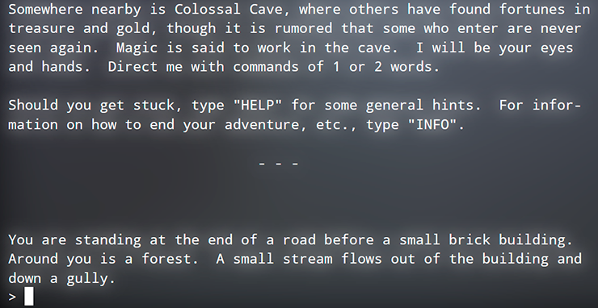
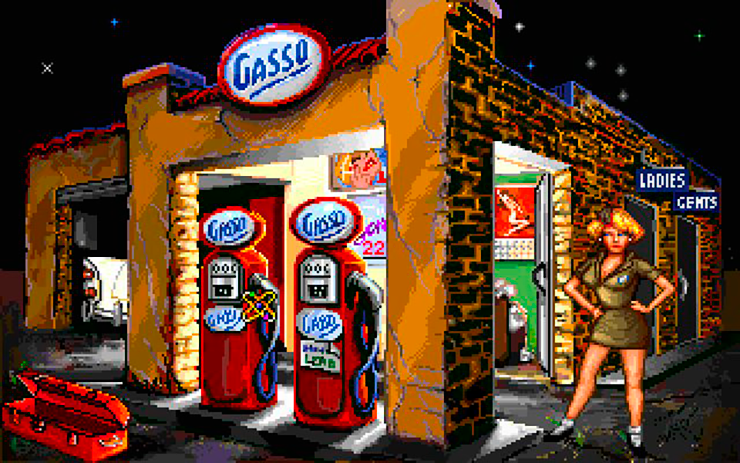
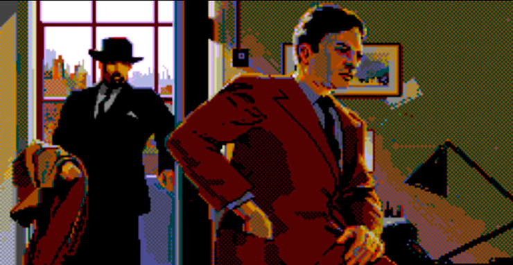
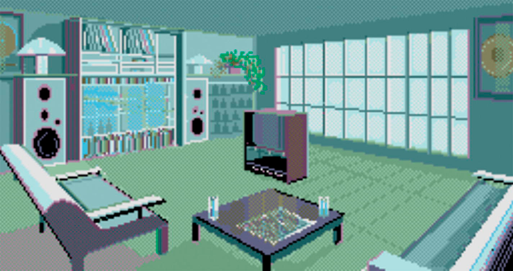
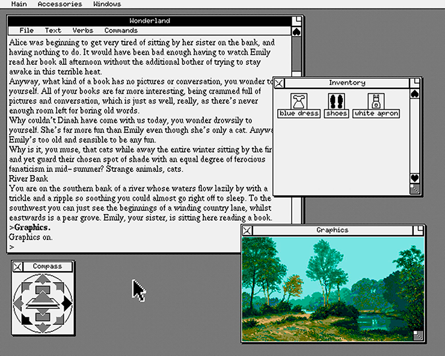
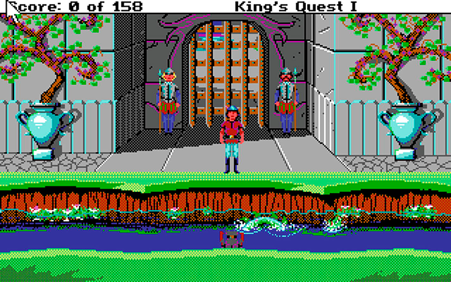
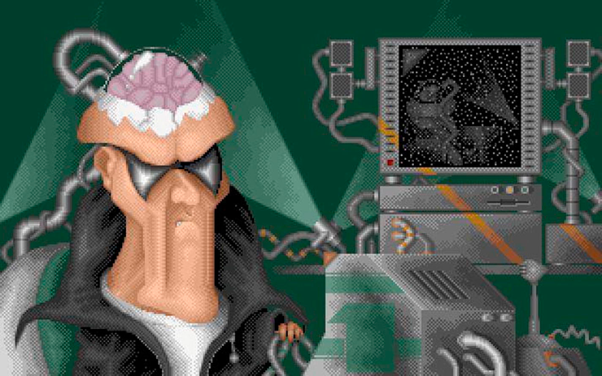
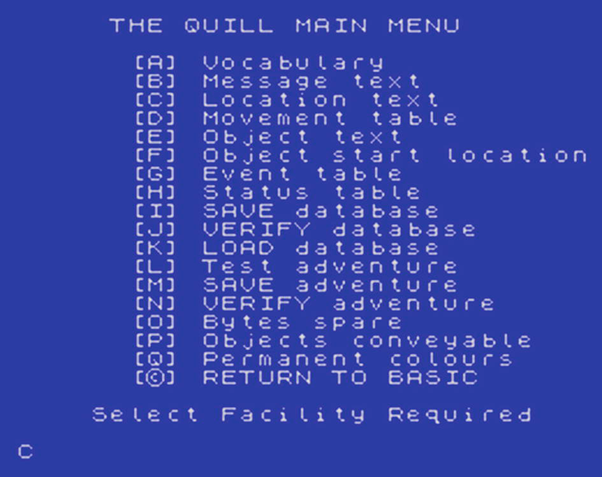

# Глава 2. Древнее искусство интерактивной художественной литературы

История визуальных новел начинается с середины 1970-х, а по другим данным с 1960-х годов. Сам термин «интерактивная 
художественная литература» означает программное обеспечение (то есть видеоигра), в которой взаимодействие с игроком 
осуществляется посредством текстовой информации. Эти игры оказали сильное влияние на становление нового жанра 
визуальные новеллы. В свою очередь: визуальный роман (визуальная новелла) – это жанр компьютерных игр, подвид 
текстового квеста, в котором зрителю демонстрируется история при помощи вывода на экран текста, статичных (либо 
анимированных) изображений, а также звукового или музыкального сопровождения.

В этой главе мы рассмотрим несколько интерактивных художественных произведений, ставшие основоположниками жанра 
визуальных новел, и поговорим о программном обеспечении, которое использовалось для создания этих игр.

## Прапрадед визуальных новелл: ELIZA (1966)

Можно утверждать, что ELIZA сформировала основу интерфейса для всех будущих игр в жанре интерактивной литературы. Сама 
программа представляла из себя виртуального психиатра с текстовым вводом данных. Она была создана в Массачусетском 
технологическом институте с 1964 по 1966 год Джозефом Вайценбаумом. Имея задатки искусственного интеллекта ELIZA 
предоставляла примитивного, но иногда убедительного виртуального психотерапевта, который давал возможность людям 
выговориться и поделиться своими проблемами.

ELIZA впервые появившись на огромном компьютере IBM 7094, а в последствии была перенесена на десятки других платформ. 
Заявлялось, что она прошла теста Тьюринга (создан в 1950 году Аланом Тьюрингом), который проверяет, неотличимость 
взаимодействие компьютера и его пользователя от взаимодействия человека с человеком. 

В результате программа ELIZA заложила для будущих игр основные концепции взаимодействия игры с пользователем и 
основные каноны оформления дизайна. Если сравнивать, то на 2019 год в основном игры имеют простой искусственный 
интеллект, и не составляет конкуренцию пользователю игры. Возможно, если вы, будучи разработчиком углубитесь в изучении 
данной темы, то это может позволить сделать вашу игру уникальной и прорывной.


## Дедушка жанра: Colossal Cave Adventure (1975)

_Colossal Cave Adventure_ была первой работой в жанре интерактивной художественной литературы, созданная в 1975 году 
Уиллом Кроутером, выпускником Массачусетского технологического института. Игра, которую часто называли _Adventure_, 
выполнялась на гигантском компьютере PDP-10 (см. рисунок 2-1). Цель игры была проста: найти сокровища и выбраться из 
пещеры. В игре с текстовым интерфейсом насчитывалось 78 локаций.



__Рисунок 2-1.__ Текстовое приветствие игры "Adventure"

В 1976 году выпускник Принстона Дон Вудс, после согласия Кроутера, доработал игру, добавив множество экзотических 
существ и предметов. Эти усовершенствования привели к ещё большей популяризации игры, вызвав лавину появления всё новых 
версий игры, и перенос её на различные системы. Про неё писали в журналах, говоря, как о одной из лучших игр того 
времени.

## Первопроходцы

В последствии такие компании как Infocom, Magnetic Scrolls, Level 9, и более мелкие команды за десятилетия выпустили 
множество новаторски игр в жанре интерактивной художественной литературы, которые в последствии стали основой для 
развития жанра современных визуальных новелл.

### Infocom

В начале среди интерактивной художественной литературы первенство делили две могущественные компании Infocom из США и 
Magnetic Scrolls из Великобритании. Infocom была основана в 1979 году Дэйвом Леблингом, Марком Бланком, Альбертом 
Вецца и Джоэлем Березом. В 1986 году компанию покупает издательство Activision. После покупки Infocom продолжала 
выпускать игры на протяжении 1990-х годов, пока, 2002 году не была окончательно расформирована.

**Серия Zork (1977–1993)**

Сразу после выхода игры _Adventure_, в 1977 году была выпушена _Zork I: The Great Underground Empire_ компанией 
Infocom. В 1982 году было продано 32 000 копий игры, что позволило ей стать самой продаваемой видеоигрой. К 1986 год 
_Zork I_ уже имел более 370 000 продаж. Это говорило, что публике по душе текстовые приключения, и она хотела 
продолжения.

Как следствие была выпушена игра _Zork II: The Wizard of Frobozz_, которая к концу 1986 году разошлась в количестве 
173 000 копий. _Zork III: The Dungeon Master_ стала завершающей частью в трилогии, и была продана тиражом 120 000 копий. 
В результате этот жанр игр стал основным направление компании.

С каждой новой частью _Zork_, компания улучала визуальное оформление игры в ущерб прозе, такой подход критиковался как 
прессой так и игроками. Тем не менее, серия _Zork_ не теряла популярность до конца 1990 года показывая стабильный рост 
новых пользователей.

Благодаря успеху серии _Zork_, компания Infocom стала не только узнаваема всеми, но твёрдо укрепилась на рынке видеоигр, 
и продержавшись три десятилетия, выпустила ещё не одну успешную игру в жанре интерактивной художественной литературы.

**Трилогия Enchanter: Enchanter (1983), Sorcerer (1984), Spellbreaker (1985)**

_Enchanter_ была амбициозной игрой, даже по меркам Infocom, а её отличительная черта - это продвинутая система 
заклинаний. Всего было продано около 75 000 копий. В игре мы играли за неопытного мага, знающего только простых 
заклинаний, но, который не хотел мириться с могущественным чернокнижником Криллом.

События _Enchanter_ происходят в том же мире что и события игровой серии _Zork_, но на качественно новом уровне. В 
общем игра была хорошим и принятым приключением, став ещё одним успешным продуктом Infocom.

После _Enchanter_ выходит продолжение игры под название _Sorcerer_, где события происходят после поражения злодея 
Крила. Главный герой становиться учеником под руководством чародея Белбозом. Используя всё туже систему произношения 
заклинаний, по ходу игры мы начинаем подозревать, что Белбоз перешел на темную сторону. Хоть у вас теперь 
больше знаний и сил, но соответственно и головоломки стали сложнее.

Завершила трилогию игра _Spellbreaker_, где главному герою круг чародеев поручает выяснить причину неадекватного 
поведения магии во всех землях Зорк. 

Игру _Spellbreaker_ в основном критиковали за высокий уровень сложности и мрачную атмосферу. Несмотря на появление 
новых мощных заклинаний, их использование приводило к непредсказуемым результатам. Игра также была более объёмной 
из-за чего большинство игроков не могли пройти игру без руководства. Всё это объяснялось тем, что игра _Spellbreaker_ 
позиционировала себя, как игра для заядлых геймеров. Однако все эти моменты не стали преградой для блестящего 
завершения трилогии _Enchanter_.

**Planetfall (1983) и Stationfall (1987)**

Игрок принимает роль младшего офицера на космическом корабле Файнштейн. Несмотря на стремление к подвигам, он просто 
изо дня вдень драил палубы. Однако на корабле происходит серия взрывов, и персонаж покидает его на спасательной 
капсуле, которая приземляется на ближайшей планете Resida. Выясняется, что на ней присутствуют следы развитой 
цивилизации, и ваша задача заключаться в том, чтобы понять что произошло.

Игра _Planetfall_ стала еще одним хитом Infocom, и получила множество положительных отзывов. Многим игрокам припал по 
душе маленький робот помощник Флойд. Он до сих пор считается одним из самых лучших персонажей интерактивной литературы.

В _Stationfall_ наш главный герой получает повышение, теперь вместо уборки палуб, он занимается бумажной волокитой и 
выполняет простые поручения командования. Повстречав робота Флойда, они попадают на пустынную космическую станцию, 
где обнаруживают только страуса и Арктурианское существо. Из этой запутанной ситуации разворачиваться увлекательное 
приключение полное тайн.

Игру _Stationfall_ хвалили за отличный продуманный сюжет, и за возвращение любимого робота Флойда. Сама игра больше 
подходила для опытных игроков, нежели для новичков.

**The Hitchhiker’s Guide to the Galaxy (1984)**

_The Hitchhiker’s Guide to the Galaxy_ (_Автостопом по Галактике_) – это интерактивная фантастическая компьютерная 
игра, основанная на одноимённом романе Дугласа Адамса, и была выпущена в 1984 году. Игра создавалась при самом 
непосредственном участии Дугласа Адамса, работавшего в тесном сотрудничестве с программистом Стивом Мерецки. 

Абсурдное научно-фантастическое приключение стало хитом, и разошлось тиражом более 400 000 копий. Данная игра была 
портирована на множество компьютеров с разной архитектурой, в том числе на Apple II, и современные браузеры.

В 2004 году к 20-летию игры на сайте BBC была представлена одноимённая текстовая игра. По сей день (2019 год) в неё 
можно с играть, перейдя по ссылке www.bbc.co.uk/h2g2game.

**Wishbringer (1985)**

Основная цель игры _Wishbringer_ это познакомить игроков младшего поколения с жанром интерактивной художественной 
литературы. Это пятая игра-бестселлер от Infocom, проданная тиражом в количестве 150 000 копий. Сюжет рассказывает 
историю об обычном почтальоне, который должен доставить письмо к владельцу "Ye Olde Magick Shoppe". Выйдя из лавки 
герой оказывается в деревне Witchville полную зла. Далее выясняется, чтобы спасти деревню от наваждения нужно победить 
колдунью по имени The Evil One, а на это у героя остается несколько часов.

Игра _Wishbringer_ имела возрастное ограничение от 9 лет. Для Infocom эта игра стала экспериментом для поиска новой 
целевой аудитории, и продажи показали, что он был успешным.

**Leather Goddesses of Phobos (1986) и Leather Goddesses of Phobos 2 (1992)**

Помимо классического фэнтези, Infocom создавала и непристойную научную фантастику. Так в юмористической истории, 
_Кожаные богини из Фобоса_ хотят поработить землю, а вы должны помешать этому. Игра была выпушена в 1986 году, для 
самых популярных на то время компьютерных платформ. Игра походила на пародию американских pulp-журналов и комиксов 
первой половины двадцатого века, содержа в себе элементы легкой эротики, уровень откровенности которой можно было 
выбрать из трёх возможных вариантов. Сам интерфейс был классическим и имел минималистический текстовой формат 
свойственный для игр Infocom.

Первая часть разошлись тиражом 130 000 копий. Следовательно, продолжение не заставило себя ждать. При постоянном росте 
технических возможностей компьютеров в начале 1990-х годов, Infocom решила сделать шаг в сторону красочной графики, и 
в _«Кожаные богини 2»_ уже было использовано визуальное сопровождение, оцифрована речь, и использовался графический 
интерфейс, но к сожалению игра оказались провальной. Многие считают, что это самая худшая игра от Infocom.



__Рисунок 2-2.__ Графика в «Кожаные богини из Фобоса 2» была впечатляющей, но описания не так много

Перейдя от классического интерфейса, к визуальному оформлению с управлением мышью (см. Рис. 2-2), очень разочаровал 
игроков. Это оказался тот случай, когда стиль преобладает над содержанием. Критике так же подвергся слабый тест и 
головоломки игры. Это было странно так как _«Кожаные богини 2»_ были написаны одним из самых лучших авторов Infocom 
Стивом Мерецки.

### Magnetic Scrolls

Magnetic Scrolls была основана в 1984 году Анитой Синклер, Кеном Гордоном и Хью Стиерсом, и располагалась в Лондоне. В 
начале 1990-х годах она ушла с игрового рынка, а в 2017 году снова появились под брендом Strand Games 
(www.strandgames.com). Бывшая команда Magnetic Scrolls решила восстановить свои старые текстовые игры для нынешнего 
поколения. На данный момент проект выпустил две ранние игры, и вероятней всего Strand Games не остановится на этом.

**The Guild of Thieves (1987)**

Игра _The Guild of Thieves_ от Magnetic Scrolls была известна своим прекрасным визуальным оформлением и 
мультиплатформенностью. Имея на вооружении высокую сложность, криминальную тематику, она отлично погружала игрока в 
атмосферу событий, которые происходили в выдуманной стране Керовнии. 

Огромный игровой мир разделялся на четыре области: сельскую местность, замок, лабиринт и храм, которые в свою очередь 
имели более сотни различных локаций. Так же игра включала множество предметов для коллекционирования и предметов 
повседневного использования, например, как полностью рабочий санузел, что в свою очередь делало выдуманный мир более 
живым и реалистичным. В игре имелись и контейнеры предметов, то есть один предмет состоял из нескольких других предметов.

Спустя 30 лет _The Guild of Thieves_ была перевыпушена в декабре 2017 года и была приятно встречена как поклонниками 
игры так и критиками. 

> **Примечание:** 
> 
> **The Guild of Thievesre**-релиз от Strand Games (https://strandgames.com/games/theguild). 

**Corruption (1988)**

_Corruption_ - это превосходный пример игры, которая показывает актуальные проблемы и политическую обстановку 80-х 
годов. Она хорошо зашла геймерам и получила положительные отзывы от критиков. Главный герой данной игры биржевой маклер 
среднего звена. 

Игра _Corruption_ по сути детективная история, пропитанная политикой времен холодной войны, включая в себя реалистичную 
статическую графику, и имея стиль повествования криминальной драмы (Рис. 2-3). Особенностью игры было присутствие мест 
где, введя всего лишь одну не верную команду сюжетная линия заходила в тупик и на этом игра заканчивалась. Данный трюк 
заставлял игрока следить за всеми героями, и взвешенно принимать решения в определённый момент повествования.



__Рисунок 2-3.__ Реалистичная графика игры "Corruption"

**Fish! (1988)**

Игра _Fish!_ – это самая оригинальная текстовая игра от Magnetic Scrolls, в которой главный герой аквариумная золотая 
рыбка (см. рис. 2-4). Её цель защитить морскую жизнь на всей планете, сражаясь с отрядом «Семи Смертоносных Плавников». 



__Рисунок 2-4.__ Плюшевый стиль игры Fish!

Вероятно, разработчики решили создать данную игру, чтобы отдохнуть от релиза сложных проектов, придумал такой забавный 
сюжет. Это был рискованный ход выпускать подобную игру, но риск оказался оправданным, и она стала хитом.

**Wonderland (1990)**

В 1990 году Magnetic Scrolls выпустила игру на основе классического произведения Льюиса Кэрролла «Алиса в стране 
чудес» - _Wonderland_. Игра имела множество новаторских идей, и получила признание от многих критиков. Она были красиво 
оформлена, использовала отличную анимацию и визуальные эффекты. Пользовательский интерфейс имел оконный вид, как в 
операционных системах Windows и macOS на то время, так же использовалось управление мышью (см. рис. 2-5). Игра 
_Wonderland_ – это отличный пример переноса классического произведения в цифровой мир.



__Рисунок 2-5.__ Игра Wonderland и её оконный интерфейс

### Level 9 Computing

Level 9 была основана в Великобритания братьями Майком, Николасом и Питом Остином, и просуществовала с 1981 по 1991 
год. Студия создавала изысканные игры в жанре интерактивной художественной литературы, которые состояли в основном из 
трилогий.

**Colossal Adventure (1983)**

Воспользовавшись успехом хита Уилла Кроутера 1977 года _«Adventure»_, «Level 9» предоставила обновленный вариант 
оригинальной игры, добавив 70 новых локаций. Хоть релиз _Colossal Adventure_ подвергся критике за грубую графику, но 
большинство согласились, что это обновления пошло на пользу оригиналу. 

**Трилогия Silicon Dreams (1986)**

Эта научно фантастическая трилогия имеет общую сюжетную линию для всех трёх игр. Основная тематика - это колонизация 
человечеством других планет, и к каким проблемам это может привести.


__Рисунок 2-6.__ Вид игры Snowball. Level 9 не могла похвастаться потрясающимся визуальным оформлением, но имела 
впечатляющий сюжет.

_Snowball_, выпущена в 1983 году, повествует историю о космическом корабле, который держит путь на планету Эдем для 
её колонизации, но сошедший с ума пассажир, направил его на солнце. Чтобы предотвратить катастрофу, главный компьютер 
корабля пробуждает от сна главную героиню Кимберли. 

По данной игре был снять научно-фантастический фильм, который был хорошо принят как критиками, так и геймерами.
 
Через год после релиза первой части была выпушена _Return to Eden_ в которой главной героине нужно выжить в диких 
джунглях и спастись от роботов убийц. Визуальное оформление игры было очень упрошено, но тем не менее, сама игра 
была динамична и хорошо написана. 

Завершающая часть игры под названием _The Worm in Paradise_, которую Level 9 выпустила в 1985 году, включала в себя 
простую графику (рис. 2-6), но имела качественный и захватывающий сюжет. События в игре происходили спустя сто лет 
после _Return to Eden_ в райском куполообразном городе Еноха.

**Трилогия Time and Magik (1988)**

Данная трилогия выпускалась с 1983 по 1986 год для 8-битных домашних компьютеров. В 1988 году компанией Mandarin 
Software все три части игры доработала и переиздала для платформ нового поколения. В этот раз Level 9 сделал ставку на 
визуальное оформление игры (см. рис. 2-7).
 
Игра _Lords of Magic_ 1983 года имела хитрый сюжет, основанный на путешествиях во времени. Главный герой, программист, 
встречается с Отцом Времени, чтобы спасти сокровища девяти эпох Римской империи, эпохи динозавров и ледникового период. 
Игра, разработанная Сью Газзард, была тепло встречена прессой и игроками. Игры _Red Moon_ (впервые выпущена в 1985 
году), и продолжение _The Price of Magik_ (1986 года) уже содержали элементы ролевой игры. Особенно последняя часть 
включала обширную, как для своего времени систему произношения заклинаний.


__Рисунок 2-7.__ Визуальное оформление Lords of Magic: версия для ПК (вверху) и версия Commodore 64 (внизу).

## Другие известные игры в этом жанре

«Большая двойка» (Infocom и Magnetic Scrolls) и Level 9 были не единственными издателями качественной интерактивной 
художественной литературы, существовали и другие команды разработчиков создававшие впечатляющие продукты. Далее мы 
познакомимся с некоторыми из них.

### King’s Quest: Quest for the Crown от Sierra On-Line (1984)

Издательство Sierra On-Line, основанная в 1979 году Кеном и Робертой Уильямсом приобрело культовый статус в жанре 
приключенческих игр, создав успешные франшизы, такие как _Space Quest_, _Police Quest_ и _King’s Quest_. Создавая 
качественные и прибыльные приключенческие игры Sierra On-Line прекратила своё существование только в 2004 году. 

В самой игре _King’s Quest_ отважный молодой рыцарь, сэр Грэм, мечтает стать правителем Королевства Давентри. Он должен 
найти нужные магические предметы и решить многочисленные головоломки, чтобы доказать королю Эдварду, который сам 
планирует уйти в отставку, что он достоин трона. Хотя по современным меркам графика очень устарела, но повествование до 
сих пор захватывает и удерживает в игре.



__Рисунок 2-8.__ Сцена из улучшенной версии King’s Quest I 1990 года.
 
Несмотря на то, что _King’s Quest_ имеет подробный визуальный мир, и имеет управление схожее с аркадными играми 
(см. Рис. 2-8), но по сути, это игра жанра интерактивной художественной литературы.

### Трилогия Spellcasting от Legend Entertainment (1990–1992)

Legend Entertainment была основана в 1990 году Стивом Мерецки, который написал _Leather Goddesses of Phobos_ и 
_The Hitchhiker’s Guide to the Galaxy_ для Infocom. 

Новая компания Мерецки сразу же пришла к успеху со своим дебютным продуктом _Spellcasting 101_, который выпускался 
эксклюзивно для платформы ПК, сочетая в себе юмор и фэнтезийные элементы. Трилогия повествовала о трудности 
студенческой жизни и приключениях возникающие вокруг главного героя Эрни Иглбик. Он ботаник волшебник-новичок, который 
хочет получить знания и завоевать статус, чтобы добиться расположения некой Лолы Тигербелли, ради которой и поступив 
в университет для подготовки волшебников. Однако, в колледже непросто быть ботаником, даже имея магические способности.


__Рисунок 2-9.__ Spellcasting 301, как и две другие части игры трилогии, имела качественную картинку.

_Spellcasting 101_ положил начало успешной трилогии игр, за которой последовали _Spellcasting 201: The Sorcerer's 
Appliance_ и _Spellcasting 301: Spring Break_. Последняя игра в трилогии имела впечатляющую 256-цветную графику 
(см. рис. 2-9), которая сопровождалась звуком, что делало игру еще более захватывающей.

Совмещая простоту, взрослую тематику из _Leather Goddesses of Phobos_ и высококачественную графику игра стала хитом.

### Timequest от Legend Entertainment (1991)

Legend не ограничивалась только подростковыми фэнтези, но и имела в своём каталоге научно-фантастические франшизы. Сюжет 
игры _Timequest_ крутится вокруг путешествия во времени и опасными последствиями от этих путешествий. Создатель данной 
игры Боб Бейтс, который, как и Стив Мерецки, ранее работал в Infocom. 

В _Timequest_ Зик С. Веттенмайер, лейтенант Патруля времени похищает машину времени (интеркроном), и вмешиваясь в 
историю, вызывая волновой эффект во временном потоке, который приведет к катастрофическим событиям для всего 
человечества. Главный герой рядовой Патруля времени, должны выследить лейтенанта, о котором идет речь, и исправить все 
ошибки, которые он совершил. 


__Рисунок 2-10.__ В Timequest вы повстречаете немало исторических личностей. Вот, например, бывший премьер-министр 
Великобритании.

Используя тот же игровой движок, что и для франшизы _Spellcasting_, _Timequest_ имел качественную графику с высоким 
разрешением и приятный интерфейс, который управлялся мышью, а странная мелодия, добавляя особую атмосферу. Так же не 
часто можно повстречать такие исторические фигуры, как Уильям Шекспир, Уинстон Черчилль (см. рис. 2-10) и Моисея во 
младенчестве в течение одного дня. Игра в начале 1990-х годов получила несколько наград в области видеоигр.

### Demoniak от Palace Software (1991)

_Demoniak_ обладала стандартным футуристическим сценарием судного дня, но показала новые горизонты в создании игр. 
Написанная Аланом Грантом, автором комиксов о судье Дредде и Бэтмене, игра получила хорошее описание столкновение 
межпространственного демона с четырех враждующими противниками. Имея хорошо прорисованное графическое оформление в 
стиле мультфильма, игра создавала свою собственную уникальную атмосферу (см. рис. 2-11). 



__Рисунок 2-11.__ Снимок экрана Demoniak, на котором изображен Док Кортекс.

_Demoniak_ производила впечатление обычного текстового приключения, однако не ограничивалась четырьмя главными героями, 
а предоставляла возможность сыграть за 50 разных персонажей в игре. После смерти игрок мог продолжить игру выбрав 
любого обитателя игровой вселенной, со своими причудами и личностными особенностями. Так же игрок может просто 
наблюдать за обычной деятельностью персонажей игры.

## Как они это делали? Инструменты для создания интерактивной художественной литературы

Как и любой тип программного обеспечения, текстовые игры создаются, используя язык программирования общего назначения 
(например: C, C++, BASIC или Java). Однако уже тогда существовали специальные инструменты для создания игр этого жанра. 
Некоторые из них рассмотрим в данной книге. 

Созданные тогда фреймворки заложили основы программного обеспечения для создания подобных игр и их наследие ощущается 
до сих пор. Например, как в случае с системой разработки Грэма Нельсона Inform, которую можно все ещё использоваться 
для создания новых игр.

### Несколько слов о парсерах

_Парсер_ - это часть программного обеспечения, которое интерпретирует вводимые пользователем данные в логические 
структуры данных. В контексте интерактивной художественной литературы парсеры выступают посредником между игроком и 
игровым миром, переводя вводимый текст в действия, которые соответствуют логике игры.

Уровни синтаксических анализаторов сильно различается между собой. Самый простой анализатор не понимает длинные 
словосочетания, только несколько однотипных фраз. Продвинутый синтаксический анализатор может принимать множество 
глаголов и существительных и даже собирать релевантные слова из отдельных частей предложения. Благодаря чему 
синтаксический анализатор Infocom имел огромного успех и впечатлял хорошим разбором ведёных игроком предложений. 
Например, легендарная игра _Adventure_ от Уильяма Краудера в основном работала по довольно простой системе «глагол и 
существительное», принимала только такие команды, как «ПОЛУЧИТЬ КИНЖАЛ», спустя десятилетие такой подход считался 
устаревшим. 

В современную эру развития визуальных новелл используется ввод данных при помощи мыши, поэтому указанные синтаксические 
анализаторы являются не актуальными в разработке. Конечно, остается довольно большая фанатская база интерактивной 
художественной литературы созданная с 1980-х годов, которая остаётся верной вводу текста через клавиатуру.

### Zork Interactive Language (Зорк Интерактивный Язык) (ZIL) или Z-machine

В период расцвета с конца 1970-х до конца 1980-х Infocom использовала ими же разработанную виртуальную машину под 
названием Z-machine. Она разделялась на два основных элемента, на саму _Z-machine_ для конкретной платформы (например, 
ПК, C64, Amstrad), и на системно-независимый файл (или Z-файл). Каждый из файлов содержал игру, написанную на языке под 
названием _Zork Interactive Language (ZIL)_, который был основан на языке MIT Design Language (MDL) 1971 года. 

Благодаря такой структуре создаваемая игра не разрабатывалась под определённую платформу, а переносилась в Z-файлы, 
которые без проблем запускались на любой платформе. 

Созданная еще в 1979 году _Z-machine_, до сих пор жива, и портирована на современные платформы такие как Windows, Linux, 
macOS и iOS.

Несмотря на то, что ZIL предлагает довольно лаконичный подход к программированию интерактивной художественной 
литературы, он имеет большое количество команд, и для его освоения потребуется потратить некоторое время. Пример 
использования ZIL наведён в Листинге 2-1.

```
<ROOM APRESS-LOUNGE
      (LOC OFFICE)
      (DESC "The Apress Lounge")
      (SOUTH TO MEETINGROOM)
      (EAST TO KITCHEN)
      (NORTH TO TOILET IF DOOR-UNLOCKED ELSE "The water closet door won't budge.")
      (ACTION APRESS LOUNGE-F)
      (FLAGS RLANDBIT ONBIT)
      (GLOBAL STAIRS)
      (THINGS (SLIPPERY WET) (DOORKNOB HANDLE) SLIPPERY-HANDLE-F)
```

**Листинг 2-1**. Пример определения комнаты в Zork Interactive Language (ZIL).

Флаг RLANDBIT в ZIL означает, что комната находится на суше, ONBIT указывает, что комната по умолчанию освещена. 
Ключевое слово THINGS использовался для создания псевдообъектов, которые нельзя перемещать, и такие образом он занимал 
меньше памяти, чем обычные объекты. В те времена это было очень важно, из-за ограничения в вычислительных возможностях 
компьютеров приходилось экономить на оперативной памяти и сокращать времени загрузки игры. 

В Листинге 2-2 показан пример объявления объекта в ZIL.

```
<OBJECT PEN(LOC APRESS-LOUNGE)
      (SYNONYM PEN MARKER)
      (ADJECTIVE EXPENSIVE)
      (DESC "expensive pen")
      (FLAGS TAKEBIT)
      (ACTION PEN-F)
      (FDESC "An expensive ink-powered writing tool is on a table.")
      (LDESC "There is a writing tool (ink-powered) here.")
      (SIZE 2)>
```

**Листинг 2-2**. Пример определения объекта ручки в ZIL.

Флаг TAKEBIT указывает, что игрок может поднять объект, а флаги объекта WEARBIT, READBIT и CONTBIT указывали, что его 
можно перенести, прочитать или он является составным. В атрибуте SIZE задаётся вес предмета во вселенной _Z-machine_. 
Например, камень должен иметь значение больше, чем обычная ручка. 

В свойство FDESC указывается описывает объект до первого контакта с игроком, а свойство LDESC содержит описание после 
контакта.

### Quill от Gilsoft (1983)

Quill создана Грэмом Йендленом для компьютера ZX Spectrum, а в 1980-х годах была перенесена на множество популярных на 
то время 8-битные компьютеры. С помощью данного программного обеспечения было создано около 450 коммерческих игр. Quill 
могла поддерживать около 200 локаций, но не имела из коробки поддержку графики, пока в 1984 году Gilsoft не выпустила 
надстройку Illustrator, которая исправляла эту проблему. 

Основанный на базе данных Quill имела простой в использовании интерфейс (см. рис. 2-12), благодаря чему она помогла 
многим познакомиться с миром интерактивной художественной литературы.



__Рисунок 2-12.__ Главное меню Quill.

### Professional Adventure Writer от Gilsoft (1986)

Продолжением Quill стал Professional Adventure Writer (PAW). В наследие он получил интуитивно понятный пользовательский 
интерфейс, был добавлен более продвинутого синтаксического анализатора, облегчено добавление визуальных эффектов и так 
же сделаны другие улучшения.

На основе PAW было создано около 400 приключений, но к сожалению, он был разработан для уже устаревшей на тот момент 
ZX Spectrum.

### Adventure Game Toolkit от Дэвида Мальмберга (1987)

Adventure Game Toolkit (AGT) включает в себя два метода разработки обычный для начинающих разработчиков и 
профессиональный для опытных программистов. 

AGT основан на Generic Adventure Game System (GAGS) (1985 год) Марка Велча для ПК. Продукт Мальмберга отличался 
значительно улучшенным анализатором и расширенными возможностями. В дальнейшем AGT был портирован на множество других 
платформ. Хотя он был немного сложен для понимания и освоения, но мог потягать с инструментами для разработки от Infocom.

### Inform от Грэхема Нельсона (1993–)

Inform – это профессиональный инструмент для разработки игр, а в поздних версиях он фактически стал языком 
программирования. Он предоставлял удобные инструменты для разработки игры, кроме того, созданная игра была на 100% 
совместима с Z-machine от Infocom.

До версии 6 Inform был похож на простой язык программирования (см. Листинг 2-3), но после выпуска революционной 7 
версии, процесс создание игры стало похоже на саму игру (см. Листинг 2-4). 

```
 Constant Story "Example Quest"; 
 Constant Headline "This is an example of Inform 6"; 

 Include "Parser";
 Include "VerbLib";

 [ Initialise;
     location = Storage_Room;
     "Welcome to the storage room!";
 ];

 Object Garage "Garage";
 Object Front_Door "Front Door";

 Object Storage_Room "Storage Room"
     with
         description "A spacious and cold room.",
         e_to Garage,
         n_to Front_Door,
     has light;
```

**Листинг 2-3**. Пример кода Inform версии 6

```
"Example Quest" by "Mr Programmer"

The story headline is "This is an example of Inform 7".

The Storage Room is a room. "A spacious and cold room."
The Garage is east of the Storage Room.
The Front Door is north of the Storage Room.
The Front Door is a door. The Front Door is closed and locked.
```

**Листинг 2-4**. Пример кода Inform версии 7

Если судить по активности на форуме The Interactive Fiction Community Forum, Inform и сейчас пользуется сильной 
популярностью среди разработчиков интерактивной художественной литературы. Inform даже использовался для выпуска 
1997 года _Zork: The Undiscovered Underground_ (Activision). Так же его использовали такие игры как _Galatea (2000)_ и 
_Floatpoint (2006)_ от Эмили Шорта.

## Заключение

Прочитав эту главу, вы должны получить твердое представление об истории интерактивной художественной литературы. Так же 
вы узнали: 

* Какие текстовые игры были самыми продаваемыми и успешными. 
* Что такое парсеры и как создавалась игры жанра интерактивной художественной литературы. 

В следующей главе подробно рассматриваются новые текстовые игры, так называемые - визуальные новеллы.
