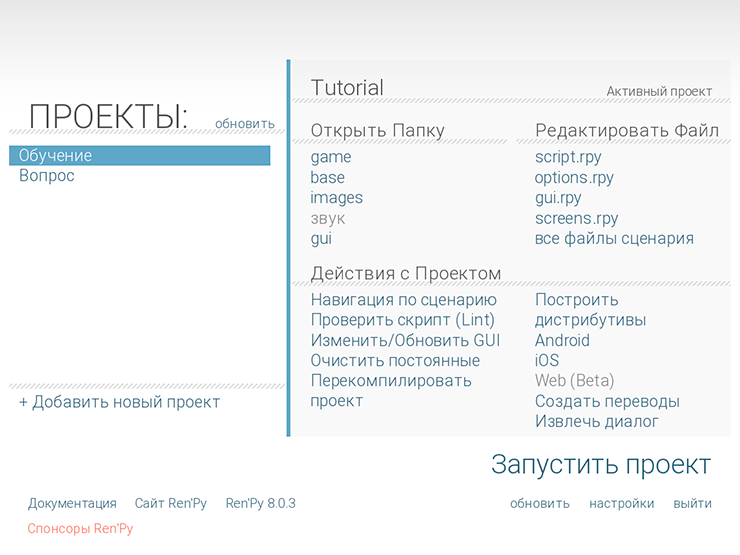
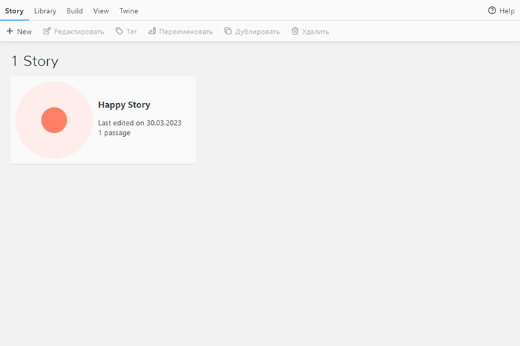
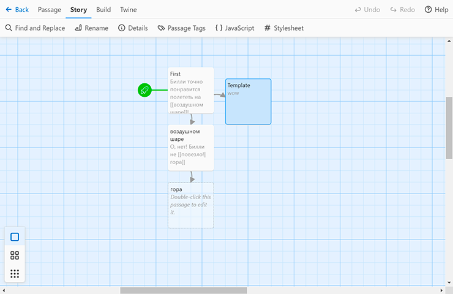
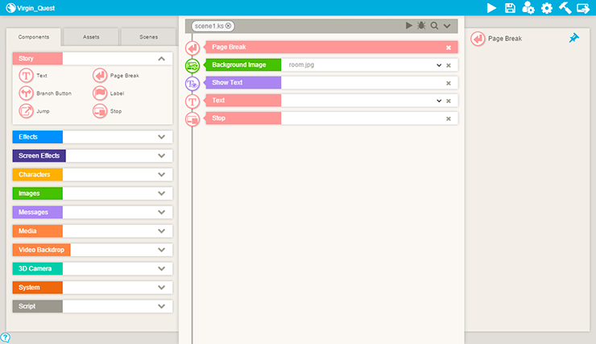
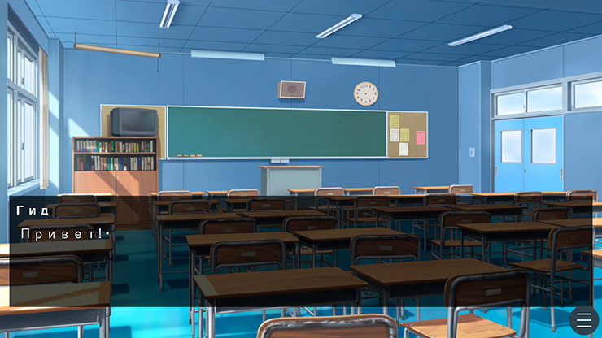
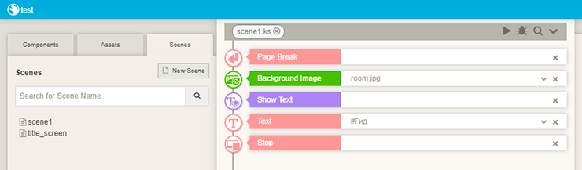

# Глава 4. Знакомимся с Ren’Py, Twine и TyranoBuilder

В этой главе мы рассмотрим три инструмента для создания визуальных новелл: Ren’Py, Twine и TyranoBuilder. Хотя основное 
внимание в этой книге отдано Ren’Py, но также будет уделено достаточно времени и к двум другим движкам, чтобы 
познакомится с их пользовательскими интерфейсами, основными возможностями, и с подходами к разработке визуальных новелл. 

Примеры в данной главе будут простыми, а в следующих главах мы рассмотрим более продвинутые методы разработки в виде 
трех мини-приключений. 

И начнём мы с сравнением характеристик этих движков (см. таблицу 4-1).

__Таблица 4-1.__ Сравнительная таблица Ren’Py, Twine и TyranoBuilder

| Инструмент      | Лицензия   | Поддержка ОС                               | Разработка на ОС              | Лучше всего подходит для                                                                                                |
| --------------- | ---------- | ------------------------------------------ | ----------------------------- | ----------------------------------------------------------------------------------------------------------------------- |
| _Ren’Py_        | Свободная  | Windows, macOS, Linux, iOS, Android        | Windows, macOS, Linux         | Визуальных новелл                                                                                                       |
| _Twine_         | Свободная  | Windows, macOS, iOS, Android, Linux, HTML5 | Windows, macOS, Linux, online | Минималистической интерактивной художественной литературы с поддержкой визуальных элементов на основе CSS и JavaScript. |
| _TyranoBuilder_ | $15 (2023) | Windows, macOS, iOS, Android               | Windows, macOS                | Визуальных новелл с продвинутой анимацией персонажей с использованием технологии Live2D                                 |

## Ren'Py в деталях

Ren’Py — это мощный инструмент, разработанный исключительно для написания визуальных новелл, а благодаря языку 
программирования Python позволяет создать более сложные игры. Данное программное обеспечение распространяется 
бесплатно, и его можно скачать по ссылке: [https://www.renpy.org/](https://www.renpy.org/). 

Данный игровой движок позволяет создавать как некоммерческие, так и коммерческие игры для разных платформ. Самые 
успешные созданные визуальные новеллы это _Doki Doki Literature Club!_ и _Digital: A Love Story_. Кроме того, Ren’Py 
имеет огромное сообщество разработчиков и не мало активных форумов. Так же Ren’Py поддерживает большинство популярных 
форматов изображений и аудио.

Выйдя в 2004 году, Ren'Py по-прежнему остается популярным инструментом для разработки визуальных новелл, а регулярно 
выходящие новые версии движка говорит о том, что проект активно развивается.

### Как работает Ren'Py

Ren’Py можно разделить на три компонента: лаунчер (см. рис. 4-1), файлы сценариев и аудиовизуальные элементы (то есть 
изображения и аудиофайлы). Лаунчер — это, по сути, менеджер проектов, который позволяет вам создавать и управлять 
игровыми проектами, над которыми вы работаеете.



__Рисунок 4-1.__ Лаунчер Ren’Py

Все файлы сценариев в Ren’Py имеют расширение _.rpy_ (например: _script.rpy_). Это обычный текстовый файлы, который 
можно редактировать в любом текстовом редакторе, но сам Ren'Py не имеет встроенного редактора для работы с файлами со 
скриптами.  Однако, на сайте Ren’Py присутствует список рекомендуемых бесплатных текстовых редакторов.

### Создание нового проекта

Чтобы создать проект нужно на панели лаунчера нажать «Добавить новый проект». Появиться окно, где нужно выбрать 
каталог, в котором будут сохранены все файлы игры. На следующем шаге вам будет предложено указать название проекта. 

Далее вам нужно выбрать расширение экрана. По умолчанию предлагаются следующие расширения 1280x720 (HD), 
1920x1080 (Full HD), 2560x1440 (Quad HD), 3840x2160 (4K) или «Своё». Выбор обычно зависит от размера используемой 
графики в художественном произведении. Естественно, лучше подобрать оптимальный масштаб изображений для проекта. 
Например, на данный момент самым распространённым расширение мониторов является 1920x1080 (Full HD), в результате на 
мониторах 1280x720 игра будет выглядеть отлично, но хуже на мониторах с большими расширениями. Так же игры с указанным 
расширением способны запуститься на более старых компьютерах, поскольку такие проекты не требовательны к 
характеристикам оборудования, по с сравнением 3D играми.

В конце вам будет предложено выбрать цветовую схему для игры. Выбирайте ту, которая лучше всего соответствует вашему 
проекту, её можно будет изменить позже если это потребуется. После это будет создан проекта, который появиться в списке 
проектов лаунчера. 

Для запуска игры достаточно нажать «Запустить проект».

### Функционал Ren'Py

Лаунчер выступает основным инструментов для управления проектами в Ren'Py. Хотя доступ к директории и файлам проекта 
можно получить через обыкновенный проводник или файловый менеджер, но удобней это будет делать через лаунчер. Давайте 
познакомимся с его основными возможностями (см. таблицу 4-2).

__Таблица 4-2.__ Возможности лаунчера Ren'Py

| Действие                   | Описание                                                                                                                           | Используется для                                                                                                     |
| -------------------------- | ---------------------------------------------------------------------------------------------------------------------------------- | -------------------------------------------------------------------------------------------------------------------- |
| _Навигация по сценарию_    | Позволяет быстро находить файлы и другие элементы в вашем проекте                                                                  | Позволяет добавить файл сценария                                                                                     |
| _Проверить скрипт (Lint)_  | Запускает Lint, чтобы проверить игровые скрипты на содержание ошибок                                                               | Желательно запускать, каждый раз перед сборкой вашего проекта                                                        |
| _Изменить/Обновить GUI_    | Позволяет изменить цветовую схему пользовательского интерфейса                                                                     | Используется, когда меняется дизайн визуальной новеллы                                                               |
| _Очистить постоянные_      | Удаляет сохранения и другие временные данные игр                                                                                   | Тестирование игры с нуля                                                                                             |
| _Перекомпилировать проект_ | Перекомпилирует все файлы скриптов в проекте                                                                                       | Используется для устранения дефектов в скомпилированных скриптах или импорта проекта из старой версии Ren’Py в новую |
| _Построить дистрибутивы_   | Создает исполняемый файл игры (например, для ПК, macOS, Linux)                                                                     | Используется для распространения игр на указанных вами платформах                                                    |
| _Android_                  | Запускает процесс экспорта проекта на Android, при помощи установленного бесплатного инструмент Ren’Py для упаковки Android (RAPT) | Позволяет выпустить визуальную новеллу для платформы Android                                                         |
| _iOS_                      | Запускает процесс экспорта проекта для iOS путем установки бесплатного инструмента Renios                                          | Позволяет выпустить визуальную новеллу для платформы iOS (iPad, iPhone)                                              |
| _Создать переводы_         | Создает переводы текстов в игре на другие языки                                                                                    | Используется, когда возникает необходимость выпустить игру на дополнительных рынках                                  |
| _Извлечь диалог_           | Экспорт внутри игровых диалогов (или другого текста) в текстовых файл или в файл электронной таблицы                               | Позволяет корректорам и другим членам команды прочитать материал, не играя в игру                                    |

Как видно, Ren’Py довольно многофункционален. Сперва он может показаться сложным для новичка, но после ознакомления с 
основными принципами работы программы, придёт понимание, что они не так уже и сложны. Со временем имея достаточно 
мотивации, вы научитесь использовать мультиязычность и собирать проект для Android.

### Основы в написания сценариев на Ren’Py

Ren’Py имеет гибкий и простой язык сценариев, с которым мы сейчас познакомимся на основе приведённого ниже простого 
примера.

> **Примечание:** 
> 
> Имена файлов с изображениями персонажей должны быть короткие и понятные к каким героям они относятся. Например, в 
> нашем небольшом скрипте изображение Маркуса имеет название mar.png, то есть оно сокращено, и соответствует имени 
> определённое в скрипте. Также файлы должны быть помещены в каталог с изображениями вашего 
> проекта.

``` python
init:
    $ mar = Character('Маркус')
    image home = Image("home_of_markus.jpg")
    image markus happy = Image("markus_happy.png")
    image markus sad = Image("markus_sad.png")
label start:
    scene home
    show markus happy
    mar "Вот я дома и счастлив!"
    hide markus happy
    show markus sad
    mar "Но похоже молоко закончилось."
    "Маркус явно расстроился из-за отсутствия молока."
    hide markus happy
    show mar
    mar "Не поздно ли идти в продуктовый магазин?"
```

Как видим скрипт начинается с оператора инициализации _init:_, где мы задаем изображения для фона и персонажей. 
В наведённом примере, изображение _home_of_markus.jpg_ связано с переменной _home_. Всякий раз, когда нужно показать, 
что наш герой находится дома достаточно вызвать переменную под именем home, вместо длинного имени 
файла _home_of_markus.jpg_.

Аналогично, когда нам нужно изобразить эмоциональное состояние Маркуса, например, грустного или счастливого, мы 
соответственно задаём переменные, которым присваиваем изображения грустного и счастливого Маркуса, и чтобы показать 
счастливого главного героя нужно написать команду "show markus happy". Это позволяет не использовать длинные имена 
файлов, сократить код, держать его чистым и понятным для чтения. Вы можете применять другие эмоции, так как Ren’Py не 
имеет на них ограничения.

Одним из основным оператором в Ren’Py являются метки, которые позволяют выполнить переход по сценарию игры или 
используются для создания меню выбора. То есть по сути метки можно сравнить с понятием сцены, которые могут меняться 
по ходу игры. В нашем примере, игра начинается с метки _label start:_. Так как сценарий простой в нем нет других меток 
или вариантов выбора, пользователь просто щелкает, переходя от одного диалога к другому. Имена меток могут быть любые, 
например, _label work:_ или _label holiday:_.

После метки _start:_ идет оператор по выводу фона и изображения счастливого Маркуса. Далее выводится текст 
"Вот я дома и счастлив!", _помеченный оператором символа_ (_character definition statement_) mar, который был 
инициализирован в разделе _init:_ командой _Character('Маркус')_. Простыми словами, мы создали героя _Маркус_ и 
связываем все его диалоги при помощи переменной mar.

Далее мы рассмотрим некоторые основные элементы языка Ren'Py в таблице 4-3.

__Таблица 4-3.__ Ключевые элементы языка Ren’Py

| Элемент/Объявление | Описание                                                                                                                                        | Пример использования                                                                |
| ------------------ | ----------------------------------------------------------------------------------------------------------------------------------------------- | ------------------------------------------------------------------------------------|
| init:              | Метка инициализации. Используется для объявления псевдонимов имен файлов и других постоянных данных. Обычно используется для изображений.       | init:<br> image garage = Image("garage.jpg")                                        |
| image              | Используется для определения псевдонимов для файлов изображений.                                                                                | image billy happy = Image("billy.jpg")<br>  image billy angry = Image("billy2.jpg") |
| label              | Используется для создания метки перехода по сценарию игры.                                                                                      | label garage:<br> "We're in the garage!"                                            |
| _Макрос персонажа_ | Используется для создания короткого псевдонима игровому персонажу.                                                                              | $ b = Character('Billy')<br> $ c = Character('Christopher')                         |
| scene              | Удаляет все отображаемые объекты с экрана перед вызовом новых.                                                                                  | scene garage                                                                        |
| show               | Показывает изображение персонажа. Так же можно указывать дополнительное описание, например, «Джеймс счастлив» или «Джеймс злой».                | show billy happy                                                                    |
| hide               | Скрывает изображение персонажа.                                                                                                                 | hide billy happy                                                                    |
| _Произнести фразу_ | Выводит текст на экран или выводит текст принадлежащий персонажу назначенный с помощью макроса персонажей.                                      | "Стояла тишина."<br> b "Кристофер! Ты здесь?"<br> c "Да, Билли. Я здесь."           |
| _Переходы_         | Для мягкого появления изображений в сцене используются переходы, например, затухание или растворение. Вызывается эти эффекты оператором _with_. | show billy angry<br> with fade<br> hide billy angry<br> with dissolve               |
| play sound         | Воспроизводит звуковой файл.                                                                                                                    | play sound "soundfx1.ogg"                                                           |
| pause              | Ставит игру на паузу до щелчка мыши. Если указано число, пауза закончится через указанное количество секунд.                                    | pause 2.0                                                                           |

### Взаимодействуем с пользователем: Меню

Хотя существует жанр _кинетическая новелла_ - это визуальная новела с линейным сюжетом, неплохо бы было дать игроку 
возможность выбора в истории. Для этого используется такой элемент как _menu_, которое состоит из меток и команд 
перехода _jump_. Пример использования показан в сценарии приведённый ниже.

Так же обратите внимание, как в примере используются псевдонимы, которые ссылаются на Кристофера _(c)_ и Билли _(b)_ 
рассматриваемые в предыдущей главе.

``` python 
b "Эй, Кристофер, пошли на улицу?"
pause 2.0

menu:
    "Да. Давай.":
        jump outsideworld
    "Нет. Хочу остаться здесь.":
        jump stayput

label outsideworld:
    c "О. А здесь так свежо!"
    jump endstory

label stayput:
     c "Гараж - *это* прекрасное место."
     jump endstory

label endstory:
     "Конец истории."
     play sound "fanfare.ogg"
```

### Отступы и текстовые блоки 

Одной из наиболее распространенной причиной ошибок в Ren’Py является неправильное соблюдение отступов. Язык очень 
чувствителен к пробелам до такой степени, что скрипт может просто не запуститься. Благодаря отступам, состоящих из 
четырех пробелов, скрипт делиться на логические блоки, как это показано в следующем примере.

``` python 
"Это предложение является частью первого блока."

if True:

    "Это предложение является частью второго блока."

    "Да, это предложение также является частью второго блока."

    "Я думаю вы догадались? Это предложение тоже относится ко второму блоку."

"И вот мы снова вернулись к первому блоку."
```

Как видим операторы первого блока не содержит отступов, однако они есть во втором блоке. Если перед каким-либо 
оператором во втором блоке будет стоять другое количество пробелов, то программа отнесет оператор в новый блок или 
запутается в логике скрипта и выдаст сообщение об ошибке.

### Условные операторы: if, elif, else

В предыдущем сценарии мы встретили такой элемент как _if_ - _условный оператор_, который используются для проверки 
состояния переменных. Сами переменные — это «именованное хранилище» для данных внутри игры, например, таких как 
количество жизней персонажа или других данных. Давайте рассмотрим условный оператор более подробно в следующем сценарии.

``` python 
# Создадим переменную с именем energy и присвоим ей случайное значение от 40 до 100.
# Мы могли бы просто использовать что-то вроде "$ energy = 100",
# но мы сделаем по-другому.
$ energy = renpy.random.randint(40, 100)
if energy >= 100:

   b "Уровень вашей энергии оптимален!"

elif energy >= 50:

   b "Уровень вашей энергии приемлем."

else:

   b "Уровень вашей энергии на исходе."
   play sound "klaxon.ogg"
   pause 4.0
```

В примере при помощи условного оператора _if_ мы сравнивали переменную _energy_. Если переменная energy имеет 
значение 100 или больше, мы выводим сообщение восторга и одобрения. Далее идет оператор elif - это сокращение от 
_else if_. Эта часть программы выполняется, если energy больше или равна 50, но меньше 100, а после _оператор else_ 
выполняется часть программы, если energy падает ниже 50.

После указания условного оператора соблюдая правила отступов, вы можете указывать не ограниченное количество текста и 
команд, как это показано в примере. После оператора else выводится диалоговый текст, далее проиграется звук, и игра 
приостанавливается на 4 секунды.

### Подробней об операторе управления

Использование меток и команд перехода — это не единственный способ управления сценариями Ren’Py. Другая полезная 
конструкция состоит из команд _label_, _call_ и _return_. Их использование продемонстрировано в сценарии ниже.

``` python 
c "Давайте выпьем немного газировки."

call drink_soda

c "Так мы выпили всю газировку."

return

label drink_soda:
    c "Мм. Вкусно, не так ли?"
    return
```

Данный пример выведет следующий текст: «Давайте выпьем немного газировки. Ммм... Вкусно, не так ли? Так мы выпили всю 
газировку». Используя команду call, мы переходим к метке drink_soda, после которой при помощи команды return снова 
возвращаемся в то же место сценария откуда был выполнен переход. Это позволяет вам повторно использовать повторяющиеся 
части кода. Однако если выполнить оператор return перед меткой _drink_soda_, то мы покинем основной сценарий и выйдем 
из игры попав в главное меню.

## Twine в деталях

> **Примечание:** 
> 
> На данный момент Twine имеет версию 2.6.2, которую и будем рассматривать в этой книге.

Twine — прекрасный интуитивно понятный инструмент для создания игр с минималистическим интерфейсом. Его можно скачать 
с официального сайта: www.twinery.org или открыть в браузере по адресу: https://twinery.org/2 .

После установки и запуска Twine (см. рис. 4-2) мы увидим интерфейс состоящий из панели инструментов и из списка ранее 
сохраненных историй. Если его сравнить с Ren’Py, то Twine выглядит проще.



__Рисунок 4-2.__ Интерфейс Twine

Чтобы создать новый проект на вкладке Story нужно нажать «+ New». В диалоговом окне нужно задать название игры, после 
чего вас перебросит на главный экран редактора.

Основной элемент в Twine - это _параграфы_ (_passages_). После создания нового проекта, по умолчанию в виде квадрата с 
названием создается стартовый параграф. При двойном клике на нем, откроется редактор, где нужно описать локацию/комнату, 
с которого игрок начнет свое путешествие. Давайте напишем что-то простое, например: «Билли точно понравится полететь 
на воздушном шаре!»

### Связываем параграфы переходами

Чтобы игрок мог перемещаться между созданными параграфами нужно использовать переходы. Для этого триггерные слова 
оборачиваются в двойные квадратные скобки. Давайте, возьмём предыдущий пример и добавим такой переход. 

```
Билли точно понравится полететь на [[воздушном шаре]]!
```

Теперь во время игры при нажатии на словосочетании «воздушном шаре» игрок попадет в новую локацию. Однако, если данный 
параграф не существует, то Twine автоматически создаст его. 

```
В результате мы получим два параграфа, один созданный по умолчанию Twine, и один под 
названием «воздушном шаре».
```

Предположим, нам нужно создать третий отрывок, в котором рассказывается, что Билли врезается в гору. Для этого 
отредактируем параграф «воздушном шаре», чтобы он выглядел примерно так:

```
О, нет! Билли не [[повезло!|гора]]
```

Что произойдёт в данной ситуации? Twine создает новый параграф под названием «гора», хотя использовалось ключевое 
слово — «повезло!». Как видим, чтобы обозначить альтернативное имя для нового параграфа используется специальный 
символ вертикальная черта (|). Таким образом, название параграфа в Twine не всегда может совпадать с названием перехода.

### Twine и аудиовизуал

По сути, Twine – это документ в формате _HTML_, и чтобы добавить изображение или аудио в игру используются 
соответствующие HTML теги. Twine также поддерживает _каскадные таблицы стилей (CSS)_, что позволяет легко менять 
цветовую схему и шрифты. В приведённой таблице рассмотрены наиболее популярные HTML теги, которые используются 
в Twine (см. Таблицу 4-4).

__Таблица 4-4.__ HTML-теги в Twine

| HTML-тег   | Назначение                                                                                                                                                                                  | Пример                                                                                                                                                  |
| ---------- | ------------------------------------------------------------------------------------------------------------------------------------------------------------------------------------------- | ------------------------------------------------------------------------------------------------------------------------------------------------------- |
| \    | Отображает изображение в параграфе, поддерживает все популярные форматы                                                                                                                     | \                                                                                                                        |
| \<a href\> | Определяет гиперссылку для перехода на другую страницу в Интернете                                                                                                                          | \<a href="http://www.example.com"\>Пример сайта\</a\>                                                                                                   |
| \<audio\>  | Воспроизводит аудиофайлы в формате mp3, Ogg и wav.                                                                                                                                          | \<audio autoplay\><br>\<source src="audio/wind.ogg" type="audio/ogg"\><br>\</audio\>                                                                    |
| \<video\>  | Воспроизводит видеофайлы в формате mp4, Ogg или WebM. Атрибуты width и height используются для указания ширины и высоты. Если указать атрибут autoplay видео воспроизведётся автоматически. | \<video width="400" height="240" autoplay\><br>\<source src="movie.mp4" type="video/mp4"\><br>\<source src="movie.ogg" type="video/ogg"\><br>\</video\> |
| \<iframe\> | Используется для встраивания видео с YouTube                                                                                                                                                | \<iframe width="420" height="345" src="https://www.youtube.com/embed/tgbNymZ7vqY?autoplay=1"\>\</iframe\> |

Указанные теги просто встраиваются в содержание любого параграфа.

### Форматы Twine

Twine 2 поддерживает редактирование игр в различных форматах, которые переключаются на вкладке Twine -> _Story Format_. 
Формат _Harlow_, выбранный по умолчанию, ориентирован на начинающих пользователей. Формат _SugarCube_, обеспечивает 
совместимость с Twine первой версии, он больше относиться к авторам, уже знакомым с веб-технологиями. Третий формат 
_Snowman_ минималистичен и ориентирован на разработчиков, уже знакомых с HTML и CSS.

В этой главе мы рассмотрим _формат истории SugarCube_, а с _Harlowe_ и _Snowman_ познакомимся позже.

### Макросы в Twine

К дополнению к HTML, в Twine имеет набор макросов, которые упрощают работу, например, со звуком или переменными 
(см. Таблицу 4-5). Сами макросы добавляются прямо в содержимое параграфа по ходу диалога.

В Twine возможно использовать либо локальные ресурсы (хранящиеся на вашем компьютере), либо ресурсы из интернета. 
Однако, как правило, рекомендуется использовать локальные ресурсы, так как ресурсы из интернета могут стать недоступны 
в любой момент.

__Таблица 4-5.__ Основные макросы в Twine для игр в формате SugarCube.

| Макрос                 | Назначение                                                                                                                                                                                                                                         | Пример                                                                                                                                                                                                |
| ---------------------- | -------------------------------------------------------------------------------------------------------------------------------------------------------------------------------------------------------------------------------------------------- | ----------------------------------------------------------------------------------------------------------------------------------------------------------------------------------------------------- |
| \<\<cacheaudio\>\>     | Кеширует аудиофайл для дальнейшего воспроизведения и присваивает ему имя.                                                                                                                                                                          | \<\<cacheaudio "forest" "forest.mp3"\>\><br>\<\<cacheaudio "wow" "http://www.soundbank.com/wow.mp3"\>\>                                                                                               |
| \<\<audio\>\>          | Воспроизводит аудиофайл<br>Воспроизведение аудиофайла в повторе<br>Останавливает воспроизведение аудиофайла<br>Устанавливает текущее время воспроизведения (в секундах)<br>Устанавливает громкость звука в диапазоне от 0 до 1 и воспроизводит его | \<\<audio "forest" play\>\><br>\<\<audio "wow" play loop\>\><br>\<\<audio "forest" stop\>\><br>\<\<audio "music1" time 30\>\><br>\<\<audio "music1" volume 0.2 play\>\>                               |
| \<\<createplaylist\>\> | Создаёт плейлист. Работает в паре с \<\<cacheaudio\>\>                                                                                                                                                                                             | \<\<cacheaudio "song1" "song1.mp3"\>\><br>\<\<cacheaudio "song2" "song2.mp3"\>\><br>\<\<createplaylist "myplaylist"\>\><br>\<\<track "song1"\>\><br>\<\<track "song2"\>\><br>\<\<\/createplaylist\>\> |
| \<\<playlist\>\>       | Воспроизводит плейлист, созданный с помощью \<\<createplaylist\>\><br>Останавливает воспроизведение плейлиста                                                                                                                                      | \<\<playlist "myplaylist" play\>\><br>\<\<playlist "myplaylist" stop\>\>                                                                                                                              |
| _Stop all audio_       | Останавливает воспроизведение всех аудиофайлов                                                                                                                                                                                                     | \<\<audio ":all" stop\>\>                                                                                                                                                                             |
| \<\<goto\>\>           | Немедленно перенаправляет игрока к параграфу с указанным именем                                                                                                                                                                                    | \<\<goto "Pyramids"\>\>                                                                                                                                                                               |
| \<\<back\>\>           | Создает ссылку с текстом "Restaurant", которая возвращает на один параграф назад                                                                                                                                                                   | \<\<back "Restaurant"\>\>                                                                                                                                                                             |
| \<\<include\>\>        | Выводит содержимое параграфа с заданным именем, внутри текущего параграфа                                                                                                                                                                          | \<\<include "Pyramids"\>\>                                                                                                                                                                            |
| \<\<script\>\>         | Выполняет JavaScript                                                                                                                                                                                                                               | \<\<script\>\> alert( ‘Привет!’ ); \<\</script\>\>                                                                                                                                                    |
| \<\<set\>\>            | Изменяет значение переменной на основе указанного выражения                                                                                                                                                                                        | \<\<set $money to 0\>\>                                                                                                                                                                               |

Как видно, Twine имеет неплохие инструменты, чтобы сделать ваше приключение лучше. Но, если этого вам окажется 
недостаточно, то можно перейти к использованию JavaScript.

### Пользовательский интерфейс Twine

Интерфейс Twine действительно очень прост по сравнению, скажем, с Ren’Py.



__Рисунок 4-3.__ Рабочая область Twine

Рабочая область Twine имеет вид чертежной доски (см. рис. 4-3), на которой располагаются параграфы прямоугольной формы. 
В свою очередь параграфы могут быть связаны переходами виде стрелок. Такая форма предоставления данных дает четкое 
понимание, что происходит в игре.

Теперь, давайте рассмотрим основные функции панели инструментов (см. Таблицу 4-6).

__Таблица 4-6.__ Функции панели инструментов Twine.

| Элемент               | Описание                                                                             | Для чего используется                                                                                    |
| --------------------- | ------------------------------------------------------------------------------------ | -------------------------------------------------------------------------------------------------------- |
| Story\JavaScript      | Даёт возможность вставить JavaScript, который будет выполнен при инициализации игры. | Позволяет добавить новый функционал при помощи JavaScript                                                |
| Story\Stylesheet      | Позволяет редактировать каскадные таблицы стилей (CSS)                               | Позволяет изменить внешний вид вашей игры                                                                |
| Twine\Story Formats   | Изменяет подход к разработке вашего проекта                                          | Используется для выбора формата истории, например: Harlowe, Snowman или SugarCube                        |
| Story\Rename          | Изменяет название игры                                                               | Если потребуется изменить название игры, то это можно сделать на любой стадии разработки проекта         |
| Passage\Select All    | Выделает все параграфы                                                               | Позволяет выделить все параграфы если их количество слишком велико                                       |
| Show                  | Указывает вид отображения параграфов                                                 | Используется для организации работы с параграфами по вашему вкусу                                        |
| Story\Details         | Отображает информацию об игре, количество параграфов, символов, слов и др.           | Используется для определения размера проекта или сверки IFID (с данным термином познакомимся чуть позже) |
| Build\Proof           | Отображает историю в текстовом виде                                                  | Используется для вычитки и для поиска несоответствий в тексте                                            |
| Build\Publish to File | Экспортирует историю в HTML-файл                                                     | Позволяет распространить игру на различны платформы (Windows, Mac, iOS, Интернет и т. д.)                |

Так же Twine имеет возможность выполнять быстрый поиск. Для этого перейдите на вкладку «Passage» и выберите «Go To». 
Появиться форма для ввода поискового запроса. Указав искомый текст, вы в реальном времени получите выборку параграфов 
на основе указанного запроса.

### Несколько слов о IFID

В предыдущем разделе мы встретились с идентификатором длиной в 32 символа, помеченный как _Interactive Fiction 
IDentifier (IFID)_. Это уникальный идентификационный номер, который присваивается каждому интерактивному произведению. 
По сути это то же что и система ISBN для книг. Данная система была создана в 2006 году. Twine автоматически назначает 
такой идентификатор каждому произведению.

Узнать больше о IFID можно на официальном сайте: [https://ifdb.tads.org](https://ifdb.tads.org).

### Знакомимся с CSS

Основным языком для декорирования внешнего вида веб-страниц являются CSS (каскадные таблицы стиле), и для тех же целей 
они успешно используется в Twine. Чтобы их изменить, нужно перейти на вкладку Story -> Stylesheet.

Давайте познакомимся с некоторыми CSS-селекторами (см. Таблицу 4-7).  

__Таблица 4-7.__ CSS селекторы используемые в Twine.

| Селектор          | Описание                                                                                      | Пример                                                                                                                                          |
| ----------------- | --------------------------------------------------------------------------------------------- | ----------------------------------------------------------------------------------------------------------------------------------------------- |
| _body_            | Позволяет изменить стили фона. Например: цвет фона, цвет шрифта, стиль шрифта или его размер. | body {<br>background-color: white;<br>}<br> Устанавливает белый цвет фона                                                                       |
| _a_<br> _a:hover_ | Изменяет стили ссылок<br> Настраивает стили ссылок при наведении на них указателя мыши.       | a { color: red; }<br> Ссылки станут ярко-красными<br> a:hover{ color: yellow; }<br> Все ссылки станут желтыми при наведении на них курсора мыши |
| _#ui-bar_         | Изменяет стиль панели слева в истории в формате SugarCube.                                    | #ui-bar { display: none; }<br> Скрывает панель                                                                                                  |
| _#story_          | Изменяет стиль правой части интерфейса истории в формате SugarCube.                           | #story { margin-left: 2.5em; }<br> Устанавливает левый отступ 2.5em                                                                             |
| _.passage_        | Изменяет стиль области вывода параграфа.                                                      | .passage { color: blue; }                                                                                                                       |


Приведённые примеры в таблице — это только верхушка того, что может CSS. Хотя в играх созданные при помощи Twine, 
делается акцент на сюжет, однако, визуальные эффекты не помешают улучшить атмосферу игры.

## TyranoBuilder в деталях

TyranoBuilder предлагает удобный и простой интерфейс понятный как для начинающих, так и для продвинутых разработчиков. 
Используя метод схвати мышкой и перетяни (см. рис. 4-4), позволяет разработчику сконцентрироваться на написании 
сюжета.



__Рисунок 4-4.__ Интерфейс TyranoBuilder

Если вам будет недостаточно стандартных средств TyranoBuilder для создания визуальной новеллы, тогда можно 
воспользоваться встроенным языком TyranoScript.

TyranoBuilder позволяет опубликовать игру на большинстве платформ, например: Windows, Mac, iOS, Android, Web.

Ознакомиться с TyranoBuilder можно на официальном веб-сайте: https://tyranobuilder.com/.

### Рабочий процесс в TyranoBuilder

После запуска TyranoBuilder, отобразиться список ранее созданных проектов. Вы можете выбрать нужный проект или создать 
новый нажав на кнопку «New Project». В случае создания проекта потребуется, выполнить пошаговые инструкции, в которых 
нужно указать параметры для будущей игры. Результатом обоих действий будет открытие рабочей области программы. Именно 
здесь, вы будете добавлять сцены, тексты и другие компоненты. В самих сценах добавляемые компоненты отображаются и 
выполняются сверху вниз.

Компоненты TyranoBuilder можно разделить на три категории: элементы истории, аудиовизуальные эффекты, скрипты. Хотя 
список компонентов и небольшой, из которых больше всего аудиовизуальных, но их достаточно, чтобы создать увлекательную 
историю. Теперь давайте познакомимся с основными компонентами TyranoBuilder (см. Таблицу 4-8).

__Таблица 4-8.__ Основные компоненты TyranoBuilder

| Компонент           | Описание                                                                                                    | Группа     |
| ------------------- | ----------------------------------------------------------------------------------------------------------- | ---------- |
| _Text_              | Отображает диалог                                                                                           | Story      |
| _Label_             | Создает метку для перехода                                                                                  | Story      |
| _Jump_              | Выполняет переход к указанной метке                                                                         | Story      |
| _Page Break_        | Очищает экран от диалога                                                                                    | Story      |
| _Wait_              | Останавливает повествование на указанное время (задается в миллисекундах)                                   | Effects    |
| _Join Scene_        | Добавляет в сцену персонаж (персонаж создаётся через меню «Project\Characters»)                             | Characters |
| _Exit Scene_        | Удаляет персонажа из сцены                                                                                  | Characters |
| _Change Background_ | Изменяет фон используя эффект перехода (доступно 16 вариантов)                                              | Images     |
| _Play Sound Effect_ | Воспроизводит аудио. Имеет параметры: плавный переход, громкость от 0% до 100%, циклическое воспроизведение | Media      |
| _Stop Sound Effect_ | Останавливает звук. Имеет параметр: затухание                                                               | Media      |

### Приключение в двух сценах

Чтобы понять, как работает TyranoBuilder, давайте, просто создадим новый проект. Для этого на панели лаунчера нажмем 
кнопку _"New Project"_. Далее, выполняем пошаговые инструкции: указываем название проекта, тип игры, расширение экрана и 
дополнительные параметры, которые в данном примере можно оставить как есть.

На втором шаге при создании проекта нужно выбрать тип игры: _визуальная новелла_ или _звуковая новелла_. С таким типом, 
как визуальная новелла мы уже познакомились на страницах данной книге, а вот с термином звуковая новелла ещё нет. Сам 
по себе это тип игр мало известен. Разница заключается в подаче истории, в звуковой новелле, как не странно, может 
отсутствовать озвучка, а визуальная новела всегда наполнена визуальными эффектами. Можно сказать звуковая новелла — это 
минималистическая игра, в которой весь экран заполнен текстом. Сам термин возник благодаря компании по разработке 
ролевых игр _Chunsoft_ в середине 1980-х.

По умолчанию в новом проекте присутствует демо игра, давайте познакомимся с ней. Для этого запустим проект нажав на 
белый треугольник в верхнем правом углу редактора (см. рис. 4-5).



__Рисунок 4-5.__ Проект по умолчанию в TyranoBuilder.

Теперь давайте изменим игру. Создадим новую сцену и добавим переход на неё.

Закрываем демо игру, и возвращаемся в редактор TyranoBuilder. В левой части находится панель с трема вкладками: 
_Components (компоненты)_, _Assets (ассеты)_, _Scenes (сцены)_ (см. рис. 4-6). Выбираем вкладку "Scenes", далее 
нажимаем кнопку _"New Scene (Новая сцена)"_, указываем имя сцены, и подтверждаем создание нажав на _"Create (Создать)"_.

TyranoBuilder автоматически переключиться на новую сцену. Чтобы вернуться к исходной сцене _"scene1"_ щёлкните по серой 
полосе, которая находится сверху над областью игры. Выбираем вкладку Components, находим компонент _"Branch Button 
(Кнопка перехода)"_, и перетягиваем её в конец области игры, после чего в правой части программы отобразиться панель с 
параметрами данного компонента. Так как каждый компонент имеет разную функциональность соответственно на правой панеле 
будут отображаться разные параметры. Одним из основных параметром кнопки перехода является _Target (Цель)_, где 
указывается метка для перехода. Так же можно задать текст кнопки в поле _Text (Текст)_, а при помощи 
_инструмента позиционирования (Positioning Tool)_ можно задать положение кнопки в игре.

> **Примечание:**
>
> Будьте внимательны, компонент Stop (остановка) должен быть внизу сцены. Если данный компонент окажется над кнопкой 
> перехода, то она никогда не появится.

Давайте зададим произвольный текст для кнопки указав его в поле Text, после чего для подтверждения нажимаем кнопку 
_Accept (Принять)_. Так же изменим расположение кнопки. Нажимаем кнопку Positioning Tool, в появившемся окне виде 
схематической сцены, мышкой перетягиваем кнопку куда вам нужно. Данные параметры можно указать вручную на панели сверху 
справа. После чего для подтверждения нажимаем кнопку _Accept_ и сохраняем сцену нажав белую кнопку сверху слева или 
пункт меню Project\Save.



__Рисунок 4-6.__ Вкладка сцен в TyranoBuilder.


Теперь перейдем на ранее созданную сцену. По умолчанию на ней нет ничего, кроме одного текстового элемента. Дважды 
клацаем по нему и редактируем диалог на своё усмотрение. Затем перетаскиваем компонент Label (Метка) в самую верхнюю 
часть сценария. Выбираем созданную метку и в поле Label Name указываем название, например «label1». Сохраняем сцену и 
возвращаемся к сцене, где был добавлен компонент Branch Button.

Выбираем кнопку перехода и в параметре _"Location (Местоположение)"_ указываем сцену для перехода, а в поле _Target_ 
указываем метку для перехода _label1_. Сохраняем сцену и запускаем игру.

Теперь, по ходу игры читая диалог, должна появиться кнопка, которая перенесет вас на вторую сцену и отобразит ее диалог.

В результате мы создали простой проект, в котором разобрали как использовать компоненты, создавать новые сцены и 
выполнять переход между ними.

### Персонажи в TyranoBuilder

Персонажи — это важный аспект любой визуальной новеллы, и в TyranoBuilder имеется инструмент для управления ими. Чтобы 
добавить персонажа, просто нажмите в верхнем правом углу на белой иконке с изображением пользователя и шестерёнки или 
выберите пункт главного меню _Project/Characters_. Откроется окно, где в поле Character name (Имя персонажа) введите 
имя, после чего нажмите кнопку Add (Добавить). Поздравляем, теперь у вас есть новый персонаж в игре.

Для вывода персонажей на сцену используется компонент _join scene (присоединить к сцене)_. Добавляем этот компонент, и 
на панеле параметров нажимаем кнопку Browse (Обзор), где прикрепляем файл изображения персонажа, а при помощи 
инструмента позиционирование выставляем размер и позицию персонажа на сцене. При разработке одновременно можно выводить 
на сцену больше одного персонажа, а чтобы их всех убрать используется компонент _exit all_.

### Добавление мультимедиа

Как видно из таблицы 4-8, TyranoBuilder имеет компоненты для добавления в игру различные типы мультимедиа. Сам процесс 
очень прост: перетаскиваем соответствующий компонент (например, с функцией добавления аудио, фонового изображения или 
видео) на сцену. На панели параметров нажимаем _"Browse (Обзор)"_, и выбираем файл на жестком диске. Большинство 
мультимедийных компонентов имеют эффект плавного появления или нарастания, период которого задаётся в миллисекундах. 
Одна секунда равна тысяче миллисекунд, поэтому для 2-секундного нарастания нужно ввести значение равное 2000 
миллисекундам.

Позже в книге мы более подробно познакомимся с аудиовизуальными возможностями TyranoBuilder, а пока вам следует 
поэкспериментировать с такими компонентами как _"Background Image (Фоновое изображение)"_, _"Play Music 
(Воспроизведение музыки)"_ и другими мультимедийными компонентами в TyranoBuilder.

### TyranoBuilder и медиафайлы
