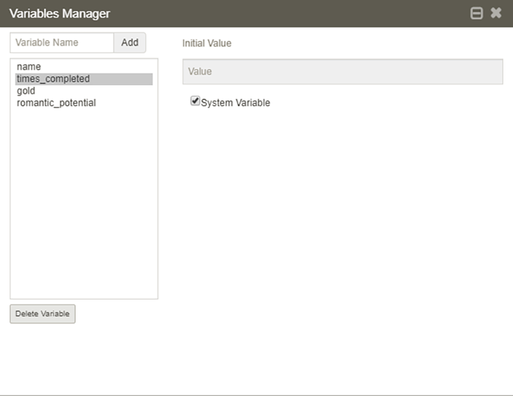
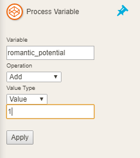
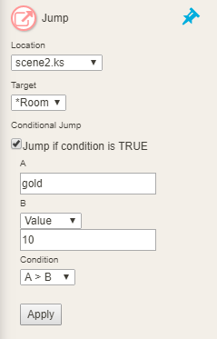
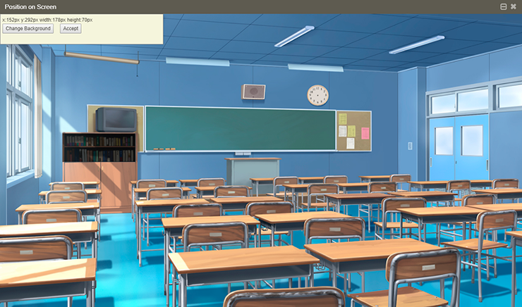

# Глава 5. Погружаемся глубже

Дойдя до этой главы, вы уже усвоили базовые теоретические и практические знания по _Ren’Py_, _Twine_ и _TyranoBuilder_. 
Теперь познакомимся с более сложными инструментами, которые имеются в рассматриваемом программном обеспечении. Например, 
разберём, как интегрировать видео в Ren’Py, как улучшить игры на Twine при помощи каскадных таблиц стилей (CSS), и как 
создать произвольный диалог в TyranoBuilder.

## Ren’Py, контейнеры и кодеки

Информация о форматах видео, по сути, не касается Ren’Py, TyranoBuilder или Twine, но она может оказаться полезной при 
работе с аудиовизуальными эффектами в проекте.

Видео (и аудио) файл обычно состоит из двух компонентов это контейнер и кодек. Контейнер — это файл, который содержит 
в себе видео, аудио и субтитры. В свою очередь кодек является инструментом для сжатия и распаковки видеофайла внутри 
контейнера. Существует многое количество кодеков, которые различаются между собой качеством и коэффициентом сжатия. 
Самыми популярными форматы контейнеров являются _.ogg_, _.webm_ и _.avi_, и соответственно они имеют поддержку на многих 
платформах как на настольных, так и на мобильных.

Что касается кодеков, то хорошим выбором является _H.264_ (известный как _MPEG-4_), _MPEG-2_ и _MPEG-1_. Данный формат 
был разработан в 1988 году _Хироси Ясудой_ и _Леонардо Кьярильоне_, а аббревиатура _MPEG (Moving Picture Experts Group)_ 
расшифровывается как _Экспертная группа по движущимся изображениям_.

Давайте, используя таблицу 5-1, сравним самые распространённые кодеки:

__Таблица 5-1.__ Наиболее распространенные видеокодеки

| Кодек                                       | Лицензия                                                     | Дата релиза | Особенности                                                                                                                                                  |
|---------------------------------------------|--------------------------------------------------------------|-------------|--------------------------------------------------------------------------------------------------------------------------------------------------------------|
| _VP9_                                       | Свободная                                                    | 2012        | Поддержка видео высокого разрешения (например, 4K/8K UHD), опция сжатия без потерь                                                                           |
| _VP8_                                       | Свободная                                                    | 2008        | Поддержка многопроцессорности. Свободный доступ для редактирования видео. Лучше всего использовать для видео с низким разрешением                            |
| _Theora_                                    | Свободная                                                    | 2004        | Поддерживает потоковую передачу видео через Интернет, достоянная картинка при низком битрейте                                                                |
| _H.264 (MPEG-4)_                            | Бесплатная для использования в Интернете                     | 2003        | Эффективен для потокового видео через Интернет, поддерживает разрешение до 8192 × 4320 (включая 8K UHD)                                                      |
| _Xvid, бесплатная реализация MPEG-4 part 2_ | Свободная (Универсальная общественная лицензия GNU)          | 2001        | Оптимизирована производительность, широкая поддержка                                                                                                         |
| _MPEG-2_                                    | Все американские патенты MPEG-2 истекли 13 февраля 2019 года | 1996        | Формат золотой стандарт DVD, может включать объемный звук 5.1                                                                                                |
| _MPEG-1_                                    | Свободная (срок действия патентов истек)                     | 1989        | Хорошо работает с видео с низким битрейтом (например, для небольших дисплеев), принимая во внимание как качество изображения, так и небольшой размер файла.  |

Теперь при помощи таблицы 5-2 сравним форматы контейнеров:

__Таблица 5-2.__ Наиболее распространенные видео контейнеры

| Формат контейнера                            | Лицензия               | Дата релиза | Поддерживаемые кодеки                                                               |
|----------------------------------------------|------------------------|-------------|-------------------------------------------------------------------------------------|
| _WebM_                                       | Свободная              | 2010        | Видео VP8 и VP9, аудио Ogg Vorbis и Opus audio                                      |
| _Matroska_                                   | Свободная              | 2002        | Любой                                                                               |
| _Ogg_                                        | Свободная              | 1993        | Видео Theora и Dirac. Аудио Opus, Vorbis и Speex                                    |
| _MPEG-контейнер (не путать с MPEG-кодеками)_ | Ограниченна            | 1993        | Видео MPEG-1 и MPEG-2. Аудио MPEG-1 Layers 1, 2, и 3 (то есть mp3)                  |
| _AVI_                                        | Относительно свободная | 1992        | В основном содержит несжатое видео (Full Frame), Intel Real Time (Indeo) и Cinepak  |

### Видео в Ren’Py

Воспроизвести видео в Ren’Py относительно простая задача. Благодаря поддержке нескольких широко распространённых 
видеоформатов, вам не придётся прибегать к трудному процессу преобразованию видео из одного формата в другой. 

Следующая строка кода, добавленная в сценарий, воспроизведёт видео во весь размер окна игры:

``` python
$ renpy.movie_cutscene("introvideo.webm")
```

Видео будет проигрываться до тех пор, пока не достигнет своего конца или пока игрок не щелкнет мышью. Но этим Ren’Py 
не ограничивается. Вы можете использовать видео как фон или как изображение персонажа. 

Давайте рассмотрим пример:

``` python
    image markus movie = Movie(play="markus_movie.webm", mask="markus_mask.webm")
    show markus movie
    "Разве это не весело?"
    hide markus movie
```

Данный код в первой строке определяет _видео спрайт_ (_movie sprite_) с именем "markus", которому присваивается 
видеофайл _markus_movie.webm_. Далее командой show воспроизводиться видео. Потом выводиться диалог, а затем видео 
скрывается командой hide.

Как мы знаем видео имеет квадратную или прямоугольную форму и не имеет прозрачности. Чтобы скрыть нежелательные края 
или фон в видео спрайте во время вызова метода Movie указывается параметр _mask_ (_маска_). _Маска_ – это видео такого 
же размера и продолжительности, что и видео, с которым она связана.

Что касается Ren’Py, то в маске белый цвет обозначает видимую область, а черный — область, которую нужно скрыть.

### Расширенные функции аудио в Ren’Py

Во время разработки игры возникает потребность одновременно воспроизводить фоновую музыку, звуковые эффекты, голоса 
персонажей. Для это в Ren'Py используется подход, при котором один аудиоканал используется для воспроизведения музыки, 
второй для звука, и ещё один для голоса. Каждый из этих каналов воспроизводит по одному аудиофайлу за раз. Если вам 
потребуется дополнительный аудиоканал вы можете его создать. Как это сделать будет показано далее в книге.

Нижеприведённом примере используются сразу все три канала для одновременного воспроизведения песни, звукового эффекта 
и диалога.

``` python
    play music "song1.ogg"
    play sound "boom.mp3"
    voice "dialogue1.ogg"
    "Привет, как ты?"
```

Ren’Py поддерживает _.wav_, _.ogg_, _.mp3_ и _Opus_ форматы. Из них формат .wav (который является стандартным аудио 
форматом для компакт-дисков), пожалуй, самый громоздкий, так как не имеет сжатия, его не рекомендуется для использования 
в релизной версии игры. Никто не любит, когда игра занимает много дискового пространства, а особенно когда она 
распространяется через Интернет (то есть будет долго загружаться). Наилучшее применение .wav формата – это когда звук 
находится на стадии обработки, и только после выполнения всех работ, его можно сохранить в формат с элементом сжатие. 
Имейте виду, при сжатии идёт потеря качества аудиодорожки, в результате вы получаете копию, а не оригинал. Если это 
повторить несколько раз, то качество звука сильно упадёт.

#### Аудио очереди

Игра будет более приятно восприниматься, когда в место одной короткой повторяющейся мелодии будет плейлист с 
разнообразной музыкой. Это можно легко сделать в Ren’Py при помощи метода _queue_. В примере показано, как создается 
очередь из трех мелодий (в формате .ogg) для музыкального канала.

``` python
queue music [ "song1.ogg", "song2.ogg", "happysong.ogg" ]
```

#### Параметры операторов воспроизведения и остановки

Оператор play не ограничивается простым открытием файла и его воспроизведением. Например, вы можете передать в него 
очередь аудиофайлов, задать затухание в начале и в конце.

``` python
play music [ "song1.mp3", "song2.mp3" ] fadeout 2.0 fadein 2.0
```

Если вы хотите остановить воспроизведение музыкального канала с затуханием длиной в 10 секунд, то нужно в операторе 
stop указать следующие параметры:

``` python
stop music fadeout 10.0
```

Если вам когда-нибудь понадобится вставить паузу перед воспроизведением, то воспользуйтесь тегом silence (тишина) с 
параметром длительность тишины в секундах.

``` python
play audio [ "<silence 2.5>", "song1.mp3" ]
```

#### Воспроизводим произвольную часть аудиофайла

Ren’Py при помощи оператора from позволяет прослушать часть аудиофайла. В приведённом примере воспроизводиться аудио 
_song1.mp3_ с 2,5 секунды до 10,5 секунды.

``` python
play music "<from 2.5 to 10.5>song1.mp3"
```

### Подробней о графике

Ren'Py может не только скрывать и показывать изображения, а имеет ряд дополнительных методов для работы с ними. Давайте 
познакомимся с наиболее полезными.

#### Цвет диалога

В предыдущей главе мы уже встречались с инициализацией персонажа и это выглядело так:

``` python
$ m = Character('Маркус', color="#EE1100")
```

Но в этот раз мы указали свойство color, которое задает цвет диалога персонажа в виде шестнадцатеричного значения. Оно 
в свою очередь состоит из красного, зеленого и синего цвета (т. е. RGB). Первые два символа после хэштега (#) задают 
значение красного цвета, третий и четвертый задают значение зеленого, а остальные символы задают значение синего цвета. 
Так как шестнадцатеричная система в качестве цифр счисления использует цифры от 0 до 9 и латинские буквы от A до F, то 
мы видим буквенные значения в определении цвета.

Такую же цветовую модель используют в HTML, CSS и во всех игровых движках, описанных в этой книге. В нашем примере 
персонажу Маркуса указывается красный цвет диалога с вкраплением зелёного. 

Давайте познакомимся с наиболее распространёнными цветами типа RGB (см. Таблице 5-3).

__Таблица 5-3.__ Наиболее популярные RGB цвета

| Цвет         | Шестнадцатеричное значение |
|--------------|----------------------------|
| _Черный_     | #000000                    |
| _Белый_      | #FFFFFF                    |
| _Серый_      | #808080                    |
| _Зеленый_    | #008000                    |
| _Синий_      | #0000FF                    |
| _Желтый_     | #FFFF00                    |
| _Красный_    | #FF0000                    |
| _Фиолетовый_ | #800080                    |
| _Апельсин_   | #FFA500                    |
| _Берливуд_   | #DEB887                    |

#### Выравниваем изображения

Если вам нужно отцентрировать изображение в независимости от позиции в пикселях, то укажите следующие параметры _xalign_
и _yalign_. Параметр xalign задает выравнивание по горизонтали, если указать 0,0 — изображение выровняется по левому 
краю, если указать 0,5 — то по центру, если 1,0 — то по правому краю. Соответственно параметр yalign выполняет 
выравнивание по вертикали, если указать 0,0 – выполниться выравнивание по верхнему краю, 0,5 — по центру, а значение 1,0 
выровняет изображение по нижнему краю экрана.

В следующей строке кода загружается файла _man.png_, который при выводе на экран отображаться в нижнем правом углу.

``` python
image man right = Image("man.png", xalign=1.0, yalign=1.0)
```

#### Добавляем переходы

Ren’Py имеет набор переходов между сценами. Чтобы их применить используется функция _with_. Если нужно настроить 
переходы для глобальных элементов игры используйте конфигурационные файлы _gui.rpy_ или _options.rpy_.

Рассмотрим пример использования перехода:

``` python
show bg garage
with dissolve
"Черт возьми! Эрни! Мы в гараже!"
```

Как видим скрипт выводит фоновое изображение гаража, используя классический переход _dissolve_ (_растворение_). 

Теперь давайте рассмотрим какие есть ещё переходы в Ren’Py (см. Таблицу 5-4).

__Таблица 5-4.__ Основные визуальные переходы в Ren’Py

| Переход                                                           | Описание                                                                                     |
|-------------------------------------------------------------------|----------------------------------------------------------------------------------------------|
| _dissolve_                                                        | Изображение исчезает или показывается с затуханием                                           |
| _fade_                                                            | Изображение, темнея исчезает или появляется из темноты                                       |
| _pixellate_                                                       | Изображение пикселизируется при исчезновении или депикселизируется при появлении             |
| _blinds_                                                          | Смена сцены при помощи эффекта "вертикальные жалюзи"                                         |
| _zoomin_                                                          | Новое изображение появляется с эффектом увеличения                                           |
| _zoominout_                                                       | Изображение исчезает с эффектом уменьшения                                                   |
| _move_                                                            | Анимирует перемещение изображения изменившее местоположение                                  |
| _slideawayleft_, _slideawayright_, _slideawayup_, _slideawaydown_ | Сдвигает старую сцену в заданном направлении                                                 |
| _slideleft_, _slideright_, _slideup_, _slidedown_                 | Сдвигает новую сцену в заданном направлении                                                  |
| _Vpunch_                                                          | При вызове этого перехода встряхивает экран в вертикальном направлении                       |
| _Hpunch_                                                          | При вызове этого перехода встряхивает экран в горизонтальном направлении                     |
| _easeinleft_, _easeinright_, _easeintop, _easeinbottom_           | Похож на move, за исключением того, что скорость движения строится на основе кривой косинуса |
| _irisin_, _irisout_                                               | Показывает новое изображение или скрывает текущее с помощью прямоугольника                   |
| _Squares_                                                         | Переход изображения квадратами                                                               |
| _wipeleft_, _wiperight_, _wipeup_, _wipedown_                     | Стирает изображение в указанном направлении                                                  |
| _moveoutright_, _moveoutleft_, _moveouttop_, _moveoutbottom_      | Перемещает изображение за пределы экрана                                                     |
| _moveinright_, _moveinleft_, _moveintop_, _moveinbottom_          | Переход выводит изображения на экран с соответствующей стороны                               |

Лучшим способом познакомиться с переходами в Ren’Py, — это, поэкспериментировать с ними. Никогда не знаешь, какую можно 
получить атмосферу в сцене комбинируя их.

### Настройка графического интерфейса в Ren’Py

Все элементы графического интерфейса (GUI) в Ren’Py можно настроить, отредактировав файл _gui.rpy_. Доступ к нему можно 
получить через лаунчер в разделе _"Редактировать файл"_. Этот текстовый файл содержит множество настроек, давайте 
рассмотрим некоторые из них (см. Таблицу 5-5).

__Таблица 5-5.__ Полезные опции в файле __gui.rpy__

| Опция                             | Описание                                                                                                        |
|-----------------------------------|-----------------------------------------------------------------------------------------------------------------|
| _define gui.text_size_            | Размер текста диалога. По умолчанию: 22                                                                         |
| _define gui.text_color_           | Устанавливает цвет текста диалога. По умолчанию: белый (#ffffff)                                                |
| _define gui.textbox_height_       | Устанавливает высоту диалогового окна. По умолчанию: 185 пикселей                                               |
| _define gui.name_text_size_       | Задаёт размер имен персонажей. По умолчанию: 30                                                                 |
| _define gui.text_font_            | Определяет внутриигровой шрифт. Файл со шрифтом должен находиться в папке с игрой. По умолчанию: DejaVuSans.ttf |
| _define gui.main_menu_background_ | Задаёт фоновое изображение главного меню игры. По умолчанию: "gui/main_menu.png"                                |
| _define gui.game_menu_background_ | Задаёт фоновое изображение игровом меню игры. По умолчанию: "gui/game_menu.png"                                 |
| _define gui.title_text_size_      | Устанавливает размер заголовка игры. По умолчанию: 50                                                           |
| _define gui.interface_text_size_  | Устанавливает размер текста в пользовательском интерфейсе. По умолчанию: 22                                     |
| _define gui.label_text_size_      | Устанавливает размер заголовка в пользовательском интерфейсе. По умолчанию: 24                                  |

Файл gui.rpy — это не единственный файл, который позволяет настроить работу Ren’Py, ещё имеется _options.rpy_. Его так 
же можно открыть через лаунчер в разделе _"Редактировать файл"_. Давайте разберём некоторые настройки из этого файла и 
что они значат для визуальной новеллы (см. Таблицу 5–6).

__Таблица 5-6.__ Полезные опции в файле __options.rpy__

| Опция                                                             | Описание                                                                                                                            |
|-------------------------------------------------------------------|-------------------------------------------------------------------------------------------------------------------------------------|
| _define gui.show_name_                                            | Определяет, показывать ли заголовок игры, на экране главного меню. По умолчанию: True                                               |
| _define config.has_sound_                                         | Показывает или скрывает звуковой микшер. По умолчанию: True                                                                         |
| _define config.has_music_                                         | Показывает или скрывает микшер музыки. По умолчанию: True                                                                           |
| _define config.has_voice_                                         | Показывает или скрывает микшер голоса в игре. По умолчанию: True                                                                    |
| _default preferences.text_cps_                                    | Контролирует скорость вывода текста. По умолчанию: 0 — мгновенно. Число больше нуля — это количество печатаемых символов в секунду. |
| _default preferences.afm_time_                                    | Устанавливает задержку при авточтении. По умолчанию: 15. Допустимый диапазон значений от 0 до 30.                                   |
| _define config.window_icon_                                       | Иконка значка на панеле задач и рабочем столе. По умолчанию: "gui/window_icon.png"                                                  |
| _define config.intra_transition_                                  | Задаёт типом перехода между экранами игрового меню. По умолчанию: dissolve                                                          |
| _define config.enter_transition_, _define config.exit_transition_ | Управляет типом визуального перехода при входе и выходе из игрового меню. По умолчанию: dissolve                                    |
| _define config.after_load_transition_                             | Устанавливает эффект перехода после загрузки игры. По умолчанию: None                                                             |

## Продвинутые функции TyranoBuilder

Хотя TyranoBuilder кажется простым инструментом разработки, но на самом деле под его капотом скрываются мощные методы 
для создания игр. Давайте познакомимся с некоторыми из них.

### Плагины

TyranoBuilder имеет возможность расширять свой функционал при помощи _плагинов_. Они могут быть как платные, так и 
бесплатные. На данный момент их уже существует десятки.

> **Примечание:**
> 
> Поддержка плагинов в TyranoBuilder была добавлена с версии 182.

Познакомится с плагинами можно на странице: [https://plugin.tyrano.jp/](https://plugin.tyrano.jp/) или на 
[https://plugin.tyrano.jp/en](https://plugin.tyrano.jp/en) (английская версия).

Чтобы добавить плагин в TyranoBuilder, сперва его нужно загрузить с указанного выше ресурса. Затем в главном меню 
выбираем _Project\Plugins_ (_Проект\Плагины_), после чего откроется диалоговое окно «Плагины». Далее нажимаем кнопку 
_Add New_ (_Добавить новый_), и выбираем ранее загруженный файл с расширением _.tbp_.

Для того чтобы воспользоваться встроенными и загруженными плагинами в главном меню выбираем 
_Project\Customize Tool Area_ (_Проект\Настройка области инструментов_). В появившемся диалоговом окне на вкладке 
_Components_ (_Компоненты_) находим _Plugins_ и ставим флажок. После нажатия кнопки _Apply_ (_Применить_) на вкладке с 
компонентами появится новый раздел Plugins (Плагины).

Хотя плагинов может существовать разное множество, давайте познакомимся с некоторыми из них (см. Таблицу 5-7).

__Таблица 5-7.__ Плагины TyranoBuilder и назначение

| Плагин                        | Описание                                                                                                                                             | URL                                 |
|-------------------------------|------------------------------------------------------------------------------------------------------------------------------------------------------|-------------------------------------|
| _Background Mask Transitions_ | Плагин позволяет выполнять смену фона с использованием маски. Содержит в себе множество различных переходов                                          | https://plugin.tyrano.jp/item/20007 |
| _Mask Transitions_            | Плагин позволяет добавить переходы на основе масок для персонажей. В комплекте 200 масок.                                                            | https://plugin.tyrano.jp/item/20014 |
| _Sleep and Awake_             | Позволяет игроку сохранить её и начать другой квест, а затем по своему желанию вернуться к исходному приключению.                                    | https://plugin.tyrano.jp/item/20001 |
| _Custom Save Game Thumbnail_  | Позволяет установить миниатюры для сохранений игры вместо захваченных TyranoBuilder.                                                                 | https://plugin.tyrano.jp/item/20002 |
| _Auto Save and Load_          | Добавляет компоненты, которые могут в игре выполнять автозагрузку и автосохранение.                                                                  | https://plugin.tyrano.jp/item/20003 |
| _Show Dialogue_               | Выводит диалоговое окно подтверждения поверх всех элементов игры.                                                                                    | https://plugin.tyrano.jp/item/20009 |
| _Change Title_                | Позволяет изменить заголовок окна игры. Например, можно использовать для отображения названия каждой главы новеллы.                                  | https://plugin.tyrano.jp/item/20010 |
| _Screen Filters_              | Добавляет компонент, который накладывает фильтр на экран игры. Включает в себя эффект размытия, прозрачности, оттенки серого, сепии, инверсию тонов. | https://plugin.tyrano.jp/item/20005 |
| _Open Website_                | Позволяет запустить браузер и открыть в нем веб-сайт.                                                                                                | https://plugin.tyrano.jp/item/20008 |
| _Sprite Sheets_               | Обеспечивает поддержку спрайтовой анимации. Имеет настройки: скорость воспроизведения, зацикливание и размер спрайтов.                               | https://plugin.tyrano.jp/item/20012 |

### Переменные

Переменные — это важная часть любой визуальной новеллы. Благодаря им вы можете хранить количество золота, которое имеет 
игрок или определить какое впечатление производит он или она друг на друга на основе их интересов. Для работы с 
переменными в TyranoBuilder имеется _Variables Manager_ (_Диспетчер переменных_). Чтобы его открыть, выберите в 
главном меню Project\Variables (Проект\Переменные) (см. рис. 5-1). Сами переменные записываются в сохранении игры.



__Рисунок 5-1.__ Диспетчер переменных в TyranoBuilder

TyranoBuilder также имеет _системные переменные_, которые хранятся независимо от функции сохранения игры. Такие 
переменные можно использовать, например, для подсчёта количества раз прохождения квеста и в результате игроку 
предложить альтернативную концовку.

Чтобы выполнить операции над переменными в TyranoBuilder имеется группа компонентов _System_ (_Система_), в которую 
входят три компонента: _Process Variable_ (_Операция над переменной_), _Input Box_ (_Поле ввода_) и _Commit Input_ 
(_Зафиксировать ввод_). Основным компонентом является Process Variable (см. рис. 5-2), который позволяет выполнить 
арифметические операции над переменной или присвоить ей случайное значение.



__Рисунок 5-2.__ Панель параметров компонента Process Variable

Теперь, чтобы переменные повлияли на историю, достаточно воспользоваться компонентом _Jump_ из группы компонентов 
_Story_, и в параметрах компонента поставить флажок возле _"Jump if conditional is TRUE"_. Как показано на рисунке 5-3. 



__Рисунок 5-3.__ Панель параметров компонента Process Variable

Как видим в добавленном компоненте перехода настроен переход на сцену _scene2_ к метке _Room_, но он выполниться только 
при условии, что переменная _gold_ (_золото_) будет больше 10.

Для создания поля ввода, например, получить имя игрока, используются компонент _Input Box_ и _Commit Input_. Для этого 
нужно перетянуть Input Box на сцену, а в параметрах задать имя переменной в поле _Assign Variable_ 
(_Назначить переменную_). Используя инструмент позиционирования, можно задать нужное положения поля на сцене. Чтобы 
зафиксировать ввод данных и присвоить их переменной, перетяните на сцену компонент Commit Input.

### Случайный диалог

В современных визуальных новеллах редко используют такой трюк как случайный диалог. Это когда из заранее заготовленного 
списка фраз или слов берётся случайный вариант и вставляется в диалог. Хотя это может никак не повлиять на основной 
сюжет, но добавит разнообразия в игру.

Для этого нам понадобиться компоненты _iScript_ и _TyranoScript_. 

Откройте проект с прошлой главы или создайте новый. Далее, перетащите компонент iScript поверх компонента _"Text"_. 
Затем добавим компонент TyranoScript между созданным компонентом iScript и компонентом Text. Теперь скопируем следующий 
код в iScript.

``` iScript
itemArray = [
  "яблоко",
  "ключи",
  "огурец",
  "федору",
  "наушники",
  "картошку"
];

randomItem = itemArray[Math.floor(Math.random()*itemArray.length)];
```

В данном скрипте мы определяем массив _itemArray_, переменную, которая хранит в себе несколько значений. Сами значения 
могут быть числами, символами или строками. Название переменной может быть произвольным, но в данном случае логичней 
использовать имя itemArray.

Далее мы определяем переменную _randomItem_, и помещаем в неё случайно выбранное значение из массива itemArray. Для 
этого благодаря функции _Math.random()_ генерируем случайное число от 0 до 1 и умножаем на длину массива 
_itemArray.length_, в результате получим значение от 0 до 5 в виде цифры с плавающей запятой, например, "4,34234". 
Чтобы это исправить воспользуемся функцией _Math.floor_, которая округлит число до 4.

Теперь, вставим следующую строку кода в компонент TyranoScript:

``` TyranoScript
[eval exp="randomitem_text=randomItem"]
``` 

Как видим, используя тег eval exp создаётся переменная _randomitem_text_, которой присваивается значение randomItem. 
То есть мы приводим неизвестный тип переменной randomItem к строковому типу. Это делается из-за того, что экран 
отображает только строки.

И в конце мы вставляем _randomitem_text_ в компонент Text, как показано в примере ниже:

```
Привет!
О, нет! Я потерял [emb exp="randomitem_text"]!
```

Запускаем проект, и на экране отобразится что-то вроде «Привет! О, нет! Я потерял огурец!».

Заметьте, в показанном примере используется тег _emb_ для встраивания выражений в диалог.

Если задуматься об оптимизации скрипта, то шаг с компонентом TyranoScript можно пропустить, а в компоненте Text указать 
следующий код:

```
Привет!
О, нет! Я потерял [emb exp="randomItem"]!
```

### iScript в сравнении с JavaScript

Глобальные переменные в JavaScript объявляются при помощи ключевого слова _var_, а так как это язык с динамической 
типизацией, то тип определяется автоматически.

``` JavaScript
var myName = "Тим";
var myAge = 54;
```

Если посмотреть на пример ниже, то мы увидим, что для объявления переменных в iScript используется другой синтаксис, 
что является основным отличием от JavaScript.

``` iScript
f.myName = "Тим";
f.myAge = 54;
```

Запомните, iScript — это, по сути, JavaScript, а TyranoScript – это язык разметки с возможностью интеграции тегов.

### Кликабельные области изображения

В TyranoBuilder на фоновом изображении можно создать _кликабельные области_. Например, у вас на изображении есть дверь, 
по которой выполнив щелчок, игрока перенесёт на другую сцену. Так как кликабельные области не имеют своего изображения 
они всегда используются в комбинации с компонентом "_Background Image (Фоновое Изображение)_".



__Рисунок 5-4.__ Инструмент позиционирования кликабельной области. В данном случае книжная полка определена как
кликабельная область.

Чтобы добавить кликабельную область, перетащите компонент "_Clickable Area (Кликабельная область)_" под компонент 
фонового изображения. Далее, в параметрах вызываем инструмент позиционирования (см. Рисунок 5-4), и используя маску, 
имеющую вид затемнённого прямоугольника, задаём позицию и размер активной области.

После указания маски задаём параметр "_Location (Местоположение)_" то есть имя сцены и "_Target (Цель)_" то есть метку 
на сцене куда перенесётся игрок при клике по активной области.

### Пользовательские шрифты
