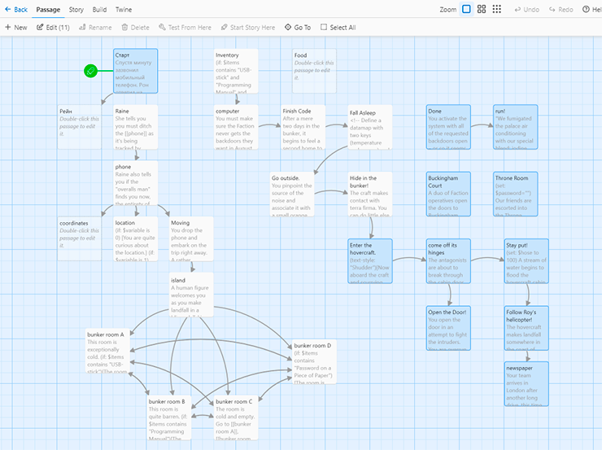
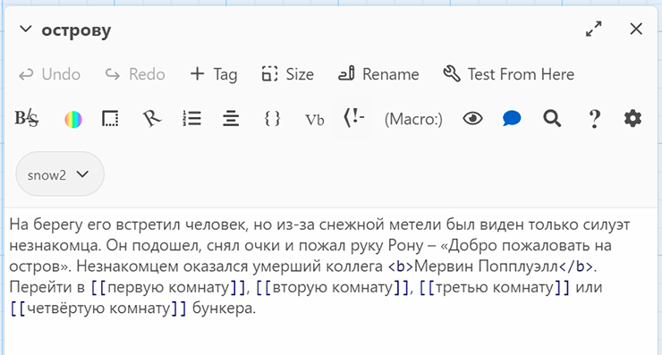
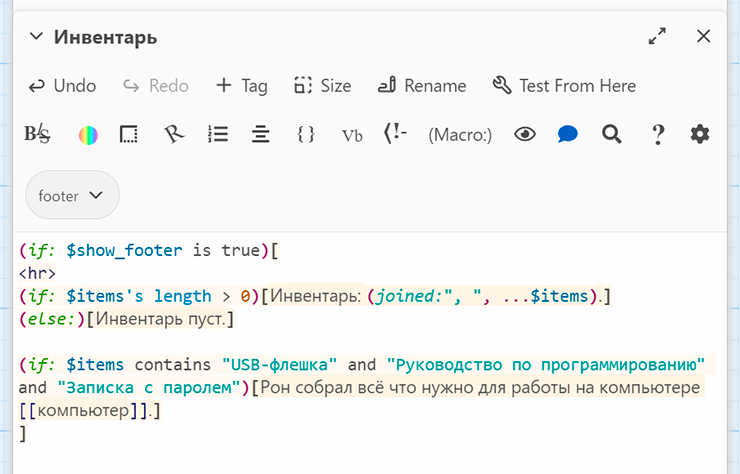

# Глава 7. Три мини игры

На основе рассмотренной в первой главе повести мы создадим визуальную новеллу на Ren’Py, Twine и TyranoBuilder под 
названием _"Август возвращается"_. В процессе создания предпочтение будет предоставлено больше Ren’Py.

Хотя вы можете написать свою собственную историю, однако, чтобы это сделать правильно, лучше сперва познакомьтесь, как 
происходит процесс превращения повести в игру.

## Составляем план

Перед программированием, желательно составить план для вашего приключения, то есть сделать каталогизацию персонажей, 
определить сцены. Может показаться это лишним, но без этого не обойтись при работе в больших командах.

Сначала разложим повесть _"Август возвращается"_ на блоки в виде таблиц. Так же вы можете воспользоваться другим методом 
визуализации для этих целей. Главное – не пропускать данный этап, во избежание негативных последствий при создании игры.

### Состав персонажей

Начнем с персонажей (см. Таблицу 7-1). Если забыли про них, то вернитесь к первой главе книги.

В это же главе повторите материал про 12 архетипов личности Джозефа Кэмпбелла, некоторые из них будут использованы в 
создаваемой игре.

__Таблица 7-1.__ Главные герои

| Герой                         | Роль/Архетип                | Пол и Возраст         | Внешний вид                                                 |
|-------------------------------|-----------------------------|-----------------------|-------------------------------------------------------------|
| _**Рон Легион-Смерти**_       | Главный герой (т. е. игрок) | Мужчина, около 30 лет | Среднего телосложения и роста, на вид физически подтянутый  |
| _**Мервин Попплуэлл**_        | Искатель                    | Мужчина, лет за 30    | Худой, среднего роста, небрежно одетый                      |
| _**Ройстон Медовая-Бабочка**_ | Мудрец                      | Мужчина, 50 лет       | Крепкое телосложение, имеет обычный вид                     |
| _**Клэр**_                    | Правитель                   | Женщина, около 20 лет | Спортивное телосложение, среднего роста, модно одетая       |
| _**Человек в комбинезоне**_   | Бунтарь                     | Мужчина, без возраста | Спортивное телосложение, высокий, лысый с причудливым видом |
| _**Рейн**_                    | Любовник                    | Женщина, около 30 лет | Среднее телосложение, низкий рост, изящный вид              |

### Локации

В визуальных новеллах главное не количество локаций, а количество слов в повествовании. В среднем это от 10000 до 50000 
слов.

> Примечание:
> 
> Игра, создаваемая в этой книге, не соответствует вышеуказанному правилу.

По сравнению с каталогизацией персонажей, определиться с локациями событий в игре сложнее. Слишком малое количество 
портят атмосферу, а слишком много сбивают с толку игрока. Лучше всего начать с малого, определить основные элементы 
игры, после чего разделить их на более мелкие единицы (например, комнаты) (см. Таблицу 7-2).

Для построения истории мы воспользуемся такими понятиями как:

* **Сеттинг** – это среда, в которой происходит действие, где определяются базовые свойства реальности. В нашем случае 
это общая тема, атмосфера происходящего (например, стиль фона).
* **Место**, обстоятельство и время при которых развиваются события. Здесь могут быть применены разные звуковые дорожки,
задний фон.
* **Комнаты** – наименьшая единица локации игры, которые часто имеют связь между собой.

__Таблица 7-2.__ Основные сеттинги и места повести "Август возвращается"

| Сеттинг                              | Место                                      | Пример описание комнаты                                                                                                                                                                           |
|--------------------------------------|--------------------------------------------|---------------------------------------------------------------------------------------------------------------------------------------------------------------------------------------------------|
| _**Офис**_                           | _Рабочее место Рона_                       | Вы бездельничаете за рабочим столом, на котором среди стопок бумаг стоит персональный компьютер. Только наклейка с изображением женщины-киборга выделяет ваше рабочее место среди всех остальных. |
| _**Офис**_                           | _Помещение, где храниться сотовый телефон_ | Поднявшись на верхний этаж, вы попадаете в заброшенную часть офиса со старой мебелью.                                                                                                             |
| _**Город**_                          | _Парк, Арка_                               | Ночь, одинокая арка городского парка, статуи освещённые тусклым светом, только усиливают волнения и страх вызванный недавними событиями.                                                          |
| _**Офис (Пожар)**_                   | _Рабочий стол Рона_                        | Ад. Рабочее место Рона окутано огнём. Защищаясь портфелем, он ныряет в него.                                                                                                                      |
| _**Город (Жилой район)**_            | _Квартира Рона_                            | Квартира главного героя становится не такой безопасной, когда из-за двери доносятся странные звуки.                                                                                               |
| _**Город (Железнодорожный вокзал)**_ | _Железнодорожный вокзал_                   | Вы испуганный, лихорадочно просматриваете расписание движения поездов в поиске ближайшего, который готов к отправке.                                                                              |
| _**Поезд**_                          | _Поезд на север_                           | Сидя в мягком сиденье поезда, женщина с черными волосами напротив вас сняла наушники, улыбнулась и представилась.                                                                                 |
| _**Конечная станция**_               | _Конечная станция_                         | Пытаясь слиться с толпой, вас ловят за руку.                                                                                                                                                      |
| _**Остров**_                         | _Остров_                                   | Вы высаживаетесь на острове, для вас это чужой мир. Холод проникает до дрожи костей. Корабль покидает причал, и вы остаетесь один на холодном северном ветре.                                     |
| _**Остров**_                         | _Бункер_                                   | Незаметное снаружи строение на удивление оказалось просторным, комфортным, с отличной мебелью. Это напоминало больше отель нежели бункер.                                                         |
| _**Океан**_                          | _Судно_                                    | По правому борту без опознавательных знаков появляется второе судно. Вы начинаете паниковать.                                                                                                     |
| _**Север**_                          | _Аэропорт_                                 | Вы оказываетесь в международном аэропорту, заполненным огромным количеством людей. Возможность раствориться в толпе успокаивает вас.                                                              |
| _**Город**_                          | _Аэропорт_                                 | Вас окружает беззаботная жизнь. Туристы, тянут свой багаж, но вы внутренне готовитесь к битве всей своей жизни.                                                                                   |
| _**Город**_                          | _Резиденция президента_                    | Нет времени любоваться городом. По вам открыли огонь, остается только бежать.                                                                                                                     |
| _**Новый офис**_                     | _Новое рабочее место Рона_                 | Прежде чем приступить к новым обязанностям, он с тяжестью в душе возвращает старый сотовый телефон в шкаф.                                                                                        |

Теперь разделим вышеупомянутые места на более мелкие эпизоды, а именно на комнаты. Давайте сперва это сделаем для 
сеттинга "Офис" (см. Таблицу 7-3).

__Таблица 7-3.__ Сеттинг "Офис" в повести "Август возвращается"

| Сеттинг    | Место                                          | Комната                       | Связанные комнаты                                    |
|------------|------------------------------------------------|-------------------------------|------------------------------------------------------|
| _**Офис**_ | _Рабочее место Рона_                           | _Рабочий стол Рона_           | _Зона с питьевым фонтанчиком, Рабочий стол Ройстона_ |
|            |                                                | _Зона с питьевым фонтанчиком_ | _Рабочий стол Рона, Соседний рабочий стол_           |
|            |                                                | _Соседний рабочий стол_       | _Зона с питьевым фонтанчиком_                        |
|            | _Верхний этаж (т. е. место хранение телефона)_ | _Рабочий стол Ройстона_       | _Рабочий стол Рона, Шкаф для документов_             |
|            |                                                | _Шкаф для документов_         | _Рабочий стол Ройстона_                              |

#### _Сеттинг I. Офис_

Как вы, помните, наше приключение начинается с того, что Рон получает загадочное письмо от умершего коллеги, некоего 
Мервина Попплуэлла.

Замечания по обстановки в **Офисе**:

* Тон написания должен быть мрачным и зловещим.
* Звуковое сопровождение — это рабочий шум офиса, звуки работающей аппаратуры, ксерокса, приглушенные голоса 
сотрудников, телефонный звонки и разговоры.

#### _Сеттинг II. Город_

Выполняя инструкцию из загадочного письма, мы идем по улицам города в направлении арки парка (см. Таблицу 7-4).

__Таблица 7-4.__ Сеттинг "Город" в повести "Август возвращается"

| Сеттинг     | Место   | Комната             | Связанные комнаты |
|-------------|---------|---------------------|-------------------|
| _**Город**_ | _Парк_  | _Парк_              | _Арка_            |
|             | _Арка_  | _Арка_              | _Парк_            |
|             | _Улица_ | _Дорога мимо офиса_ | _Арка_            |
|             |         | _Увиденный пожар_   | _Нет_             |

Замечание к дизайну **Города**:

* Тон письма по-прежнему должен быть зловещим.
* Звук — это уличная суета: проезжающие мимо автомобили, шаги людей, разговоры по мобильным телефонам, и иногда сигнал 
работающего светофора.

#### _Сеттинг III. Офис (Пожар)_

Это один из опасных моментов в приключениях нашего главного героя. Рон решился вернуться в свой офис, но он оказался 
охвачен огнем (см. Таблицу 7-5). Не имея средств защиты, кроме портфеля, он бросается в жерло пожара.

__Таблица 7-5.__ Сеттинг "Офис (Пожар)" в повести "Август возвращается"

| Сеттинг            | Место                  | Комната             | Связанные комнаты                    |
|--------------------|------------------------|---------------------|--------------------------------------|
| _**Город**_        | _Вход в офис со двора_ | _Переулок_          | _Пожарная лестница_                  |
| _**Офис (Пожар)**_ |                        | _Пожарная лестница_ | _Помещение офиса_                    |
|                    |                        | _Помещение офиса_   | _Рабочий стол Рона_                  |
|                    |                        | _Рабочий стол Рона_ | _Соседний стол А_                    |
|                    |                        | _Соседний стол А_   | _Рабочий стол Рона, Соседний стол Б_ |
|                    |                        | _Соседний стол Б_   | _Соседний стол А_                    |

Замечания по обстановке в сеттинге **Офис (Пожар)**:

* Тон повествования должен выражать огорчение и растерянность главного героя.
* Аудио сопровождение в данном сеттинге — это звуки пожарных машин, пламени и обрушения внутри здания.

#### _Сеттинг IV. Город (Жилой район)_

В этой точке сюжета Рон направляется домой. Но и здесь что-то происходит непонятное. Он слышит, странные звуки из своей 
квартиры. Рон чувствует интуицией, что если туда войдет, то уже никогда из неё не выйдет (см. Таблицу 7-6).

__Таблица 7-6.__ Сеттинг "Город (Жилой район)" в повести "Август возвращается"

| Сеттинг                   | Место           | Комната               | Связанные комнаты        |
|---------------------------|-----------------|-----------------------|--------------------------|
| _**Город (Жилой район)**_ | _Квартира Рона_ | _Улица_               | _Нет_                    |
|                           |                 | _Коридор_             | _Улица_                  |
|                           |                 | _Дверь квартира Рона_ | _Коридор, Квартира Рона_ |
|                           |                 | _Квартира Рона_       | _Нет_                    |

Замечание к дизайну **Город (Жилой район)**:

* Написание в этой короткой, но напряженной сцене, должно передавать чувство обреченности.
* Что касается аудио, то мы должны услышать эхо шагов и непривычные инопланетные звуки.

#### _Сеттинг V. Город (Железнодорожный вокзал)_

Теперь, находиться в городе стало опасно для жизни Рона, его нужно немедленно покинуть, из-за чего он как можно скорей 
пытается добраться до вокзала. Где Рон садится на первый поезд, идущий на север (см. Таблицу 7-7).

__Таблица 7-7.__ Сеттинг "Город (Железнодорожный вокзал)" в повести "Август возвращается"

| Сеттинг                              | Место                    | Комната       | Связанные комнаты     |
|--------------------------------------|--------------------------|---------------|-----------------------|
| _**Город (Железнодорожный вокзал)**_ | _Железнодорожный вокзал_ | _Статуя_      | _Платформа А_         |
|                                      |                          | _Платформа А_ | _Статуя, Платформа Б_ |
|                                      |                          | _Платформа Б_ | _Поезд_               |
|                                      |                          | _Поезд_       | _Нет_                 |

Замечание к дизайну **Город (Железнодорожный вокзал)**:

* Тон написания остаётся прежним. Рона преследуют, и он в панике.
* Звук в этом сеттинге такой же, как и в городе, только сообщает о присутствии большого количества людей.

#### _Сеттинг VI. Поезд_

Зайдя в поезд, Рон немного успокаивается. Однако это спокойствие длится недолго, его продолжают преследовать 
(см. Таблицу 7-8). В результате он запирается в туалете, прячась от преследователей. В этот момент ему позвонили на 
старый мобильный телефон, и сказали покинуть поезд на ближайшей станции.

__Таблица 7-8.__ Сеттинг "Поезд" в повести "Август возвращается"

| Сеттинг     | Место            | Комната           | Связанные комнаты            |
|-------------|------------------|-------------------|------------------------------|
| _**Поезд**_ | _Поезд на север_ | _Двери поезда_    | _Нет_                        |
|             |                  | _Первый вагон_    | _Второй вагон, Двери поезда_ |
|             |                  | _Второй вагон_    | _Первый вагон_               |
|             |                  | _Туалет в поезде_ | _Второй вагон, Третий вагон_ |
|             |                  | _Третий вагон_    | _Нет_                        |

Замечание к дизайну сеттинга **Поезд**:

* Обстановка в плане драматичности остаётся прежней и усиливается к завершению данного сеттинга.
* Атмосфера – тихий шум движущегося поезда.

#### _Сеттинг VII. Конечная станция_

Рон, не зная, что делать, метается по платформе, пока его не хватает кто-то за руку. Рона начинает трясти, но это 
оказался коллега из отдела технической поддержки Ройстон Медовая-Бабочка. После встречи они оказываются в парке на 
скамейке возле станции, где Рону сообщают о деталях происходящего (см. Таблицу 7-9).

__Таблица 7-9.__ Сеттинг "Конечная станция" в повести "Август возвращается"

| Сеттинг                | Место              | Комната            | Связанные комнаты            |
|------------------------|--------------------|--------------------|------------------------------|
| _**Конечная станция**_ | _Конечная станция_ | _Платформа А_      | _Платформа Б_                |
|                        |                    | _Платформа Б_      | _Платформа А, Дорога в парк_ |
|                        |                    | _Дорога в парк_    | _Скамейке в парке_           |
|                        |                    | _Скамейке в парке_ |                              |

Замечание к дизайну сеттинга **Конечная станция**:

* Не считая ситуации на платформе, сеттинг имеет расслабленный тон повествования. В этой сцене благодаря встречи с 
союзником главный герой чувствует себя в безопасности.
* Звуковое сопровождение должно быть как в сеттинге «Город», но более тихим и не таким насыщенным.

#### _Сеттинг VIII. Остров_

Когда Ройстон покинул Рона, ему снова позвонили на телефон. Рейн сообщает ему, что нужно избавиться от телефона, и 
используя поезд, паром, рыбацкую лодку, прибыть в течении трёх дней на самый дальний остров на севере (см. Таблицу 7-10).

На самом острове Рона встречает погибший Мервин Попплуэлл, и скрывшись в бункере из четырех комнат, за чашкой чая Рону 
рассказывают, что нужно закончить работу над системой безопасности «Август».

Поскольку команда не может защититься, на помощь, используя вертолет, прилетает Ройстон Медовая-Бабочка.

__Таблица 7-10.__ Сеттинг "Остров" в повести "Август возвращается"

| Сеттинг      | Место    | Комната                       | Связанные комнаты                                                                 |
|--------------|----------|-------------------------------|-----------------------------------------------------------------------------------|
| _**Остров**_ | _Остров_ | _Берег_                       | _Путь к бункеру А_                                                                |
|              |          | _Путь к бункеру А_            | _Путь к бункеру Б_                                                                |
|              |          | _Путь к бункеру Б_            | _Вход в бункер_                                                                   |
|              |          | _Вход в бункер_               | _Первая комната в бункере_                                                        |
|              | _Бункер_ | _Первая комната в бункере_    | _Вторая комната в бункере, Третья комната в бункере, Четвертая комната в бункере_ |
|              |          | _Вторая комната в бункере_    | _Первая комната в бункере, Третья комната в бункере, Четвертая комната в бункере_ |
|              |          | _Третья комната в бункере_    | _Первая комната в бункере, Вторая комната в бункере, Четвертая комната в бункере_ |
|              |          | _Четвертая комната в бункере_ | _Первая комната в бункере, Вторая комната в бункере, Третья комната в бункере_    |

Замечание к дизайну сеттинга **Остров**:

* Остров — это место, где главный герой приходит в себя и собирается с силами, все это должен отобразиться в сценарий. 
После напряженного начала на этом этапе игры игрок чувствует себя непринужденно.
* Так как события происходят на дальнем севере мы должны слышать звуки океана и сильного ветра.

#### _Сеттинг IX. Океан_

Спустя несколько дней к Рону прибывает Рейн и предлагает покинуть бункер, так как в резиденции президента произошло 
чрезвычайное происшествие. Рон принимает предложение. После чего они покидают остров, погрузившись на судно на воздушной 
подушке. Хоть это и короткая сцена, но из-за эпизода с нападением на корабль, очень напряженная (см. Таблицу 7-11).

__Таблица 7-11.__ Сеттинг "Остров" в повести "Август возвращается"

| Сеттинг     | Место                   | Комната  | Связанные комнаты |
|-------------|-------------------------|----------|-------------------|
| _**Океан**_ | _Судно_                 | _Палуба_ | _Рубка_           |
|             |                         | _Рубка_  | _Палуба_          |
|             | _Спасательный вертолёт_ | _Рубка_  | _Палуба_          |
|             |                         | _Палуба_ | _Рубка_           |

Замечание к дизайну сеттинга **Океан**:

* Тон написание должен вызывать чувство динамики и опасности. 
* Звук соответствует тону письма. Мы слышим двигатель судна, тяжелые шаги, металлическое эхо, грохот дверей, шум волн 
океана, и в итоге нарастающий звук вертолета.

#### _Сеттинг X. Север_

Рон и его друзья покинули остров и высадились на побережье материка, где их уже ждала машина, чтобы отвезти в аэропорт. 
Используя частный самолёт, они вылетают в столицу. Во время полёта они узнают про ужасные события в резиденции 
президента (см. Таблицу 7-12).

__Таблица 7-12.__ Сеттинг "Север" в повести "Август возвращается"

| Сеттинг     | Место       | Комната                 | Связанные комнаты                         |
|-------------|-------------|-------------------------|-------------------------------------------|
| _**Север**_ | _Побережье_ | _Побережье_             | _Автомобиль в аэропорт_                   |
|             | _Аэропорт_  | _Автомобиль в аэропорт_ | _Зона аэропорта А_                        |
|             |             | _Зона аэропорта А_      | _Зона аэропорта Б, Автомобиль в аэропорт_ |
|             |             | _Зона аэропорта Б_      | _Самолет в столицу_                       |
|             |             | _Самолет в столицу_     | _Нет_                                     |

Замечания к дизайну сеттинга **Север**:

* Текст в этом сеттинге должен спокойно вести повествование, так как большую часть врагов погибло в предыдущем сеттинге. 
Однако, происшествие в резиденции может поставить крест на миссии. 
* Звуковой фон должен успокаивать игрока. Можно добавить звуки поездки с берега в аэропорт, звук двигателя самолёта.

#### _Сеттинг XI. Город_

Рон и его друзья, прибыв в столицу, немедленно направляются в резиденцию президента (см. Таблицу 7-13). Где Рон 
встречает Клер и человека в комбинезоне. Им сообщают, что премьер-министр похищен, и чтобы его освободить Рон должен 
передать исходный код системы безопасности «Августа».

Рон соглашается с выдвинутыми условиями, но ухитряется обмануть врагов, подсунув им исправную систему безопасности, а 
спецназ в свою очередь обезвреживает всех сотрудников «Фракции».

В конце концов Рон оказывается дома, а когда возвращается офис, узнает, что он получает должность, которую раньше 
занимал Ройстон. Конец!

__Таблица 7-13.__ Сеттинг "Город" в повести "Август возвращается"

| Сеттинг     | Место                   | Комната                          | Связанные комнаты                |
|-------------|-------------------------|----------------------------------|----------------------------------|
| _**Город**_ | _Аэропорт_              | _Прибытие_                       | _Машине в резиденцию президента_ |
|             |                         | _Машине в резиденцию президента_ | _Лестница_                       |
|             | _Резиденция президента_ | _Лестница_                       | _Парадный вход_                  |
|             |                         | _Парадный вход_                  | _Зал, Лестница_                  |
|             |                         | _Зал_                            | _Парадный вход_                  |
|             | _Дом Рона_              | _Приемная_                       | _Спальня_                        |
|             |                         | _Спальня_                        | _Приемная, Балкон_               |
|             |                         | _Балкон_                         | _Спальня_                        |


Замечание к дизайну сеттинга **Город**:

* Тон письма должен быть сухим, холодным. Он должен показать в действиях главного героя твёрдость и расчетливость. Рон за 
нескольких недель своих приключений пережил многое, стал мудрее.
* Что касается звука, находясь в столице — это шум города, а попав в резиденцию президента – это тихая атмосфера. Так же 
мы должны выделить динамические сцены и сцены, в которых нужно принимать судьбоносные решения.

#### _Сеттинг XII. Новый офис_

Рон возвращается на работу. Офис отремонтирован за время его отсутствия, стоят новые рабочие столы и компьютеры 
(см. Таблицу 7-14).

Появляется Ройстон и говорит, что уходит на пенсию. Он предлагает Рону занять его место в отделе технической поддержки. 
Рон не задумываясь соглашается, понимая, что в будущем его ожидают новые приключения.

__Таблица 7-14.__ Сеттинг "Новый офис" в повести "Август возвращается"

| Сеттинг          | Место                                      | Комната                                            | Связанные комнаты                                    |
|------------------|--------------------------------------------|----------------------------------------------------|------------------------------------------------------|
| _**Новый офис**_ | _Новое рабочее место Рона_                 | _Рабочий стол Рона_                                | _Зона с питьевым фонтанчиком, Рабочий стол Ройстона_ |
|                  |                                            | _Соседний рабочий стол_                            | _Новое рабочее место Рона_                           |
|                  | _Помещение, где храниться сотовый телефон_ | _Рабочий стол Ройстона (Новое рабочее место Рона)_ | _Новое рабочее место Рона, Хранилище документов_     |
|                  |                                            | _Хранилище документов_                             | _Рабочий стол Ройстона_                              |

Замечание к дизайну сеттинга **Новый офис**:

* Текст должен вызывать чувство триумфа и оптимизма.
* В этом сеттинге мы должны слышать спокойную рабочую обстановку в офисе.

## Часть I: Начало "Август возвращается" в Ren’Py

Теперь пришло время приступить к написанию кода. "Август возвращается" имеет 61 комнату, приблизительно от 2000 до 2500 
слов, и этого достаточно чтобы познакомится с процессом разработки игр в Ren’Py.

### Создание проекта

На Лаунчере Ren’Py нажмите _"Добавить новый проект"_. У вас запросят указать имя проекта на латинице, в нашем случае — 
это _"Avgust Vozvrashaetsya"_. Затем выбираем разрешение для проекта, по умолчанию это 1920x1080 (Full HD) и нажимаем 
_"Продолжить"_. На следующем шаге задаём _цветовую схему_ игры. Если возникнет потребность данные параметры можно будет 
изменить. После нажатия _"Продолжить"_, Ren’Py выполнить процесс создания проекта и вернёт вас на главный экран лаунчера. 

В левой части в разделе _"Проекты"_, выберите "Avgust Vozvrashaetsya". Далее в разделе _"Редактировать файл"_ нажмите 
на файле _script.rpy_. Он откроется в текстовом редакторе. Это основной скрипт игры. На протяжении данной главы мы в 
основном будем работать только с ним.

Нужно отметить, что скрипты Ren’Py очень чувствительны к пробелам и синтаксису. Например, некоторые текстовые редакторы 
выполняют авто форматирование и заменяют _обычные кавычки_ на _изогнутые_. Это приводит к тому, что Ren’Py не может 
выполнить скрипт. Желательно отключите авто форматирование в вашем текстовом редакторе или используйте IDE 
(интегрированную среду разработки).

### Настройка персонажей

По умолчанию в файле сценария присутствует персонаж Эйлин. Мы его заменим на свой список персонажей указав имя и цвет 
диалога.

Для цвета в Ren’Py используется шестнадцатеричный формат, как и в HTML. В котором первые две цифры это красный цвет, 
следующие две – зелёный, а последние две – синий. Диапазон значений состоит от 0 до 9, потом от A до F. Например, 
красный цвет имеет значение: _#FF0000_, а черный: _#000000_.

Откройте файл script.rpy и найдите следующую строку:

```python
define e = Character('Эйлин', color="#c8ffc8")
```

И вместо неё вставьте следующий код:

```python
define reg = Character("Рон Легион-Смерти", color="#0099BB")
define merv = Character("Мервин Попплуэлл", color="#007799")
define roy = Character("Ройстон Медовая-Бабочка", color="#0044CC")
define rai = Character("Рейн", color="#8888EE")
define cla = Character("Клэр", color="#AA1100")
define man = Character("Человек в комбинезоне", color="#EE1100")
```

Как видим для каждого персонажа задаётся имя и цвет диалога, а сам персонаж в свою очередь присваивается константе виде 
сокращенного имени. Для различия главному герою и его команде задаются цвета синих оттенков, а стороне антагониста 
оттенки красного цвета.

### Переходы

Ранее в этой книге мы уже познакомились со стандартными переходами в Ren’Py (например, _затухание_, _растворение_, 
_пикселизация_), но иногда нужно создать переходы с индивидуальными параметрами. Добавим два таких перехода в скрипт 
игры. Первый это _"slideleft"_ - слайдер в лево, который выполняет переход в течении двух секунд. Второй _"fireflash"_ -
вспышка, который представляет собой переход к ярко-оранжевому цвету и обратно. Он будет использоваться для сцен пожара. 

```python
define slideleft = CropMove(2.0, "slideleft")
define fireflash = Fade(0.1, 0.0, 0.5, color="#e40")
```

### Изображения для персонажей

На лаунчере Ren’Py в раздел _"Открыть папку"_ есть ссылка _images_. После её нажатия откроется каталог с изображениями 
проекта.

Чтобы назначить изображение персонажу, нужно выполнить следующие правило: имя файла с изображением должно совпадать с 
именем константы, в которой храниться персонаж. Например, в нашем случае нужно добавить изображения с именами _reg.png_, 
_merv.png_, _roy.png_ и так далее. Так же файл с именем _Reg.png_ соответствует _reg.png_ и будет присвоен персонажу, 
но файл с именем _Reginald.png_ уже не подойдёт.

Нужно не забывать, что Ren’Py для персонажей использует формат изображения PNG и WEBP, а для фона JPG, PNG и WEBP.

### Подготовка ассетов

Хоть Ren’Py на основе имени автоматически подгружает изображения персонажей, то остальные аудиовизуальные ресурсы нужно 
явно определить в файле скрипта. Как мы увидим позже большая часть ресурсов в создаваемой игре это фоновые изображения 
в формате jpg, которым присвоены соответствующие имена.

Единственным исключением является персонаж Рейн. В определённый момент игры её лицо становится серьёзным. Для этого мы 
дополнительно загружаем изображение выполнив следующую команду:

```python
image rai serious = "rai_serious.png"
```

Теперь для вывода персонажа Рейн с серьезным выражением лица нужно выполнить команду _rai serious "Да, я серьезно!"_. 
На основе данного приёма сделайте своих персонажей более живыми используя как можно больше изображений с различными 
эмоциями лица.

Помните, вы можете использовать оператор image для определения как основного портрета персонажа (например, 
_image jimmy = "jimmy.png"), так и для дополнительных (например, _image jimmy happy = "jimmyhappy.png"_). Однако перед 
этим вам нужно определить персонажа (например, _define jimmy = Character("Jimmy")_), что мы и сделали в главе 
_"Настройка персонажей"_.

Теперь давайте определим ассеты для офиса, которые можно скрывать и показывать при помощи команд _hide_ и _show_ 
(например, чтобы показать изображение офиса _office1_.jpg, нужно выполнить команду: _show office_, а чтобы скрыть 
выполнить команду: _hide office_)

```python
image office = "office1.jpg"
image office2 = "office2.jpg"
image email = "email.jpg"
image topfloor = "topfloor.jpg"
image cooler = "cooler.jpg"
```

Далее назначим изображения для сцен города, парка, станции и т.д.:

```python
image london = "london.jpg"
image london2 = "london2.jpg"
image park = "park1.jpg"
image park2 = "park2.jpg"

image alley = "alley.jpg"
image door = "door.jpg"
image window = "window.jpg"

image station = "station.jpg"
```

В конце, определим четыре изображения для огня, которые будут отображаться в случайном порядке, чтобы показать хаос 
пожара.

```python
image fire1 = "fire1.jpg"
image fire2 = "fire2.jpg"
image fire3 = "fire3.jpg"
image fire4 = "fire4.jpg"
```

### В бой!

Теперь мы приступим к написанию основного сценария. Укажем кто мы и чем занимаемся. Для этого отобразим портрет главного 
героя в точке с координатами xpos: 0.7 и ypos: 0.2, где значение 0.0 – это левый край, а 1.0 правый. Так же применим 
ранее определённый эффект скольжения.

Но сначала зададим следующие переменные, которыми воспользуемся позже.

```python
# Начало игры

label start:

# Определяем переменные

    $ sips = 0
    $ time = 0
    $ items = []
    $ dvd_found = False
```

При написании скрипта, не забывайте корректно задавать отступы для блоков кода.

Далее вставляем пустую строку и прописываем щелчки мыши:

```python
    play sound [ "<silence 1.5>", "sounds/mouse_clicks.wav" ]
```

Данная строка найдет в каталоге со звуками файл "sounds/mouse_clicks.wav" и воспроизведёт его с паузой в 1,5 секунды.

```python
    show office1
    with slideleft
```

Теперь отобразим фон офиса с именем _office1_ используя ранее определённый переход _slideleft_. Эти две строки должны 
иметь одинаковый отступ иначе при запуске игры возникнет ошибка. Чтобы с отступами было меньше проблем, то лучше 
использовать более продвинутые текстовый редактор, которые позволяет делать отступы при помощи кнопки Tab.

```python
    show reg:
        xalign 0.0
        xpos 0.7
        ypos 0.2
    with easeinleft

    "Рон Легион-Смерти, правительственный эксперт по кибербезопасности, бездельничал за своим рабочим столом."

    "Вместо работы над проектом, он смотрел смешные видеоролики в интернете."

    "Рон находился в депрессии из-за смерти своего лучшего и единственного друга по офису Мервина Попплуэлла."
```

В результате после запуска игры будет отображено стартовое меню. После нажатия _"Начать"_ начнётся повествование 
истории, появится изображение офиса и портрет главного героя. Если после нажатия _"Запустить проект"_ и в игре не 
появились внесённые изменения, то вероятно не был сохранен файл сценария игры.

### Комментирование кода

Хорошим тоном написания сценария – это его комментирование, особенно когда вы работаете в большой команде. В Ren’Py – 
это делается с помощью символа хэштега (#).

Например, добавьте данный комментарий перед появлением портрета главного героя с текстом "Рон Легион-Смерти, 
правительственный…".

```python
# Комната 1: Рабочий стол Рона
```

Хоть Ren’Py имеет строгие правила к отступам, но они не распространяется на комментарии, которые не являются частью 
кода.

### Ваше первое меню

Теперь мы при помощи меню реализуем взаимодействие пользователя с игрой.

Однако сперва для работы меню нужно определить переменные после метки "start". Чтобы это сделать используйте следующий 
синтаксис: _$ variable_name = 0_, где _variable_name_ – имя переменной.

```python
label start:
    $ sips = 0
    $ time = 0
    $ items = []
```

Как видим, инициализируется три переменных: _sips_ – которая используется для подсчета количества сделанных глотков воды 
главным героем, переменная _time_ будет подсчитывать количество проведённого времени, а переменная _items_, которая 
является пустым массивом, будет хранить в себе инвентарь. Однако Ren’Py не имеет массивов как таковых, вместо этого он 
использует _списки_.

Добавим следующий код в конец основного скрипта:


```python
    menu deskaction:
     "Выбери действие"
     "Посетить зону с питьевым фонтанчиком":
         $ time += 1
         stop sound fadeout 1.0
         hide office1
         show cooler
         with dissolve
         jump drinkingfountain
         
     "Осмотреть рабочий стол коллеги":
         $ time += 1
         stop sound fadeout 1.0
         hide office1
         show office2
         with dissolve
         jump neighboringdesk

    menu drinkingfountain:
             "Выбери действие"
             "Вернуться к своему рабочему столу":
                 jump deskaction
                 
             "Выпить":
                 $ sips += 1
                 
                 "Сделано глотков [sips]."
                 jump deskaction

    label neighboringdesk:
           if time>3:
               jump emailreceived

           if time<=2:
               "Коллег ушел рано. Его рабочий стол пуст."
               hide office2
               show office1
               with dissolve
               show reg
               jump deskaction
           else:
               "Соседний рабочий стол убран."
               hide office2
               show office1
               with dissolve
               show reg
               jump deskaction
```

В данном коде для создания меню используются такие ключевые слова как _menu_, _jump_ и _label_. Каждое меню должно иметь 
метку, в нашем случае это _deskaction_. А сочетание слов jump (прыжок) и label (метка) позволит выполнит переход по 
самому меню, и переход в нужную точку сценария. Так же обратите внимание, как используется знак двоеточия в конце меток 
и пунктов меню.

При выборе пункта меню «Выпить», над переменной выполняется операция +=, а потом она выводится в строке через квадратные 
скобки. Таким образом мы подсчитываем сколько Рон сделал глотков воды пока находился возле фонтанчика с водой. Каждое 
такое действие увеличивает количество глотков на единицу, но если нужно сделать 60 глотков, то строка имела бы вид 
_$ sips += 60_.

### Использование условного оператора

Благодаря условному оператору _if_, _elif_ и _else_ игру можно сделать более разнообразной и интересной. Для этого 
замените код от строки _menu drinkingfountain:_ до _jump deskaction_ на следующий: 

```python
    menu drinkingfountain:
             "Выбери действие"

             "Вернуться к своему рабочему столу":
                 jump deskaction

             "Выпить":
                 $ sips += 1
                 play sound "sounds/gulp.wav"

                 if sips<3:
                     "Сделано глотков [sips]."
                     show office1
                     with dissolve
                     jump deskaction
                 elif sips==3:
                     "После [sips] глотков, вы утолили жажду."
                     show office1
                     with dissolve
                     jump deskaction
                 else:
                     "Пропало желание пить."
                     show office1
                     with dissolve
                     jump deskaction
```

Как видим благодаря условному оператору мы проверяем переменную _sips_ и в зависимости от количества глотков сообщаем, 
что Рон утолил жажду. Условный оператор состоит из самого условия, которое прописывается после слова _if_, ключевого 
слова _elif_ (если ещё), который используется для проверки дополнительных условий, и слова _else_, код после которого 
будет выполняться если ни одно из условий не выполнено.

Теперь давайте добавим еще условие, на основе переменной _time_. Для этого внесём изменения в код меню _deskaction_:

```python
     "Посетить зону с питьевым фонтанчиком":
         $ time += 1
         jump drinkingfountain
         
     "Осмотреть рабочий стол коллеги":
         $ time += 1
         jump neighboringdesk
```

Далее добавим условный оператор после строки _label neighboringdesk_:

```python
           if time>3:
               jump emailreceived
```

Этот код просто проверяет количество выполненных действий в игре, и когда число больше трёх, мы переходим к метке 
_emailreceived_.

Теперь сменим декорации. Добавьте следующие строки кода после _jump deskaction_:

```python
    # Время электронной почты
    label emailreceived:
        scene email
        with dissolve
```

При помощи команды scene очищаем сцену от всех отображаемых объектов (т. е. фон и спрайты персонажей), и взамен 
показываем новый фон. После чего уведомляем игрока звуком колокольчика о получении электронного письма.

```python
        play sound "sounds/email.wav"

        "Рон вернулся к своему рабочему столу, и замечает, что ему пришло письмо."
        "Оно содержало следующее сообщение: \"Встретимся сегодня в семь вечера в Парке возле Aрки. Никому не говори об этой встречи …\""
        "... и подписано Мервин Попплуэлл."
        "Это какая-то шутка. Мервина же больше нет."
        "Рон решает позвонить Ройстону сотруднику из технической поддержки, чтобы узнать, кто прислал это письмо."
        "После телефонного звонка, выясняется, что письмо настоящее, и Ройстон просит Рона подняться на верхний этаж."
```

Согласно повествованию, следующее место действия – это верхний этаж.
В этой сцене так же используется условный оператор. Будет выполнена проверка переменной sips, чтобы узнать, немного ли 
выпил игрок воды, и если да, то отобразить шутливое сообщения.

```python
label topfloor:

    scene topfloor
    with dissolve

    # Показываем изображение телефона
    show phone:
        xalign 0.0
        xpos 0.5
        ypos 0.18
    with easeinleft
```

Кроме изображений фона и персонажей Ren’Py может отобразить любой другой спрайт. Если посмотреть пример предыдущего 
кода, то сценарий выводит спрайт мобильного телефона используя эффект _easeinleft_. Далее отображается диалог, а затем 
телефон исчезает с эффектом _easeoutright_.

```python
    "Там Рон находите мобильный телефон 80-х годов, и забирает его с собой."

    hide phone
    with easeoutright
```

Теперь реализуем инвентарь. Используя метод _append_, добавим первый элемент инвентаря - мобильный телефон, и подадим 
специальный сигнал игроку.

```python
    play sound "sounds/sound.wav"
    $ items.append("специальный телефон")

    scene london
    with dissolve

   # Если игрок выпил слишком много воды, показываем сообщение
    if sips >= 3: 
        "Нужно сходить в туалет."
    "Он всё же решается на встречу, предложенную в электронном письме."

   # Парк
    label hydepark:
    play music [ "sounds/park.mp3" ] fadein 10.0 loop
```

Возможно, вы помните Ren’Py по умолчанию имеет три звуковых канала: _sound_, _music_, и _voice_. Как видим, предыдущие 
строки кода демонстрируют нам использование музыкального канала. Мы циклично (_loop_) воспроизводим с нарастанием 
(_fadein_) в 10.0 секунд фоновые звуки парка. 

```python
    scene park
    with dissolve

    "Парк находился всего в нескольких минутах ходьбы от офиса. Идя по дороге к арке парка"
    $ items.append("монета")  

    # Сортируем список элементов
    $ items.sort()

    play sound "sounds/sound.wav"
    "Рон замечаете монету в земле. Он поднял ее и положил в карман."
```

Для сохранения инвентаря мы использовали пустую переменную _items_ и походу игры используя метод _.append_ добавили виде 
строки два предмета _монету_ и _специальный телефон_. Как использовать данный список мы узнаем позже, но самый простой 
пример — это проверять наличие ключа у игрока для открытия двери.

Чтобы упорядочить инвентарь в списке отсортируем его в алфавитном порядке при помощи метода _sort_.

### Настройка скорости текста

По умолчанию Ren’Py показывает диалог персонажа одним блоком. Если вы хотите использовать классический эффект печатной 
машинки, нужно открыть файл options.rpy и найти строку _default preferences.text_cps = 0_. Далее, ноль заменить на 20, 
после чего сохранить файл и перезапустить игру.

### Обновляем систему инвентаря

Чтобы игрок не записывал найденные вещи на бумаге, реализуем интерфейс для отображения инвентаря. Добавим следующий код 
в скрипт, где оператор _init_ позволит его выполнить в первую очередь.

```python
init python:
    items = []
    def display_items_overlay():
        if len(items)>0:
            inventory = "Инвентарь: "
            for i in range(0, len(items)):
                item_name = items[i].title()
                if i > 0:
                     inventory += ", "
                inventory += item_name
            ui.frame()
            ui.text(inventory)
    config.overlay_functions.append(display_items_overlay)
```

В результате код выведет список предметов инвентаря в верхнем левом углу экрана.

В коде при помощи оператора _python_ указывается, что далее идут строки, которые нужно интерпретировать как чистый 
Python. То есть язык, на котором написан сам Ren’Py. После чего определяем список с названием _items_. Далее проверяем 
если _items_ содержит хоть один элемент, то выводим содержимое через запятую. Данный процесс будет выполниться в фоновом 
режиме на протяжении всей игры.

На будущее, для манипуляции с элементами в списке существуют различные методы, с которыми вы можете ознакомиться в 
Таблице 7-15.

__Таблица 7-15.__ Методы для манипуляции со списками в Python и Ren’Py

| Метод     | Описание                                              | Пример                           |
|-----------|-------------------------------------------------------|----------------------------------|
| _append_  | Добавить элемент в список                             | fruit.append("apple")            |
| _remove_  | Удалить элемент из списка                             | pocket.remove("pie")             |
| _insert_  | Вставляет элемент в заданную позицию                  | inventory.insert(2, "deodorant") |
| _reverse_ | В списке выставляет элементы в обратном порядке       | names.reverse()                  |
| _count_   | Подсчитывает количество элементов, найденных в списке | fruit.count("Pear")              |
| _sort_    | Сортирует элементы в алфавитном порядке               | last_names.sort()                |
| _clear_   | Удаляет все элементы из списка                        | inventory.clear()                |
| _len_     | Возвращает количество элементов в списке              | if len(items)>0:<br> "Hooray!"   |


Продолжим создавать игру добавив следующий код после строки _$ items.append("coin")_:

```python
    scene park2
    with dissolve

    "Возле Арки парка никого не было."
    "Рон довольно долго ждал, но никто так и не пришел."
    "Разочаровавшись, он отправился домой."
```

Теперь продолжим сценарий драматической сценой - пожаром в офисе:

```python
    # Офис Инферно
    label inferno:

    "На обратной дороге Рон замечает, что горит его офис."
    reg "Если бы я задержался немного на работе перед тем, как пойти в парк, то может быть предотвратил пожар."
    play sound "sounds/phone.wav" loop

    "В этот момент из портфеля послышался звук звонящего телефон. Взволнованный Рон с трудом достаёт его и отвечает на звонок."

    stop sound
    show roy:
        xalign 0.0
        xpos 0.2
        ypos 0.2
    with easeinright

    roy "Спаси розовый DVD-диск. У тебя осталось около десяти минут, прежде чем его поглотит огонь."

    hide roy
    play sound "sounds/siren.wav" fadein 5.0 fadeout 5.0

    "Речь шла про систему безопасности «Август», которую должны интегрировать во все государственные службы страны. "
```

### Добавляем функции

Функции — это многократно используемый код. Они так же приводят код в порядок и ускоряют процесс разработки. В Ren’Py 
функции вызываются при помощи команды _call_.

Перед тем как познакомится с функциями, добавим после строки _label start:_ переменную _$ dvd_found = False_, чтобы 
запомнить есть ли у вас DVD-диск или нет. Это _логическая переменная_ и может иметь только два значения: истина (True) 
или ложь (False). 

> Примечание:
> 
> Ren’Py требователен к значениям переменных логического типа, которые должны начинаться с заглавной буквы (т. е. 
> _True_ — это правильно, а _true_ вызовет ошибку).

Теперь определим три функции перед меткой _label start:_.

```python
label show_fire:
    $ num = renpy.random.randint(1, 4)
    $ which = "fire" + str(num)
    show expression which
    with fireflash
    return

label check_dvd:
    # воспроизвести звук если dvd_found не равно True
    if dvd_found == False:
      play sound "sounds/sound.wav"
    $ if dvd_found == False: items.append("DVD-диск")
    $ if dvd_found == False: items.sort()
    $ if dvd_found == False: dvd_found = True
    return

label checktime:
    # вызываем функцию show_fire из этой функции
    call show_fire

    play sound "sounds/woosh.wav"
    $ time -= 5
    if time < 5:
      jump burn
    return
```

Первая функция _show_fire_ используется для случайного выбора фона из четырех изображений. Для этого в переменную _num_ 
помещается случайное число от одного до четырех. Затем это число преобразовывается в строку и добавляется к строке 
_fire_. После чего передаём ее команде show, преобразовав оператором _expression_ в исполняемую строку. В результате с 
эффектом _fireflash_ (определённый ранее) отобразиться фон с огнём.

Вторая функция _check_dvd_ сперва проверяет, равно ли значение переменной dvd_found False. Если это так, то элемент 
добавляется в инвентарь с помощью метода append, а сам список сортируется в алфавитном порядке. В конце, переменной 
dvd_found присваивается значение True, для избежания повторного добавления DVD-диска в инвентарь.

Для третей функции _checktime_ понадобиться ранее используемая переменная _time_, со значением 25. Не бойтесь, в 
программировании повторное использование переменных вполне нормальная практика.

В эпизоде, где игрок лихорадочно ищет DVD-диск в офисе охваченным огнём имеется четыре комнаты (т. е. 
_Помещение офиса - officefire_, _Рабочий стол Рона - firedesk_a_, _Соседний стол А - firedesk_b_, 
_Соседний стол Б - firedesk_c_). А искомый диск находиться на рабочем столе коллеги _firedesk_c_, но игрок об этом не 
знает. Вот здесь и будет использоваться функция _checktime_, которая при каждом переходе между столами будет сокращать 
переменную time на 5 секунд, а как только время достигнет нуля, то функция выполнить переход к сцене гибели игрока 
в огне.

Чтобы перейти к созданию данного эпизода нужно ещё добавить сцену с переулком, где указываем значение для переменной 
time:

```python
    # В Аду
    label actionscene:

    scene alley
    with dissolve

    play music [ "sounds/fireplace.mp3" ] fadein 10.0 loop

    "Оказавшись возле офиса, Рон, недолго думая, взбирается по пожарной лестнице."
    $ time = 25

    call show_fire
```

### Система частиц с SnowBlossom

Главный герой попадает в огненный ад, а огонь как мы знаем сопровождается искрами. Давайте добавим такой эффект 
используя _систему частиц_. Где сама частица — это маленькое изображение (спрайт), а используя большое количество таких 
частиц, можно создать эффекты как дождь, снег и взрыв. Для этого в Ren’Py существует встроенный объект SnowBlossom. Он 
часто используется в визуальных новеллах для реализации падение листвы с дерева или лепестков цветущей сакуры, но мы 
применим данный эффект для создания анимации искр огня.

```python
    # Добавляем и настраиваем эффект летящих искр с помощью SnowBlossom
    image sparks = Fixed(
        SnowBlossom(im.FactorScale("images/fireparticle.png",1.0),count=12,start=5),
        SnowBlossom(im.FactorScale(im.Alpha("images/fireparticle.png",0.8),0.6),count=15,yspeed=(50,125)))
```

Основные параметры SnowBlossom это _count_, _start_, _yspeed_ и _xspeed_. Параметр start задаёт в секундах задержку 
появления новых частиц. Сейчас данный параметр равен 5 секундам. Параметр count задаёт количество частиц.

Далее параметр yspeed задает скорость по вертикали, а xspeed задает скорость по горизонтали. Значение этих атрибутов, 
может быть, как отрицательные, так и положительные, и состоять из одного числа или кортежа (например _(5,10)_ или 
_(-10,-5)_). При использовании в Ren’Py кортежей, то значение для параметра будет выбрано случайно из указанного 
диапазона чисел. В нашей игре искры должны падать довольно медленно, для этого зададим скорость от 50 до 125.

Так же видно, что в коде используется два экземпляра SnowBlossom. Первый создаёт полноразмерные частицы, а второй 
уменьшенный вариант этих частиц. Так же во втором варианте через параметр _im.Alpha_, который равен 0,6, указывается 
альфа-канал, делающий искры огня полупрозрачными. Благодаря этому достигается иллюзия глубины.

Так же можно использовать более упрощенный вариант эффекта SnowBlossom:

```python
  image sparks = Fixed(
       SnowBlossom(im.FactorScale("images/fireparticle.png",1.0), count=10, yspeed=(100,110), xspeed=(1,2), start=4))
```

Но такой код создаст просто красивый эффект снега, но нам нужны более реалистичные искры, поэтому оставим предыдущий код.

Далее активизируем частицы при помощи команды show:

```python
    show sparks

    menu officefire:
     "Выбери действие. У вас осталось [time] секунд. Вы находитесь в помещении офиса."
     "Подбежать к своему рабочему столу":
         call checktime
         jump firedesk_a

     "Подбежать к столу коллеги":
         call checktime
         jump firedesk_b

     "Подбежать к столу другого коллеги":
         call checktime
         call check_dvd
         jump firedesk_c
```

После чего игрок видит меню из трёх пунктов. Сделав выбор, вызывается функция _checktime_, которая уменьшает оставшееся 
время на пять единиц. Если значение времени станет ниже пяти, то функция перенесет игрока к метке _burn_ окончания игры. 
В этой части кода хорошо показано, как вынесенный повторяющийся код в функцию сокращает его размер.

Когда игрок попадает в комнату с DVD-диском (_firedesk_c_), то выполняется функция _check_dvd_, которая добавить диск к 
инвентарю, и отметит, что он найден.

```python
    menu outwindow:
     "Выбери действие. У вас осталось [time] секунд. Вы находитесь в помещении офиса."
     "Вылезти через окно":
         call checktime
         jump window

     "Подбежать к своему рабочему столу":
         call checktime
         jump firedesk_a

     "Подбежать к столу коллеги":
         call checktime
         jump firedesk_b

     "Подбежать к столу другого коллеги":
         call checktime
         call check_dvd
         jump firedesk_c
```

Для комнаты _"Помещение офис"_ создаётся два почти идентичных меню. Первое это _officefire_ переход, к которому 
выполняться при _dvd_found_ равно False. Второе меню _outwindow_ с дополнительным пунктом _"Вылезти в окно"_, выведется 
если переменная _dvd_found_ будет равна True. Другими словами, возможность покинуть охваченный огнём офис через окно, 
появляется, когда игрок найдет DVD-диск посетив комнату _firedesk_c_, а потом вернется в комнату _"Помещение офис"_.

```python
    menu firedesk_a:
     "Выбери действие. У вас осталось [time] секунд. Вы находитесь возле своего рабочего стола, но здесь нет DVD-диска, только пламя."

     "Вернуться в помещение офиса":
         call checktime
         if dvd_found == False:
              jump officefire
         else:
              jump outwindow

     "Подбежать к столу коллеги":
         call checktime
         jump firedesk_b

     "Подбежать к столу другого коллеги":
         call checktime
         call check_dvd
         jump firedesk_c

    menu firedesk_b:
     "Выбери действие. У вас осталось [time] секунд. Вы находитесь возле стола своего коллеги, но здесь нет DVD-диска, только дым."

     "Вернуться в помещение офиса":
         call checktime
         if dvd_found == False:
              jump officefire
         else:
              jump outwindow

     "Вернуться к своему рабочему столу":
         call checktime
         jump firedesk_a

     "Подбежать к столу другого коллеги":
         call checktime
         call check_dvd
         jump firedesk_c
```

Так. Комнаты _firedesk_a_ и _firedesk_b_ добавлены, осталось добавить комнату с DVD-диском:

```python
    menu firedesk_c:
     "Выбери действие. У вас осталось [time] секунд. Вы находитесь возле стола другого коллеги."

     "Вернуться в помещение офиса":
         call checktime
         if dvd_found == False:
              jump officefire
         else:
              jump outwindow

     "Подбежать к своему рабочему столу":
         call checktime
         jump firedesk_a

     "Подбежать к столу коллеги":
         call checktime
         jump firedesk_b
```

В случае если наш главный герой погибает, но он при этом успел найти диск, то мы, используя условный оператор, отобразим 
дополнительный диалог:

```python
label burn:
    "Задыхаясь от дыма, вы теряете сознание и сгораете заживо."
    if dvd_found == True:
        "В результате после пожара спасатели обнаружили труп с DVD-диском в руках."

    # Возвращаемся в главное меню
    $ renpy.full_restart()
```

После этого используя метод _full_restart_ сбрасываем игру, отобразив игроку главное меню. Игра окончена!

Теперь вставим код, когда главный герой успешно находит DVD-диск и спасается от огня:

```python
label window:
    "В конце концов вы находите спасение выбравшись из офиса через окно и спустившись по пожарной лестнице!"
```

### Случайный диалог

Давайте добавим в историю случайные диалоги, чтобы разнообразить игру.

```python
    $ randomdialogue = renpy.random.choice(['Телефон в портфеле снова зазвонил.', 'Из портфеля раздался пронзительно громкий звук.', 'Зазвонил старый мобильный телефон.'])

    play sound "sounds/phone.wav" loop

    # Отображаем случайный диалог
    "[randomdialogue]"

    stop sound
    show roy:
        xalign 0.0
        xpos 0.2
        ypos 0.2
    with dissolve

    roy "Молодец. Теперь иди домой и жди дальнейших указаний. Если необходимо, защити диск ценой своей жизни."
```

В данной части кода используя переменную randomdialogue строка _"[randomdialogue]"_ выводит одну из трех строк, 
хранящихся в переменной _random_narration_.

То есть если нам понадобиться получить и вывести случайное значение, нужно написать приблизительно следующие строки:

```python
    # Генерируем случайное число от 20 до 80
    $ random_number = renpy.random.randint(20, 80)

    "Вы в мотивированы на [random_number]%%, чтобы продолжить квест!"
```

Здесь мы инициализируем переменную _random_number_, и присваиваем ей значение от 1 до 100. Далее выводим её в диалоге 
игры. Однако нам нужно отобразить символ _%_, а это зарезервированный символ, для этого заменим его на запись _%%_, 
иначе Ren’Py выдаст ошибку.

А если потребуется сгенерировать случайное значение с плавающей запятой от 0 до 1 (например, _0,5_ или _0,9_), то нужно 
воспользоваться методом _renpy.random.random()_.

### Стили и гиперссылки

Сценарий этой маленькой игры заканчивается следующим образом:

```python
label home:

    scene london2
    with dissolve

    # Мы используем музыкальный канал для воспроизведения фона, так как он
    # позволяет зациклит и применить затухание к аудио дорожке.
    play music [ "sounds/london_bridge.wav" ] fadein 10.0 loop

    "Чем ближе Рон становился к дому, тем спокойней себя чувствовал." 

    play sound "sounds/phone.wav" loop

    "Телефон снова зазвонил."
    stop sound

    "Ответив, он услышал женский голос."
   
    # Показываем Рейн с серьёзным лицом
    show rai serious:
        xalign 0.0
        xpos 0.2
        ypos 0.2
    with dissolve
```

Как видим, код выводит диалоги без форматирования. В конце, командой _show rai serious_, изменяем лицо Рейн на 
серьёзное, которое было определено ещё в начале сценария.

```python
    rai "{i}Ни в коем случае, не возвращайтесь домой!{/i} Покинь город прямо {u}сейчас.{/u} Сядь на поезд, и уезжай на север."
    rai "Главное не задерживайся! Чуть позже я тебе перезвоню. {b}И не потеряй диск!{/b}"
```

Следующая часть кода сменяет лицо Рейн на дерзкое, оно является лицом по умолчанию. Напомним, что если команда show 
применяется без каких-либо параметров, то будет показано изображение персонажа по умолчанию (например, _rai.png_, 
_roy.png_ и _reg.png_).

```python
    # Меняем лицо Рейн с серьёзного на дерзкое
    hide rai
    show rai:
        xalign 0.0
        xpos 0.2
        ypos 0.2
```

В предыдущих диалогах мы применили к тексту три стиля: жирный, курсив и нижнее подчеркивание. Для этого строки 
оборачиваются в специальные теги состоящий из фигурных скобок с символом нужного стиля внутри (например, _{u}_). Но 
помните, используйте форматирование с умом, чтобы текст был легко читаем.

Теперь, давайте вставим немного рекламы в виде гиперссылки в диалоге.

```python
    rai "О, когда будет свободное время, посетите {a=https://www.example.com}этот сайт{/a}."
```

Как видим гиперссылки в Ren’Py встраиваются при помощи тега _a_, и после символа равно указывается ссылка на ресурс.

Если нужно изменить размер текста, то воспользуйтесь тегом _size_. Пример его использования, а также как можно 
комбинировать теги, показано в следующем коде.

```python
    rai "Я каждый день на нём нахожу что-то новое. Он очень {size=+10}{i}увлекательный{/i}{/size}."
    hide rai

    # Заменяем фоновый звук на другой 
    play music [ "sounds/ambience.wav" ] fadein 10.0 loop

    # Музыкальный канал отлично подходит и для создания атмосферного фона, 
    # и для воспроизведения аудио с определёнными параметрами.
```

### Добавляем видео

Воспроизвести видео в Ren’Py очень просто. Достаточно написать на языке Python _renpy.movie_cutscene_ и передать путь к 
видеофайлу. Будьте внимательны к регистру символов и правильности пути к файлу, иначе Ren’Py выдаст ошибку. Что касается 
формата видео контейнера для проектов Ren’Py самым популярным является WebM.

```python
    $ renpy.movie_cutscene("videos/Interlude.webm")
    scene door
    with dissolve
```

>Примечание:
> 
> Большинство видеоредакторов не поддерживают экспорт в формат WebM. Для этих целей может потребоваться установить 
> дополнительный плагин. Как альтернатива, можно экспортировать видео в любом доступном формате, а затем используя 
> сторонне программное обеспечение конвертировать видеофайл в WebM.

### Скорость текста на лету

Подобный эффект пишущей машинки мы уже рассматривали ранее в этой главе. Для этого нужно было внести изменения в файл 
_options.rpy_. Хотя данный эффект применяется глобально, но мы можем на него повлиять локально из самого скрипта игры.

```python
    "Оказавшись возле своей квартиры, Рон услышал странные звуки. Чтобы понять что там происходит, он приложил ухо к двери, {cps=5}но звук стал только громче.{/cps}"
```

Для этого используется тег _cps_, где после знака равно указывается скорость печати текста. Используйте данный эффект, 
когда нужно добавить больше драматичности тексту повествования.

### Живой текст

Ren’Py имеет множество тегов для стилизации текста в диалоге игры.

```python
    "{k=-1.5}Что-то не так.{/k} {k=1.5}Рон вспомнил совет девушки и ушел прочь.{/k}"
    "Он направился на вокзал. По дороге случайно оглянулся назад, и{vspace=25}{w}заметил, что за ним следует человек."
```

В данном фрагменте сценария демонстрируется _эффект кернинг текста {k}_, 
_вертикальное пространство между строками {vspace}_ и _ожидание {w}_. Кернинг устанавливает отступ между символами. 
Может иметь как отрицательное значение (приблизить символы), так и положительное (отдалить символы).

Тег _vspace_ добавляет вертикальное пространство между строками размером равное указанному параметру в пикселях. Тег 
ожидания просто ждет щелчка мыши, чтобы продолжить повествование.

```python
    "С неестественно большими глазами, одетый в голубой комбинезон. Он выглядел как-то не естественно, хоть и имел фигуру человека. {fast} От него тянуло страхом, что аж замирало сердце."
```

Тег _fast_ мгновенно, в соответствии с настройками в файле параметров Ren’Py, отображает текст, который идет перед ним.

```python
    scene station
    with dissolve
    stop music fadeout 5.0

    "Рон побежал. Остановился только возле вокзала, задыхаясь и кашляя. Он надеялся, что оторвался от преследователя."
    "Следуя совету Рейн, Рон направился взять билет на ближайший поезд, который идет на север."
    "Вот мы и достигли конца учебной визуальной новеллы на Ren’Py."
```

Вот и подошла к концу первая часть "Август возвращается". Вы познакомились с основными возможностями Ren’Py, и в 
результате создали игру. Если вам хочется завершить данный проект, то придётся это сделать самостоятельно, а мы 
продолжим разрабатывать игру на следующем движке.

## Часть II: Основная часть истории Рона на TyranoBuilder

Чтобы продолжить историю _"Август возвращается"_, мы погрузимся в мир TyranoBuilder с его графическим интерфейсом, и для 
начала создадим новый проект.

После ввода названия укажем:

* Game Type (Тип игры): _Visual Novel (Визуальная новелла)_
* Screen Size (Размер экрана): _Landscape (1280 x 720) (Альбомный (1280 x 720))_
* Game Settings (Настройки игры):  _убрать галочки с No Title Screen (Без заголовка экрана) и No Menu Button (Без кнопок 
меню)_

На последнем шаге нажимаем кнопку _Create New Project (Создать новый проект)_.

В созданном проекте выберите _Background Image (Фоновое изображение)_ и удалите его, нажав на крестик удаления.

### Персонажи

Для повествования нам нужны персонажи. Для этого в меню выберите _Project\Characters_ (_Проект\Персонажи_). В 
появившемся окне _Characters_ (_Персонажи_), при помощи поля ввода _Character Name_ (_Имя персонажа_) добавим следующих 
персонажей: _Клэр_, _Человек в комбинезоне_, _Рон_ и _Рейн_. TyranoBuilder автоматически создаст в каталоге 
_ProjectName/data/fgimage_ пронумерованные подкаталоги для персонажей (например, 1 – это Клэр, 2 – это Человек в 
комбинезоне и так далее), в которых будут сохранены связанные с ними изображения.

### Поезд

Продолжим историю. Наш отважный главный герой оказался возле поезда. Теперь скопируйте следующий текстовый блок и 
ставьте его в красное поле _"Text (Текст)"_ под _"Show Text (Показать текст)"_.

```
Рон побежал. Остановился только возле вокзала, задыхаясь и кашляя. Он надеялся, что оторвался от преследователя.
Следуя совету Рейн, Рон направился взять билет на ближайший поезд, который идет на север.
```

Далее следует еще один фрагмент повествования для второго компонента Show Text:

```
"Извините!" — кто-то обратился к Рону. Темноволосая девушка возникла из не откуда, заблокировав проход в вагон. "Это 
поезд на север?" - улыбаясь спросила она.
```

Как видим, TyranoBuilder предлагает удобный графический интерфейс для создания визуальных новелл. Однако нужно не 
забывать о мощном компоненте TyranoScript, который имеет больше возможностей для разработки. Соответственно эта часть 
игры и будет в основном создана на данном компоненте.

### Ассеты и каталоги

TyranoBuilder использует аудио, видео, изображения и другие файлы. Всё это он распределяет по специально выделенным 
каталогам, которые автоматически создаются для каждого проекта. Давайте с ними познакомимся. Так как TyranoBuilder в 
основном распространяется через Steam, то, чтобы открыть каталог с проектом нужно выполнить следующие действия:

* Найдите в библиотеке Steam приложение TyranoBuilder, на котором щелкните правой кнопкой мыши и выберите 
_"Properties (Свойства)"_.
* Откройте вкладку _"Local Files (Локальный файлы)"_.
* Нажмите на кнопке _"Browse Local Files (Просмотреть локальные файлы)"_

Откроется каталог программы TyranoBuilder. В котором находите и открываете каталог вашего проекта, после чего переходите 
в каталог _data_ (например, _myproject\nameproject\data_). В результате отобразится структура каталога, где хранятся все 
файлы игры, с описанием которых можно ознакомиться в таблице 7-16.

Есть и другой способ попасть в данный каталог. В TyranoBuilder выбираете пункт главного меню 
_"TyranoBuilder\Project List"_. Откроется список проектов, находите ваш проект и справой стороны от названия нажимаете 
на _иконку с изображением папки_.

__Таблица 7-16.__ Основные каталоги проектов TyranoBuilder (каталог "nameproject\data").

| Каталог    | Используется для                                      |
|------------|-------------------------------------------------------|
| _bgimage_  | Фоновых изображений                                   |
| _bgm_      | Фоновой музыки (в формате .ogg или .wav)              |
| _fgimage_  | Изображений персонажей. Создаются автоматически       |
| _image_    | Изображений, связанных с пользовательским интерфейсом |
| _others_   | Плагинов (т. е. установленные дополнения)             |
| _scenario_ | Файлов сцен (например, scene1.ks)                     |
| _sound_    | Звуковых эффектов (в формате .wav или .ogg)           |
| _video_    | Видеофайлов (желательно формат .webM)                 |

Одним из основных элементов игры является звуковое сопровождение. Для этого в TyranoScript используется специальный 
набор тегов (см. Таблицу 7-17). Чтобы программа понимала, что мы используем тег его оборачивают в квадратные скобки или 
используют знак @ в начале строки если тег не более одной строки (например, _@playse Storage=cheer.ogg_).

> Примечание:
> 
> Для комментариев в TyranoScript используют точку с запятой (\;).

__Таблица 7-17.__ Теги для работы со звуком

| Тег            | Описание                                                                                                                               | Пример                                           |
|----------------|----------------------------------------------------------------------------------------------------------------------------------------|--------------------------------------------------|
| _[playse]_     | Воспроизводит звук. Параметры loop и clear не обязательны. Повторный вызов останавливает воспроизведение предыдущего звукового эффекта | [playse storage=cheer.ogg loop=false clear=true] |
| _[stopse]_     | Останавливает воспроизведение звука                                                                                                    | [stopse]                                         |
| _[seopt]_      | Устанавливает громкость звука                                                                                                          | [seopt volume=70]                                |
| _[wse]_        | Ожидает завершения воспроизведения звукового эффекта                                                                                   | [wse]                                            |
| _[playbgm]_    | Воспроизводит фоновую музыку. Параметры: _loop_, _time_ (точка с которой начать воспроизведения в миллисекундах)                       | [playbgm storage="song1.ogg" loop=true]          |
| _[stopbgm]_    | Останавливает воспроизведение фоновой музыки                                                                                           | [stopbgm]                                        |
| _[bgmopt]_     | Устанавливает громкость фоновой музыки                                                                                                 | [bgmopt volume=50]                               |
| _[xchgbgm]_    | Подмешивайте одну музыку, пока другая затихает. Параметры: _loop_, _time_ (в миллисекундах)                                            | [xchgbgm storage=song2.ogg loop=true time=4000]  |
| _[fadeoutbgm]_ | Задает затухание фоновой музыки в миллисекундах                                                                                        | [fadeoutbgm time=3000]                           |
| _[fadeinbgm]_  | Задает затухание фоновой музыки в миллисекундах                                                                                        | [fadeinbgm time=5000]                            |

### Звуки в поезде

Продолжим наше приключение. Перетащите компонент _"Change Background (Изменить фон)"_ из категории 
"Images (Изображения)" и разместите его перед добавленным текстом. В свойствах компонента нажмите кнопку 
"Browse (Обзор)", после чего загрузите файл с именем _train2.jpg_. Затем добавьте компонент "TyranoScript" перед 
компонентом _"Exit Scene (Покинуть сцену)". Раскройте его, и вставьте следующий код:

```TyranoScript
;Используя переменную "f.rumlevel", устанавливаем уровень опьянения равный ноль
[eval exp="f.rumlevel = 0"] 
```

В строке **[eval exp="f.rumlevel = 0"]**, определяем переменную с именем _f.rumlevel_ со значением ноль. Напомним вам, 
что внутри игровые переменные в TyranoBuilder должны начинаться с _f._ (например, _f.happiness_, _f.attraction_level_). 
Теперь добавим в компонент ещё код:

```TyranoScript
;Тег [r] вставляет новую строку
Девушка вызывала, только сомнение. - «Да, поезд идёт на север» - ответил Рон и пройдя мимо неё заскочил в вагон. [r]
;Тег [l] ждет щелчок мыши от игрока, а тег [cm] убирает весь текст.
Найдя своё место, Рон сел, и поезд трогается с места. [l][cm]
;Воспроизводим циклично фоновый звук в вагоне и движущегося поезда
[fadeinbgm storage=train_01.wav loop=true time=3000]
;Показываем новый фон
[bg storage=train1.jpg time=6000 wait=true]
Девушка снова встретилась с Роном, так как оказалось их места находятся рядом.[l][cm]
Она представилась, что её зовут Клер, и извинилась, что снова создаёт ему неудобства.[l][cm]
Когда Клэр села, то надела наушники, и закрыла глаза.[r]
Это обрадовало Рона, теперь он может спокойно собраться с мыслями и подумать.[l][cm]
;Проигрываем видео (невозможно пропустить)
[movie storage=interlude.webm skip=false]
```

На основе комментариев к коду, становится ясно, что, используя тег _fadeinbgm_ в фоне плавно (нарастание звука 
происходит в течении 3000 миллисекунд) зациклено воспроизводиться шум поезда.

Также меняется фоновое изображение при помощи тега _bg_ с использованием 6-ти секундным эффектом плавного перехода. А в 
конце кода воспроизводится видео в формате webM.

TyranoBuilder имеет и другие теги для работы со слоями, текстом и изображениями см. Таблицу 7-18.

__Таблица 7-18.__ Теги для работы с текстом, слоями и изображениями.

| Тег              | Описание                                                                                                                                                                                                                                                                                                                                                                                                                                                                                                                                                                                                                                                                                                                       | Пример(ы)                                                                                                                                                                                                                             |
|------------------|--------------------------------------------------------------------------------------------------------------------------------------------------------------------------------------------------------------------------------------------------------------------------------------------------------------------------------------------------------------------------------------------------------------------------------------------------------------------------------------------------------------------------------------------------------------------------------------------------------------------------------------------------------------------------------------------------------------------------------|---------------------------------------------------------------------------------------------------------------------------------------------------------------------------------------------------------------------------------------|
| _[image]_        | Отображает изображение.<br>Параметры: _layer_, _page_, _visible_, _width_, _height_, _x_, _y_. <br>Если указать layer значение _base_, то изображение выведется как фон, а если указать число больше нуля, то изображение выведется на передний план.<br>Параметр page принимает значение только _fore_ или _back_.                                                                                                                                                                                                                                                                                                                                                                                                            | [image storage="dude.jpg" layer=1 page=fore visible=true width="256" height="256" x="640" y="200"]<br>[image storage="bg.jpg" layer=base page=back visible=true width="1280" height="720" x="0" y="0"]                                |
| _[bg]_           | Изменяет фон. <br>Параметры: _method_, time_, _wait_. <br>Параметр method принимает значение какой применить тип перехода (т. е. _crossfade, explode, slide, blind, bounce, clip, drop, fold, puff, scale, shake, size_).<br>Параметр wait указывает, следует ли останавливать обработку до завершения замены.                                                                                                                                                                                                                                                                                                                                                                                                                 | [bg storage=bg1.png method=slide time=2000 wait=true]<br>[bg storage=bg2.png method=puff time=4000 wait=false]                                                                                                                        |
| _[layopt]_       | Управляет отображением слоев.<br>Параметры: _page_, _visible_, _left_ (позиция слева), _top_, _opacity_ (имеет значение от 0 до 255, где 255 — полностью прозрачен).                                                                                                                                                                                                                                                                                                                                                                                                                                                                                                                                                           | [layopt layer=1 visible=true opacity=100]<br>[layopt layer=1 visible=false]                                                                                                                                                           |
| _[anim]_         | Анимирует или перемещает изображение или спрайт персонажа.<br>Необязательные параметры: _layer, left, top, width, height, opacity, color, time, effect_.<br>Параметр effect использует следующие значения: _jswing \| def \| easeInQuad \| easeOutQuad \| easeInOutQuad \| easeInCubic \| easeOutCubic \| easeInOutCubic \|easeInQuart \| easeOutQuart \| easeInOutQuart \| easeInQuint \| easeOutQuint \| easeInOutQuint \| easeInSine \| easeOutSine \| easeInOutSine \| easeInExpo \| easeOutExpo \| easeInOutExpo \| easeInCirc \| easeOutCirc \| easeInOutCirc \| easeInElastic \| easeOutElastic \| easeInOutElastic \| easeInBack \| easeOutBack \| easeInOutBack \| easeInBounce \| easeOutBounce \| easeInOutBounce_. | [anim name="Billy" time=3000 left=100 top=40]<br>[anim name="Reginald" time=2000 left=800 top=40 effect=easeInOutQuint]<br>[anim name="Gayelord" time=1000 left=100 top=40 effect=easeInOutQuint color=red opacity=50]                |
| _[ptext]_        | Отображает текст. Понимает HTML-теги.<br>Параметры: _text, size, x, y, color, vertical_.                                                                                                                                                                                                                                                                                                                                                                                                                                                                                                                                                                                                                                       | [ptext layer=2 page=fore text="Привет \<br\>\<i\>друзья!\<\/i\>" size=30 x=30 y=180 color=green]                                                                                                                                      |
| _[mtext]_        | Отображает текст с анимацией. Имеет множество различных эффектов.<br>Параметры: _text, x, y, in_effect, out_effect_.<br>Демонстрацию в реальном времени можно посмотреть на [https://tyrano.jp/mtext/]( https://tyrano.jp/mtext/).                                                                                                                                                                                                                                                                                                                                                                                                                                                                                             | [layopt layer=0 visible=true]<br>[mtext text="Привет!" x=200 y=100 in_effect="fadeIn" out_effect="hinge"]<br>[layopt layer=0 visible=true]<br>[mtext text=" Ух ты! Что это?" x=200 y=100 in_effect="bounceIn" out_effect="bounceOut"] |
| _[filter]_       | Применяет фильтр к слою или объекту.<br>Параметры: _grayscale, sepia, saturate, hue, invert, opacity, brightness, contrast, blur_.                                                                                                                                                                                                                                                                                                                                                                                                                                                                                                                                                                                             | [filter layer="0" sepia=50]<br>[filter layer="0" invert]                                                                                                                                                                              |
| _[free_filter]_  | Отключает фильтры.                                                                                                                                                                                                                                                                                                                                                                                                                                                                                                                                                                                                                                                                                                             | [free_filter]                                                                                                                                                                                                                         |
| _[movie]_        | Воспроизводит фильм в формате mp4.<br>Параметры: _skip_ (пропустить просмотр видео или нет).                                                                                                                                                                                                                                                                                                                                                                                                                                                                                                                                                                                                                                   | ;Показываем видео, которое нельзя пропустить<br>[movie storage="happymovie.mp4" skip=false]                                                                                                                                           |
| _[bgmovie]_      | Воспроизводит видео в фоне.<br>Параметры: _volume_, _loop_.<br>Примечание: желательно использовать формат видео webM.                                                                                                                                                                                                                                                                                                                                                                                                                                                                                                                                                                                                          | ;Показать циклично видео с громкостью 80%<br>[bgmovie storage="movie.webm" volume=80 loop=true]                                                                                                                                       |
| _[stop_bgmovie]_ | Останавливает воспроизведение видео в фоне.                                                                                                                                                                                                                                                                                                                                                                                                                                                                                                                                                                                                                                                                                    | [stop_bgmovie]                                                                                                                                                                                                                        |

### Взаимодействие и переменные

Продолжим историю. Давайте добавим взаимодействия игры с пользователем. Для этого вставив в последний компонент 
TyranoScript следующий код:

```TyranoScript
;Реализуем диалоговое окно
Клер вытащила наушники, и достала флягу. Заметив, что Рон смотрит на неё, предложила сделать глоток.[l]
[dialog type="confirm" text="Хотите выпить?" label_ok="Да, пожалуй." storage="scene1.ks" target="yes_label" label_cancel="Спасибо, нет." storage_cancel="scene1.ks" target_cancel="no_label"]
```

После выполнения команды _dialog_, будет показано модальное окно с двумя кнопками. Если игрок согласится сделать глоток, 
то после нажатия кнопки "Да, пожалуй." он будет перенаправлен к месту с меткой _yes_label_. Если он откажется, нажав 
кнопку "Спасибо, нет.", то будет перенаправлен к метке _no_label_. Данные метки можно реализовать с помощью компонента 
_Label_.

Для этого перетяните компонент Label в конец сцены, и укажите название no_label. После чего после добавленной метки 
добавьте компонент TyranoScript со следующим кодом:

```TyranoScript
[cm]"Как хотите", — и Клэр делает несколько глотков из фляжки.[l][cm]
;Переходим к метке yes_label
[jump storage=scene1.ks target=*continue]
```

Теперь, так же добавим вторую метку yes_label, и компонент TyranoScript с кодом:

```TyranoScript
[playse storage=gulp.wav loop=false ]
;Увеличиваем уровень опьянения на единицу
[eval exp="f.rumlevel +=1"]
[cm]"Держи…", — сказала Клэр, протягивая вам флягу с ромом.[l][cm]
```

Если главный герой согласится выпить, то воспроизведётся звук глотка и выведется соответствующий диалог. Используемый 
файл звукового эффекта должен быть расположен в каталоге sound проекта игры. Кроме того при помощи тега _eval_ 
увеличивается значение переменной _f.rumlevel_ на единицу.

Добавим ещё один компонент TyranoScript.

```TyranoScript
Между рядами сонных пассажиров появился человек в синем комбинезоне.[l][r]
Он всё так же выглядел не естественно и пугающе.[p]
Человек, что-то кинул в Рона, тот инстинктивно вскочили и побежал по проходу вагона.[r]Клэр кивнула, дав сигнал странному человеку последовать за Роном.[p]
;Сюжет становиться сложнее
Идя быстрым шагом, Рон пытался найти укрытие.[l][r]Но человек в комбинезоне с лысой головой преследовал его не давая это сделать.[l][cm]
[bg storage=train3.jpg time=3000 wait=false]Однако Рон успевает зайти в туалет и запереть дверь. [playse storage=knock.ogg loop=false]В след последовали сильные удары в дверь. Это тупик.[l][cm]
```

В этой части сценария тег _bg_ меняет фон вагона на фон уборной, после чего тег _playse_ воспроизводит угрожающий стук 
в дверь. Так же можно заметить, для постепенного вывода текста используются ранее рассмотренные теги _[l]_ и _[cm]_.

Продолжим сценарий игры, добавив проверку переменной f.rumlevel:

```TyranoScript
;Если был сделан глоток вина, выведем дополнительное сообщение
[if exp="f.rumlevel==1"] Но выпитый алкоголь немного притуплял чувство страха... Уровень рома в крови - [emb exp=f.rumlevel].
[endif]
```

Здесь условный оператор проверяет переменную _f.rumlevel_ равна ли она единице, и если да, то будет выведена 
дополнительная строка, говорящая, что главный герой немного пьян.

В следствии написания данной части сценария игры мы познакомились с основными операциями с переменными в TyranoScript:

* [eval exp..] предназначен для присваивания значений.
* [if exp..] предназначен для сравнения значений.
* [emb exp..] предназначен для вывода переменных в текстовой строке.
* Внутриигровые переменные имеют приставку _f._.

### Случайный диалог

Теперь реализуем случайный диалог, как это было сделано в Ren’Py.

```TyranoScript
;Зацикливаем звук звонка и отображаем случайною строку
[playse storage=phone.wav loop=true ]
[cm][eval exp="f.random_number = Math.floor((Math.random() * 3) + 1)"]
[if exp="f.random_number==1"]Зазвонил мобильный телефон. [endif]
[if exp="f.random_number==2"]Зазвонил старый мобильный телефон. [endif]
[if exp="f.random_number==3"]Телефон зазвонил так громко, что заглушил все звуки вокруг. [endif]
```

Используя тег _eval_ определяем переменную _f.random_number_. Затем присваиваем ей случайное значение от одного до трех 
при помощи двух функций: _Math.floor_ и _Math.random_. Функция Math.random возвращает случайное число (например: 1,4), 
а функция _Math.floor_ округляет его до ближайшего целого числа (например: 1).

Поскольку Math.random генерирует значение от нуля до единицы, то, чтобы получить значение от единицы до трёх, нужно 
добавить единицу и умножить на три.

Продолжим:

```TyranoScript
;Отображаем персонажа Рейн и отключаем звук телефона
[chara_show name="Рейн" wait=true top=40 left=50]
[stopse]
"Вы уже в пути? Хорошо. Они преследуют вас?"[p]
"Не волнуйтесь, оставайтесь на месте и просто ждите! Им не разрешено использовать силу."[p]
[anim name="Рейн" time=2000 left=800 top=40]
"По возможности покинь поезд на ближайшей станции. Вы меня поняли?" - связь с женщиной прекратилась.
[filter name="Рейн" blur=20][chara_hide name="Рейн" time=1000 wait=true]
[p]
"Ждать!" - но такой ход, только раздражал Рона. [playse storage=knock.ogg]А удары в дверь продолжались. Прошло где-то пять минут, и они резко прекратились.
[playse storage=knock.ogg volume=30][p]
[bg storage=train1.jpg time=3000 wait=true]
Рон осторожно открыл дверь уборной. Никого не было, ни мужчины в комбинезоне, ни Клэр.[p]
```

Как видно в данном коде применяются теги _chara_show_, _chara_move_ и _chara_hide_, которые используются для вывода, 
перемещения и удаления персонажа Рейн. Более подробно узнать об этих тегах можно в Таблице 7-19.

Кроме того, были применены теги _anim_ и _filter_. Первый перемещает Рейн в право, а второй добавляет 20% размытие. Так 
же эти эффекты можно применять как к спрайтам, так и к целым слоям.

### Метки в TyranoScript

Компонент TyranoScript так же поддерживает метки, которые помечаются символом звездочка в начале строки. В следующей 
части кода выполняется проверка переменной _f.rumlevel_ на состоянии опьянения Рона, и если он пьян, то тегом _jump_ 
выполняем переход к метке _*still_tipsy_,  иначе к метке _*full_of_energy_.

```TyranoScript
[bg storage="platform1.jpg"]
Прозвучало объявление: следующая остановка "Мягкая платформа"![p]
[camera zoom=2 from_zoom=1 x=180 y=100 time=2000]
;Сбрасываем установки камеры
[reset_camera]
Когда поезд остановился, Рон огляделся по сторонам, и как только убедившись, что за ним нет слежки, покинул вагон.[p]
[if exp="f.rumlevel==1"]  [jump target=*still_tipsy]
[else] [jump target=*full_of_energy][endif]

;Добавим метку
*still_tipsy
Однако выпитый Роном алкоголь клонил его ко сну, но нужно было идти.[p] [jump target=*resume_story]

;Добавим вторую метку
*full_of_energy
Адреналин просто вскипятил кровь в венах, активизировав все ресурсы организма.[p]
*resume_story
Только Рон успел потеряться в толпе, как его схватили за руку![p]
```

### Эффект 3D-камеры

TyranoBuilder имеет функцию под названием _3D Camera_. Однако это всего лишь простое панорамирование и масштабирование 
2D-изображений. Использование данного эффекта показано в предыдущей части кода игры.

Используя тег _[camera]_ и _[reset_camera]_, в сцену был добавлен эффект актуализации внимания на сообщении диспетчера. 
Дополнительно в тег были переданы параметры: _zoom_ – величина масштабирования, _from_zoom_ – начальный масштаб, _x_ и 
_y_ – координаты куда нужно перенести камеру, _time_ – время в миллисекундах, за которое камера должна выполнить 
перемещение. Для возвращения камеры в исходное состояние вызывается тег _reset_camera_. Однако данный эффект 
ресурсоёмкий, и желательно им не злоупотреблять.

### Макросы TyranoScript

Макросы — это набор действий, определённые программистом. По есть, с их помощью можно определять новые теги. В 
приведённой части кода в первых двух строках используется тег _macro_ для определения тега _redtag_ и _yellowtag_, 
которые будут устанавливать цвет текста с помощью тега _font_ и его атрибута.

```TyranoScript
;Определяем два макроса
[macro name="redtag"][font color=0xff0000][endmacro]
[macro name="yellowtag"][font color=0xffff00][endmacro]
[redtag] "Думаю, нам следует найти более тихое место для разговора", — по голосу Рон сразу узнал [font bold=true]Ройстона Медовая-Бабочка[font bold=false]  - человека из службы технической поддержки.[p]
[bg storage="park.jpg"][chara_show name="Ройстон" wait=true top=40 left=50]
[yellowtag]"Извините, это я отправил вам письмо от имени вашего друга."[p]
[chara_mod name="Ройстон" storage="chara/6/Roy2.png" time=0]
[resetfont]
"Мне нужно было вытащить вас оттуда."[p]
```

В дополнение к двум макросам в коде используется тег смены изображения персонажа _chara_mod_, а чтобы этот процесс 
произошел мгновенно без использования эффекта затухания атрибут _time_ выставлен в ноль. Больше информации об этих тегах 
указано в Таблице 7-19.

Чтобы вернуть стиль и цвет шрифта по умолчанию, в конце указан тег _resetfont_.

__Таблица 7-19.__ Теги для работы с персонажами.

| Тег              | Описание                                                                                                                                                                                                                                                                                                                                                                                         | Пример(ы)                                                                                                                                                                                                                   |
|------------------|--------------------------------------------------------------------------------------------------------------------------------------------------------------------------------------------------------------------------------------------------------------------------------------------------------------------------------------------------------------------------------------------------|-----------------------------------------------------------------------------------------------------------------------------------------------------------------------------------------------------------------------------|
| _[chara_show]_   | Показывает персонажа.<br>Параметры: _wait_, _time_, _layer_, _left_, _top_.<br>Параметр wait если указано true, тег будет ждать появления персонажа. Параметр time устанавливает время перехода в миллисекундах (по умолчанию — 1000). Параметр layer устанавливает на каком слое нужно показать персонажа (по умолчанию — передний план). Параметры left и top указывают положение изображения. | [chara_show name="Billy"]<br>;Показываем персонажа<br>;с задержкой<br>[chara_show name="Gayelord" wait=true top=100 left=50]                                                                                                |
| _[chara_hide]_   | Убирает со сцены персонажа                                                                                                                                                                                                                                                                                                                                                                       | [chara_hide name="Billy"]                                                                                                                                                                                                   |
| _[chara_move]_   | Выполняет перемещение изображения персонажа. <br>Параметры: _time_, _anim_, _left_, _top_, _width_, _height_, _wait_, _effect_. <br>Параметр anim указывает анимировать перемещение или нет. Параметр effect устанавливает эффект для анимации. Параметры width и height устанавливают новый размер изображения                                                                                  | [chara_move name="Gayelord" time=2000 left=800 top=40 anim=true effect=easeInCubic]                                                                                                                                         |
| _[chara_mod]_    | Смена изображения персонажа.<br>Параметры: _time_, _reflect_, _wait_, _cross_.<br>Параметр reflect указывает переворачивать изображение по горизонтали или нет. Параметр cross указывает, будет ли старое изображение плавно переходить к новому. Параметр time устанавливает время эффекта перехода в миллисекундах (по умолчанию 600 мс).                                                      | ;Смена изображения персонажа<br>[chara_mod name="Billy" storage="billy/1/sadface.png"]<br>;Смена изображения персонажа с эффектом перехода<br>[chara_mod name="Billy" storage="billy/1/happyface.png" cross=true time=1000] |
| _[chara_delete]_ | Полностью удаляет персонажа из игры.                                                                                                                                                                                                                                                                                                                                                             | [chara_delete name="Billy"]                                                                                                                                                                                                 |

### Графические объекты в диалогах

При помощи тега _graph_ можно добавить изображение в текст диалога. Сами изображения должны находиться в каталоге image 
проекта.

```TyranoScript
;Add some inline images
[macro name="phone"][graph storage="phone.png"][endmacro]
[chara_mod name="Ройстон" storage="chara/6/Roy.png" time=0]
У вас получилось создать очень надёжный файрвол под названием "Август".[p]
Это не понравилось правительству. На данный момент оно хочет узнать какие существуют уязвимости и бэкдоры.[p]
Что делать дальше вам сообщит Рейн по телефону. [phone] Вы уже с ней знакомы.[p]
[chara_hide name="Ройстон" time=2000 wait=true]
```

### Графические кнопки

В TyranoScript есть система графических кнопок, и чтобы их вывести используется тег _glink_. Также данный тег имеет 
широкий набор параметров. Один из них это color который задаёт цвет кнопки (например: 
_black, gray, white, orange, red, blue, rosy, green, pink_). Есть параметры для настройки шрифтов и параметры для 
изменения общего вида кнопки.

Добавим в сценарий игры меню состоящее из трёх кнопок имеющие разные стили оформления.

> Примечание: 
>
> При создании меню, содержащих графические кнопки, в конце нужно поместить тег _[s]_, который приостановит игру до тех 
> пор, пока игрок не сделает выбор.

```TyranoScript
;Добавляем графические кнопки
После сказанного, Ройстон оставил Рона одного на скамейке в парке.[p]
*cool_buttons
[glink target="ponder" text="Подумать" size=20 width="300" y=250 color=rosy font_color=0x000000]
[glink target="try" text="Отдохнуть" size=20 width="300" y=300 color=blue]
[glink target="resume_adventure" text="Продолжить" size=20 width="300" y=350 color=gray]
[s]
*ponder
Рон задумался о том что узнал и как поступить дальше.[p] [jump target=*resume_adventure]
*try
Рон попытался забыть всё что произошло, но у него это не получалось.[p]
*resume_adventure
```

### Грандиозный финал с использованием Live2D

Перед тем как перейти от TyranoBuilder к _Twine_, покажем игроку прощальное сообщение. Так же добавим самый 
распространённый эффект в визуальных новеллах – землетрясение, применив тег _quake_, спрячем диалог при помощи тега 
_position_, и в завершение, покажем Live2D персонажа.

Для реализации данной части игры нам понадобиться модель Live2D, которую можно бесплатно скачать по ссылке 
[https://www.live2d.com/en/learn/sample/](https://www.live2d.com/en/learn/sample/). Для демонстрации воспользуемся 
моделью Хиёри Момосе.

Напомним, чтобы добавить Live2D в TyranoBuilder нужно подключить соответствующий плагин выбрав пункт меню 
_"Project\Add-In Components"_, и указать галочку напротив _Live2D Components_. Если понадобиться показать компоненты 
Live2D, на панели компонентов выберите пункт меню _"Project\Customize Tool Area"_, где на вкладке _Components_ найдите 
Live2D и поставьте галочку, после чего нажмите кнопку _"Apply"_. Не забудьте подгрузить модель Live2D, выбрав на верхней 
панели инструментов иконку _"Live2D"_. Далее в окне _"Live 2D Model Settings"_ нажав кнопку _"Add a Live2D Model"_, 
найдите файл с расширением _.model3.json_.

Теперь всё готово, чтобы продолжить создавать игру:

```TyranoScript
Поздравляю! Вы подошли к концу изучения данной части обучающей игры.[p]
[position opacity=0][quake count=3 time=200 hmax=20]
[live2d_new name="hiyori_pro_t11" model_id="hiyori_pro_t11"]
[live2d_show name="hiyori_pro_t11"]
[live2d_mod name="hiyori_pro_t11" x=0.7 y=-0.5]
[live2d_motion name="hiyori_pro_t11" mtn="Idle" no=0]
[wait time="2000"]
[live2d_motion name="hiyori_pro_t11" mtn="FlickUp" no=0]
[mtext text="Поздравляю!" layer=2 size=48 x=680 y=160 in_effect="bounceIn" out_effect="hinge"]
[live2d_mod name="hiyori_pro_t11" scale=2]
[live2d_fadeout name="hiyori_pro_t11" time=4000]
[wait time="3000"] [close ask=false]
```

Как видно из кода для работы с Live2D используется много тегов (см. Таблицу 7-20). Сперва модель определяется и 
отображается с помощью тегов _live2d_new_ и _live2d_show_. Затем задаётся позиционирование тегом _live2d_mod_. Далее 
тегом _live2d_motion_ устанавливается тип анимации _Idle_, а потом _FlickUp_.

После чего тегом _mtext_ выводится прощальный анимированный текст, а модель Live2D увеличивается в два раза и плавно 
исчезает. В конце при помощи тега _close_ игра закрывается, но так как параметр _ask_ равен false закрывается без 
подтверждения.

__Таблица 7-20.__ Теги для работы с Live2D.

| Тег                   | Описание                                                                                                                                                                                         | Пример(ы)                                                                                                    |
|-----------------------|--------------------------------------------------------------------------------------------------------------------------------------------------------------------------------------------------|--------------------------------------------------------------------------------------------------------------|
| _[live2d_new]_        | Загружает модель Live2D.<br>Параметры:<br>_name_ - имя модели;<br>_model_id_ - идентификатор модели;<br>_idle_ – имя позы модели;<br>_scale_ – масштаб модели;<br>_x_ и _y_ – координаты модели; | [live2d_new name="haru" model_id="Haru"]<br>[live2d_new name="haru" model_id="Haru" y=-0.8 x=-0.3 scale=2.5] |
| _[live2d_show]_       | Отображает модель на игровом экране.                                                                                                                                                             | [live2d_show name="haru" y=-0.8 x=-0.3 scale=2.5]                                                            |
| _[live2d_hide]_       | Скрывает модель.                                                                                                                                                                                 | [live2d_hide name="haru"]                                                                                    |
| _[live2d_expression]_ | Изменение выражения лица модели. <br>Параметр _expression_ - выражение лица.                                                                                                                     | [live2d_expression name="haru" expression="f03"]                                                             |
| _[live2d_motion]_     | Переключает позу модели. <br>Параметры:<br>_mtn_ - поза модели; <br>_no_ - индекс подгруппы позы.                                                                                                | [live2d_motion name="haru" mtn="Test" no=0]                                                                  |
| _[live2d_mod]_        | Модифицирует модель. <br>Параметры:<br>_name_ - имя модели;<br>_idle_ – имя позы модели; <br>_scale_ – масштаб модели;<br>_x_ и _y_ – координаты модели;                                         | [live2d_mod name="haru" scale=1]                                                                             |
| _[live2d_fadein]_     | Плавно отображает модель. <br>Параметры:<br>_time_ - время появления;<br>_wait_ – следует ли ждать окончание анимации эффекта;                                                                   | [live2d_fadein time=2000]                                                                                    |
| _[live2d_fadeout]_    | Скрывает модель с эффектом затухания. <br>Параметры:<br>_time_ - время затухания;<br>_wait_ – следует ли ждать окончание анимации эффекта;                                                       | [live2d_fadeout time=2000]                                                                                   |

### Ещё теги

TyranoBuilder имеет множество тегов общего назначения (см. Таблицу 7-21). Например, с помощью тега _html_ можно встроить 
в игру веб-страницу или изменить курсор мыши или добавить глиф (значок, отображающий ожидание щелчка мыши).

Так же когда в игре очень много ассетов лучше всего выполнить их предварительную загрузку используя тег _preload_.

__Таблица 7-21.__ Другие полезные теги в TyranoBuilder.

| Тег         | Описание                                                                                                                                                                                                                                                                                                                                                                                                                           | Пример(ы)                                                                                                                                                                                                                                                                                                                                                                           |
|-------------|------------------------------------------------------------------------------------------------------------------------------------------------------------------------------------------------------------------------------------------------------------------------------------------------------------------------------------------------------------------------------------------------------------------------------------|-------------------------------------------------------------------------------------------------------------------------------------------------------------------------------------------------------------------------------------------------------------------------------------------------------------------------------------------------------------------------------------|
| _[title]_   | Устанавливает название игры.                                                                                                                                                                                                                                                                                                                                                                                                       | [title name="Вторая глава игры"]                                                                                                                                                                                                                                                                                                                                                    |
| _[cursor]_  | Изменяет изображение курсора мыши.                                                                                                                                                                                                                                                                                                                                                                                                 | [cursor storage="new_cursor.gif"]                                                                                                                                                                                                                                                                                                                                                   |
| _[html]_    | Добавьте HTML. <br>Параметры: _top_, _left_.                                                                                                                                                                                                                                                                                                                                                                                       | [html top="50" left="50"]<br>\<iframe src="https://example.com/" width="560" height="315"\><br>\</iframe\><br>[endhtml]                                                                                                                                                                                                                                                             |
| _[endhtml]_ | Завершает вставку HTML. Используется в паре с [html].                                                                                                                                                                                                                                                                                                                                                                              |                                                                                                                                                                                                                                                                                                                                                                                     |
| _[web]_     | Открывает веб-сайт в браузере по умолчанию.                                                                                                                                                                                                                                                                                                                                                                                        | [web url="https://example.com"]                                                                                                                                                                                                                                                                                                                                                     |
| _[glyph]_   | Устанавливает иконку индикатора ожидания щелчка мыши.<br>Иконка находится в каталоге: tyrano/images/kag/nextpage.gif. <br>Параметры: _fix_ - разрешает указать позицию иконки, _left_, _top_.                                                                                                                                                                                                                                      | ;Добавляем глиф с координатами<br>[glyph fix=true left=100 top=100]                                                                                                                                                                                                                                                                                                                 |
| _[dialog]_ | Отображает диалоговое окно. <br>Параметры: _type_ (принимает значения: _alert_, _confirm_, _input_), _target, storage, label_ok, label_cancel_.<br>В параметр storage указывается сценарий, к которому необходимо перейти после нажатия кнопки ОК, а в параметре target указывается метка, на которую нужно перейти в сцене.<br>Также можно переименовать кнопки «ОК» и «Отмена», используя параметры _label_ok_ и _label_cancel_. | ;Показать окно оповещения<br>[dialog type="alert" text="Содержание сообщения"]<br>;Отобразить окно подтверждения<br>[dialog type="confirm" text="Содержание сообщения" storage="scene2" target="ok_label"<br>storage_cancel="" target_cancel=""]<br>;Отобразить окно ввода текста.<br>[dialog type="input" text="Пожалуйста, введите свое имя." storage="scene2" target="ok_label"] |
| _[loadcss]_ | Загружает CSS стили во время игры. Используется, когда нужно изменить внешний вид игры.                                                                                                                                                                                                                                                                                                                                            | [loadcss file="./data/others/css/new.css"]                                                                                                                                                                                                                                                                                                                                          |
| _[wait]_    | Останавливает выполнение сценария на указанное время в миллисекундах.                                                                                                                                                                                                                                                                                                                                                              | [wait time="2000"]                                                                                                                                                                                                                                                                                                                                                                  |
| _[close]_   | Выполняет выход из игры. Параметр _ask_ - указывает будет ли показано диалоговое окно для подтверждения выхода.                                                                                                                                                                                                                                                                                                                    | [close ask=true]                                                                                                                                                                                                                                                                                                                                                                    |
| _[preload]_ | Используется для предварительной загрузки графических файлов и аудиофайлов. Если параметр wait установлен в true, то игра будет приостановлена до полной загрузки файла.                                                                                                                                                                                                                                                           | [preload storage="data/images/apress.jpg" wait=true]                                                                                                                                                                                                                                                                                                                                |

На этом второй этап обучающего приключения _"Август возвращается"_ закончен. В основном для создания этой части игры 
использовался TyranoScript, так как он гибок и позволяет лучше понять принципы написания визуальных новел. В заключение 
можно сказать, TyranoBuilder довольно хороший фреймворк для создания современных визуальных новел.

## Часть III: Расскажем историю с помощью Twine

Теперь продолжим повествования истории с помощью Twine. Вот только, процесс создания игры немного отличается от 
традиционных методов, и сконцентрирован на работе с текстом. Но благодаря удобному интерфейсу, процесс разработки очень 
прост и не вызывает сложностей. Например, на рисунке 7-1 показана вся структура третей части игры 
_"Август возвращается"_. Теперь осталось и нам познакомиться с Twine, начиная с основ и заканчивая более сложными 
элементами игры.



__Рисунок 7-1.__ Структура проекта игры на Twine

Для начала создадим проект на основе формата истории Harlowe. Выбираем вкладку Story, и нажимаем на New. Далее 
указываете имя, после чего подтверждаем его, нажав кнопку "Create". Нас сразу перебросит на страницу (программу) проекта 
с минималистическим пользовательским интерфейсом. Дважды щелкнув по первой и единственной комнате (на языке Twine – 
_параграфе_), прописываете следующий код:

```
Спустя минуту зазвонил мобильный телефон. Рон ответил на звонок, - "Рейн?". "Да, это я, [[Рейн]]. Ты уже встретился с Ройстоном? Превосходно."
(set: $variable to 0)
```

После добавления кода, Twine найдя двойные квадратные скобки автоматически создаст новый параграф _"Рейн"_, а после 
запуска игры инициализирует переменную _$variable_. Она в коде на формате истории Harlowe определена при помощи круглых 
скобок и тега _set:_.

### Шрифты и цвета

Давайте изменим шрифты по умолчанию. Для этого выберите вкладку _Story_ и нажмите _Stylesheet_. Откроется окно для 
редактирования CSS стилей игры. Где вставьте следующие строки:

```css
body, tw-story
{
    font-family: Courier New;
    font-size: 22px;
    color: #EE9900;
    text-shadow: 1px 1px 1px #000000;
    background: rgb(194,169,45);
    background: linear-gradient(180deg, rgba(194,169,45,1) 0%, rgba(110,71,71,1) 31%, rgba(0,0,0,1) 86%, rgba(127,117,117,1) 100%);
}
```

Теперь у всех параграфах текст будет иметь шрифт Courier New с тенью, а фон заполниться желто-коричневым 
градиентным.

Нужно учитывать, что Twine использует только те шрифты, которые установлена на компьютере пользователя. Однако не стоить 
переживать, так как сейчас все не ограничиваться шрифтом Times New Roman, и операционные системы поддерживают 
определённый набор самых популярных шрифтов, которые помечаются как _web safe fonts_ (_веб-безопасные шрифты_) 
(см. Таблицу 7-22).

__Таблица 7-22.__ Распространенные веб-безопасные шрифты.

| Шрифт             | Тип         |
|-------------------|-------------|
| _Arial_           | Без засечек |
| _Arial Black_     | Без засечек |
| _Bookman_         | С засечками |
| _Courier New_     | С засечками |
| _Garamond_        | Без засечек |
| _Georgia_         | С засечками |
| _Helvetica_       | Без засечек |
| _Impact_          | Без засечек |
| _Times_           | С засечками |
| _Times New Roman_ | С засечками |
| _Trebuchet MS_    | Без засечек |
| _Verdana_         | Без засечек |

Продолжим. Второй параграф должен содержать следующий текст:

```
Тебе нужно избавиться от [[телефона]], потому что "они" скоро дешифруют сигнал и смогут узнать, где ты находишься.
```

После изменения цветовой гамы текста и оформления игры, ссылки стали сильно бросаться в глаза. Это нужно исправить. Для 
этого добавим в Stylesheet следующие стили:

```css
tw-link /* Устанавливаем цвет для основной ссылки */
{ color: #ffcc00; }
tw-link:hover /* Устанавливаем цвет для основной ссылки при наведении */
{ color: #ffff00; }
.visited /* Цвет для посещенных ссылок */
{ color: #ffcc00; }
.visited:hover /* Цвет посещённой ссылки при наведении */
{ color: #ffff00; }
```

### Работа с переменными

Пришло время использовать переменные в проекте.

```
Тебя все еще ищет человек в комбинезоне, если ты попадешь к нему в руки, то всей стране грозит опасность.<br>
Запомни данные [[координаты]]. Там тебе будет гарантирована полная безопасность, когда ты туда доберёшься.
(if: $variable < 3)[[[Что это за место? |местонахождение]]]
(else:)[[[Время выдвигаться. |Путешествие]]]
```

В данной части кода используется тег _if:_ для проверки значения переменной _$variable_. Если значение меньше трёх, то 
будет показана ссылка под названием "Что это за место?", которая ссылается на параграф _"местонахождение"_. Где 
демонстрируется дальнейшая работа с переменной. Так же обратите внимание на то, как используются круглые и квадратные 
скобки в данном выражении.

Рассматриваемы тег if: используется вместе с тегом _else:_. Он выполниться, когда переменная $variable станет больше или 
равная трём, то есть, когда игрок посетит параграф "местонахождение" три раза. А результатом выполнения будет ссылка с 
название "Время выдвигаться", которая выполнит переход к параграфу _"Путешествие"_. Обратите внимание на использование 
символа вертикальной черты (|) для отделения текста ссылки от самой ссылки.

> Примечание:
>
> Код в Harlowe обернутый квадратными скобками называется _хуком_ (_hooks_).

```
(if: $variable is 0) [Рона заинтересовало это предложение.]
(if: $variable is 1) [Рон задумался о рисках.]
(if: $variable is 2) [Рон все же решатся попасть туда!]
(set: $variable to it + 1)
(link: "Загадочное место.")[(go-to:"телефона")]
```

Данная часть кода из параграфа "местонахождение" на основе значения переменной $variable показывает соответствующее 
сообщение и увеличивает значение переменной на единицу. Когда будут показаны все три сообщения, игрок вернётся в 
параграф "телефона", где ссылка на параграф "местонахождение" замениться на ссылку к параграфу "Путешествие". Через 
который игрок попадёт в параграф _"острову"_, смотри код ниже: 

```
Рон выбрасывает телефон в ближайшую урну и сразу же отправляется в путешествие. Прибытие к месту назначения заняло три дня. Пришлось воспользоваться поездом, потом сесть на паром, договориться с местным рыбалкой, чтобы он на лодке доставил его к самому дальнему [[острову]] на севере.
```

### Пользовательские теги

Давайте изменим вид параграфа на основе его содержания. Для это вставьте следующие CSS стили в _Story Stylesheet_ игры:

```css
tw-story[tags~="snow"] {
    background-image:url("https://upload.wikimedia.org/wikipedia/commons/4/44/Bouvet_island_0.jpg");
    background-size: cover;  color: blue;
}
tw-story[tags~="snow"] tw-link {
    color:blue;
}
tw-story[tags~="snow"] tw-link:hover {
    color:white;
}
```

Данные строки задают стиль основному тексту и ссылкам. Чтобы Twine понимал к какому параграфу применить эти стили 
используются ключевое слово _tags_ (например: _tags~="snow"_), то есть стили будут применены к параграфу, у которого 
указан тег snow. Чтобы добавить тег к параграфу, нужно на панели инструментов воспользоваться кнопкой _"+Tag"_. После 
чего выбираем тег из выпадающего списка или создаёте новый. В нашем случае добавим тег «snow» для параграфа 
_"Путешествие"_.

> Примечание: 
>
> Будьте внимательны к именам тегов в стилях и в параграфах, они должны быть одинаковые. То есть в Twine тег _Snow_ не 
> равен тегу _snow_.

В результате параграф _"Путешествие"_ покажет игроку синего цвета текст, а на фоне остров с горной местностью, покрытый 
снегом.

Как видно использование пользовательских тегов - это отличный способ легко изменить окружающую атмосферу в игре, что 
позволит сильнее увлечь игрока в повествование истории.

Давайте еще добавим несколько стилей для пользовательских тегов в Story Stylesheet:

```css
tw-story[tags~="snow2"] {
    color: ivory;
    background: rgb(34,193,195);
    background: linear-gradient(0deg, rgba(34,193,195,1) 0%, rgba(157,157,157,1) 100%);
}
tw-story[tags~="snow2"] tw-link {
    color:#444;
}
tw-story[tags~="snow2"] tw-link:hover {
    color:white;
}
tw-story[tags~="bunker"] {
    color: white;
    background: rgb(46,46,46);
    background: linear-gradient(0deg, rgba(46,46,46,1) 0%, rgba(157,157,157,1) 100%);
}
tw-story[tags~="hovercraft"] {
    color: white;
    background: rgb(28,142,118);
    background: linear-gradient(0deg, rgba(28,142,118,1) 0%, rgba(157,157,157,1) 100%);
}
tw-story[tags~="bham"] {
    color: cornsilk;
    background: rgb(110,71,71);
    background: linear-gradient(180deg, rgba(110,71,71,1) 20%, rgba(224,230,125,1) 100%);
}
tw-story[tags~="bham"] tw-link {
    color:peru;
}
tw-story[tags~="bham"] tw-link:hover {
    color:wheat;
}
tw-story[tags~="finale"] {
    color: white;
    background: rgb(2,0,36);
    background: linear-gradient(90deg, rgba(2,0,36,1) 0%, rgba(121,9,9,1) 35%, rgba(0,0,0,1) 100%);
}
```

### Инвентарь

Формат истории Harlowe имеет множество макросов для работы с переменными. Так давайте с помощью их создадим инвентарь в 
игре. Для этого нам понадобиться такая структура данных как массив. Но чтобы понять, как с ней работать рассмотрим 
несколько простых примеров.

Сперва, нужно определить массив. Существует два способа сделать это: определить пустой массив или определить массив уже 
с существующими элементами. Давайте рассмотрим первый вариант.

```
(set: $items to (a:))
```

Второй вариант выглядит так:

```
(set: $items to (a: "ключ", "книга", "зеркало"))
```

Чтобы вывести содержимое массива виде строки, используется макрос _joined:_.

```
В инвентаре находится (joined:", ", ...$items).
```

Для добавления или удаления элементов из массива используются базовые арифметические операторы:

```
(set: $items to $items + (a: "ключ"))
(set: $items to $items - (a: "ключ"))
```

Если нужно проверить наличия какого-нибудь элемента в массиве используется комбинация макроса _if:_ _else:_ и ключевого 
слова _contains_.

```
(if: $items contains "ключ")[Вы использовали ключ, чтобы открыть [[дверь]].]
(else:)[Дверь остается закрытой. Вам нужно найти ключ.]
```

> Примечание: 
>
> Инструмент "Инвентарь" в игре будет добавлен позже, а показанный здесь код — это примеры, как работать с массивами в 
> Harlowe.

### Вывод инвентаря и футер в Twine

В предыдущей главе мы узнали, как создать инвентарь. Однако, чтобы игрок знал, что находится в нем, нужно показать его 
содержимое в интерфейсе игры. Для этого напишем следующие строки:

```
(if: $items's length > 0)[Инвентарь: (joined:", ", ...$items).]
(else:)[Инвентарь пуст.]
```

В результате, данный код выведет строку, в которой будут через запятую перечислены все вещи из инвентаря, но если 
инвентарь окажется пустым, то игрок увидит сообщение "Инвентарь пуст". Но как показать инвентарь во всех параграфах? Для 
этого воспользуемся футером. Чтобы его создать, возьмите любой параграф и пометьте тегом _footer_, а Twine автоматически 
добавит его в конец каждого параграфа.

Теперь немного усовершенствуем код вывода инвентаря:

```
<hr>
(if: $items's length > 0)[Инвентарь: (joined:", ", ...$items).]
(else:)[Инвентарь пуст.]
```

После такой манипуляции футер будет отделён горизонтальной линией от остального контента в игре.

Осталось только определить массив $items. Для этого откройте параграф, с которого начинается игра и добавьте следующий 
код:

```
(set: $items to (a: "DVD-диск"))
```

Обратите внимание, что в массиве инвентаря по умолчанию уже присутствует элемент "DVD-диск". Это тот диск, который Рон 
спас из горящего офиса в первой части игры.

### Возвращаемся к истории

Давайте вернемся к игре и в параграф _"остров"_ добавим следующие строки:

```
На берегу его встретил человек, но из-за снежной метели был виден только силуэт незнакомца. Он подошел, снял очки и пожал руку Рону – "Добро пожаловать на остров". Незнакомцем оказался умерший коллега <b>Мервин Попплуэлл</b>.
Перейти в [[первую комнату]], [[вторую комнату]], [[третью комнату]] или [[четвёртую комнату]] бункера.
```

Теперь пометим параграфы тегами для которых были назначены стили в Story Stylesheet (например: _snow_, _snow2_, 
_bunker_). Так для параграфа "острову" добавьте тег _snow2_ (см. Рисунок 7-2). Он установит гамму ледяного цвета. Для 
параграфов комнат бункера добавьте тег _bunker_, который изменит фон.



__Рисунок 7-2.__ Параграф "Остров" из "Август возвращается"

Итак, Рон оказался в бункере с четырьмя комнатами. Давайте сделаем так, чтобы ему в этих комнатах нужно было найти три 
предмета: USB-флешку, руководство по программированию, записку с паролем.

Ниже предоставлена таблица 7-23, где указан код для каждой комнаты в бункере.

__Таблица 7-23.__ Структура параграфов в бункере.

---

Первая комната

---

```
В этой комнате очень холодно.
(if: $items contains "USB-флешка")[Комната пуста.] 
(else:)[Вы нашли USB-флешку!(set: $items to $items + (a: "USB-флешка"))] 
Перейти в [[вторую комнату]], [[третью комнату]] или [[четвёртую комнату]].
```

---

Вторая комната

---

```
Эта комната пустует.
(if: $items contains "Руководство по программированию")[Комната пуста.] 
(else:)[Вы нашли руководство по программированию!(set: $items to $items + (a: "Руководство по программированию"))]
Перейти в [[первую комнату]], [[третью комнату]] или [[четвёртую комнату]].
```

---

Третья комната

---

```
Эта комната пустует и в ней холодно.
Перейти в [[первую комнату]], [[вторую комнату]] или [[четвёртую комнату]].
```

---

Четвертая комната

---

```
(if: $items contains "Записка с паролем")[Комната пуста.] 
(else:)[Вы нашли записку с паролем!(set: $items to $items + (a: "Записка с паролем"))] 
Перейти в [[первую комнату]], [[вторую комнату]] или [[третью комнату]].
```

---

### Когда предметы собраны

Теперь нужно проверить, собрал ли игрок все необходимые предметы, и в результате дать ему доступ к следующему параграфу. 
Для этого напишем следующий код:

```
(if: $items contains "USB-флешка" and "Руководство по программированию" and "Записка с паролем")[Рон собрал всё что нужно для работы на компьютере [[компьютер]].]
```

Как видно из кода у игрока проверяется, что найдено только три предмета, кроме "DVD-диска". Он уже должен быть, так как, 
не найдя его игрок погибает в пожаре. Сам код расположим в футере после вывод инвентаря. В результате получим следующий 
код для параграфа "Инвентарь":

```
<hr>
(if: $items's length > 0)[Инвентарь: (joined:", ", ...$items).]
(else:)[Инвентарь пуст.]
(if: $items contains "USB-флешка" and "Руководство по программированию" and "Записка с паролем")[Рон собрал всё что нужно для работы на компьютере [[компьютер]].]
```

Теперь, когда игрок соберёт все необходимые предметы, он сможет перейти к новому параграфу "компьютер". Его код показан 
ниже. Обратите внимание, что из инвентаря удаляются все предметы, поскольку они останутся возле компьютера, и больше 
не понадобятся по ходу игры.

```
Рон должен закончить разработку брандмауэра. Исключить наличие уязвимостей, и возможность использовать бэкдоры. Если они будут, то "Фракция" сможет внедрить вредоносный код практически в каждое электронное устройство, что сделает всю страну уязвимой для кибератак. 
"Этот брандмауэр должен быть крепок на столько, чтобы и сам Рон не смог его сломать", — подбодрил его Мервин.
<!-- Очищаем инвентарь -->
(set: $items to (a:))

[[Завершить код]]
```

### Еда и макросы

Давайте еще познакомимся с некоторыми макросами Harlowe. Сперва, вставим следующий код в параграф _"Завершить код"_, и 
пометим тегом _snow2_.

```
Спустя два дня жизни в бункере, Рон начал его воспринимать своим вторым домом. Чувство безопасности, превосходная еда: икра, авокадо с креветками, вафли, всё это больше напоминало рай.
<br>То, что надо для беззаботной жизни.
<!-- Пришло время применить "волшебство" к еде -->
(enchant: "авокадо с креветками", (text-colour: white) + (text-style:'bold'))
(display: "Еда")
Вы идёте [[спать]]
```

Как видно Harlowe позволяет при помощи макроса _enchant:_ указать стили в самом параграфе. Что касается макроса 
_display:_, то он позволяет отобразить в параграфе содержание других параграфов.

Для работы макроса _display:_ создадим параграф _"Еда"_ со следующим содержимым:

```
(Особенно, вам очень понравились — авокадо с креветками!)
```

Обратите внимание, что макрос _enchant:_ изменил стиль текста как в исходном параграфе _"Завершить код"_, так и в 
параграфе _"Еда"_, содержимое которого отобразилось позже за применённый макрос.

### Маппинг данных и Наборы данных

Harlowe поддерживает такие структуры данных как _маппинг данных (datamaps)_ и _набор данных (datasets)_. Проще говоря, 
маппинг данных – это набор данных ключ-значение. Их можно использовать для списков лучших игроков или для хранения 
характеристик персонажа. Дата-сет – это коллекция данных не имеющих ключей, больше похож на простой список. Определение 
данных структур производится так же, как и обычные переменные в Harlowe через тег set и знак доллара ($).

Давайте рассмотрим маппинг данных, где доступ к ключам происходит через окончание _'s_ (например: _$info's_). Но чтобы 
лучше понять, как работать с данной структурой данных взгляните на код из параграфа _"спать"_, где кроме определения 
маппинга данных выполняется операции вывода данных и сравнения.

```
<!-- Определяем мапинг данных с двумя ключами (температура и энергия) и присваиваем им значения -->
(set: $info to (datamap: "temperature", -20, "energy", 5))
<!-- Отображаем структур мапинга данных -->
Уведомление: ваш уровень энергии (print: $info's energy) из 10. Текущая температура (print: $info's temperature) C.
<!-- Проверяем значения ключей и при необходимости отображаем сообщения -->
(if: $info's energy is < 10)[Вы немного устали.]
(if: $info's temperature is > 10)[Очень тепло!]
(else:)[Очень холодно!]<br>
```

Теперь познакомимся с дата-сетами, и чтобы понять принцип их работы, представляйте, что это одномерный массив. К ним так 
же применимы такие манипуляторы как _is in_ (_находится внутри_) и _contains_ (_содержит_). Как работать с этим типом 
показано ниже во второй части кода из параграфа _"спать"_. Обратите внимание, что при выполнении кода, сообщение 
_"Также в портфеле есть будильник"_ не выведется, так как будильник отсутствует в дата-сете.

```
На третий день Рон слышит странный шум. Сначала кажется, что его источник где-то внутри бункера, но спустя время стало ясно, что он идет с наружи.
<!-- Создаем на основе дата-сета инвентарь -->
(set: $briefcase to (dataset: "карандаш", "ластик"))
<!-- Проверяем присутствие данных в дата-сете используя "is in" и "contains" -->
(if: "карандаш" is in $briefcase)[В портфеле есть карандаш.]
(if: "будильник" is in $briefcase)[Также в портфеле есть будильник.]
(if: $briefcase contains "ластик")[Разумеется, есть и ластик в портфеле.]
(if: $briefcase contains "ластик" and $briefcase contains "карандаш")[Ощущаешь себя хорошо подготовленным.]
[[Выйти наружу.]]
```

### Развлекаемся с массивами

Harlowe имеет множество макросов для манипуляции с массивами. Взгляните на код параграфа _"Выйти наружу"_:

```
Звук шел от приближающейся к острову маленькой оранжевой точки на горизонте. Лодка?
<!-- Создаем новый массив $array, содержащий четыре строки в случайном порядке -->
(set: $array to (shuffled: "побеге", "карандашах", "рыбе", "Августе"))
Рон заволновался, и задумался почему-то о (print: $array)!
<!-- Создаем ещё один массив, состоящий из простых чисел, и сдвигает их на два элемента -->
(set: $numbers to (a: 1,4,5,8))
И какой пароль от портфеля:  (print: $numbers) или (set: $numbers to (rotated: 2, ...$numbers)) (print: $numbers)?
<!-- Создаем массив, заполнив его строками, и сортируем -->
(set: $bands to (a: 'Abba', 'Megadeth', 'Tiffany', 'Enya'))
В конце концов Рон поймал себя на мысли, что он думает о своих любимых группах: (print: (sorted: ...$bands)).
[[Спрятаться в бункер!]]
```

Одними из полезных макросов для работы с массивами являются: _shuffled:_ (_выбрать случайно_), _rotated:_ (_сдвиг_) и 
_sorted:_ (_сортировка_). Как их использовать показано в коде выше. Также для работы с массивом используется _оператор 
расширения_ виде троеточия (…). Он применяется для вставки всех элементов массива в макрос (например: 
_sorted: ...$bands_).

Продолжим повествование, добавив следующий параграф _"Спрятаться в бункер!"_. Не забудьте применить к нему тег _bunker_.

```
Корабль причалил к берегу. Рон наблюдая из бункера, увидел как на берег сошла миниатюрная женская фигура в (either: "темно-синий", "модной") зимней куртке и (either: "в темных с большой оправой", "темных") очках.
Подойдя ко входу, она постучала. "Рон, это <b>Рейн</b>. Нам нужно в течении (random: 10,20) секунд покинуть остров!"
[[Подняться на судно]].
```

Данная часть кода использует два макроса это _either:_, который выводит случайную строку из указанного списка строк, и 
_random:_, который получает случайное целое число в указанном диапазоне.

### Больше визуальных эффектов

Взойдя на судно с воздушной подушкой, сюжет начинает развиваться более динамично, и для передачи напряженной атмосферы 
применим к тексту визуальные эффекты. Продемонстрируем это на основе кода параграфа _"Подняться на судно"_. Обратите 
внимание на использовании квадратных скобок для указания блока текста, к которому применится эффект. 

```
(text-style: "Shudder")[Корабль покинул берег и сейчас несётся по волнам. Как вдруг из тумана выныривает судно. "Это они", — воскликнула Рейн.]<br>
(text-style: "Rumble")[Черный корабль Фракции приблизился и пошел рядом по правому борту, неся на себе дюжину солдат, экипированных толстой арктической одеждой.]
(text-style: "Shudder")[(text-style: "Smear")[Не дожидаясь нападения, Рон и Рейн прячутся в каюте.]]<br>
<!-- Применяем эффект к определённой части текста -->
(set: $string to (text-style: "Shudder")) Однако крепкая дверь $string[начи]$string[нает] [[сходить с петель]].
```

Как видно, чтобы применить несколько эффектов, нужно делать вложенные блоки. Так же можно поместить эффект в строковую 
переменную и применить её там, где это необходимо. В таблице 7-24 указаны ещё эффекты, с которыми вы можете 
поэкспериментировать. 

> Примечание:
> 
> Хорошей практикой использования эффектов является (text-style: “effect name”)[текст], а не использование переменных.

__Таблица 7-24.__ Другие _text-style_ эффекты.

| Без анимации            |             |          | С анимацией |
|-------------------------|-------------|----------|-------------|
| __Bold__                | Superscript | Condense | Rumble      |
| _Italic_                | Subscript   | Shadow   | Shudder     |
| <u>Underline</u>        | Mark        | Outline  | Blink       |
| <strike>Strike</strike> | Expand      | None     | Fade-in-out |

### Twine в реальном времени

Игровой процесс на Twine, не ограничивается щелканьем мыши. На нем можно реализовать и напряженную динамическую сцену в 
реальном времени. Для этого понадобиться макрос под названием _live:_. Давайте посмотрим, как он работает на примере 
параграфа _"сходить с петель"_.

```
Захватчики пытаются прорваться через дверь.

[[Оставайся на месте!]] / [[Открой дверь!]]
(set: $time to 15)
(set: $string to (text-style: "Shudder"))
(set: $string2 to (text-style: "Rumble"))
<!-- Отобразим звуки за дверью каждые 0,8 секунды -->
{(live: 0.8s)[
    (either: "","","Два раза ")
    (either: "$string[Удар!]", "Бам!", "Ага!", "Ух!", "$string2[Бам!]")
]}Осталось |amount>[$time] секунд!
(live: 1.0s) [
    (set: $time to it - 1)
    (if: $time is 0)[(go-to: "Открой дверь!")]
    (replace: ?amount)[$time]
]
```

Параграф предоставляет игроку выбор виде двух ссылок: правильной - это параграф _"Оставайся на месте!"_ и не правильный 
_"Открой дверь!"_, который окончит игру. Так же для быстрого принятия решения определяется переменная _$time_ co 
значение 15. Если она достигнет нуля, то игрока перебросит в параграф _"Открой дверь!"_.

Макрос _live:_ просто выполняет повторно действия через определенный интервал времени. В данной части кода используется 
два таких макроса: один отображает динамические сообщения каждые 0,8 секунды, а другой уменьшает переменную $time на 
единицу каждую секунду, и с помощью макрос _replace:_ выводит её значение. Кроме того, в коде используется макрос 
_either:_, для генерации случайных сообщений.

Чтобы обратный счётчик таймера был более заметным для игрока сделаем текст жирным и красным цветом. Для этого добавьте 
следующие стиль в Story Stylesheet:

```css
tw-hook[name="amount"] {
    color: red;
    font-weight: bold;
}
```

### Первое окончание игры

Если игрок решит открыть дверь, пока враг находятся на борту, то игра заканчивается. Код для параграфа _"Открой дверь!"_:

```
Рон открыл дверь, чтобы сразиться с врагами, но был захвачен в считанные секунды.
(live: 3s) [
    (stop:)
        (text-style: "Outline")[<h1>ИГРА ЗАКОНЧЕНА</h1>]
    (link:"Попробовать сыграть еще раз")[(goto:"Старт")]
]
```

В коде используется макрос _stop:_ в сочетании с макросом live, для создания 3-секундной задержки перед отображением 
слов _"ИГРА ЗАКОНЧЕНА"_.

### Скрываем вывод инвентаря

В игре есть параграфы, где не нужно отображать инвентарь, а в некоторых это даже излишне. Давайте исправим это. Найдем 
параграф _"Инвентарь"_ (см. Рисунок 7-3), и усовершенствуем код:
```
(if: $show_footer is true)[
<hr>
(if: $items's length > 0)[Инвентарь: (joined:", ", ...$items).]
(else:)[Инвентарь пуст.]
(if: $items contains "USB-флешка" and "Руководство по программированию" and "Записка с паролем")[Рон собрал всё что нужно для работы на компьютере [[компьютер]].]
]
```

Теперь, когда переменная _$show_footer_ равна true, то инвентарь будет показан игроку, если false, то инвентарь будет 
скрыт. 

> Примечание:
>
> Будьте внимательны к регистру букв в значениях true и false, так как _True_ это не то же самое, что _true_.

В результате, чтобы показать или скрыть инвентарь, нужно в параграфе прописать одну из следующих строк кода:

```
(set: $show_footer to true) <!-- Показать инвентарь -->
(set: $show_footer to false) <!-- Скрыть инвентарь -->
```



__Рисунок 7-3.__ Окончательный код параграфа "Инвентарь"

Первую строку поместим в параграф _"Стар"_, а вторую в параграф _"Подняться на судно"_. Кроме того, помните, переменная 
_$show_footer_ будет существовать и хранить значение на протяжении всей игры, и её можно изменить в любой момент.

### Добавляем прогресс бар

Самый лучший способ представления данных — это их визуализация. Соответственно, давайте добавим прогресс бар в параграф 
_"Оставайся на месте!"_.

```
(set: $hose to 100)
Не добившись успехов, враги решили затопись судно и спустя какое-то время в каюту хлынула вода.

Послышался звук вертолета. "Рон слышишь!", — воскликнула Рейн - "К нам спешат на помощь!"

Ройстон спустился на палубу и взялся за плохих парней:
(live: 0.25s)[
    (if: $hose>0)[
        (set: $hose to $hose - (random: 1,5))
    ]
    (print: '<progress value="' + (text: $hose) + '" max="100"></progress>')
    (if: $hose < 10)[ [[Проследовать к вертолёту]]! ]
]
```

Для реализации данной идеи воспользуемся HTML-элемент _\<progress\>_, который вставится в параграф тегом _print:_.

Приступим к реализации. Определим переменную _$hose_ со значением 100. Она будет передаваться в прогресс бар как 
значение. Далее используя макрос _live_, будем случайно уменьшать значение переменной _$hose_ от 1 до 5 каждые 0,25 
секунды. Когда значение будет меньше десяти отобразим ссылку на параграф «Проследовать к вертолёту».

Однако стандартный прогресс бар выглядит скучновато. Давайте воспользуемся CSS, чтобы исправить это, и добавим следующий 
стиль в Story Stylesheet:

```css
progress {
    background-size: 20px 20px, 100% 100%, 100% 100%;
    box-shadow: 5px 5px 5px black;
}
```

Данный CSS придаст индикатору прогресс бара темно-зеленый цвет и добавит тень смещённую на 5 пикселей по горизонтали и 
вертикали.

### Переходы и вращение

Давайте познакомимся ещё с некоторыми визуальными эффектами. Первый будет _transition:_, он добавляет к тексту эффект 
перехода. В коде для примера, к тексту применим эффект _пульсации_ (_pulse_), что является хорошим способом отобразить 
заголовки новостей. Второй эффект это _text-rotate:_, который вращает текст, что придаст больше таблоидности к 
заголовкам новостей. В конце воспользуемся уже знакомым макросом _text-style:_, и добавим к тексту тиснение и размытие. 
Теперь напишем код для параграфа "Проследовать к вертолёту":

```
Вертолет приземлился на побережье материка, где Рона и Рейну ждал ничем не примечательный автомобиль. "Мы едим в аэропорт, там нас ждет частный самолет", — сказал Ройстон, открыв пассажирскую дверь машины.

По дороге Рон из газет узнаёт пугающие новости:
(transition: "pulse") [
    (text-style: "emboss")[
        <h2>(text-style: "smear")[
            (text-rotate: 2)["Резиденция президента на карантине!"]</h2>
            (text-rotate: -2)["Премьер-министр исчез!"]
        ]
    ]
    Закончить читать [[газету]] 
]
```

### Замена ссылки на параграф

При создании параграф _"газету"_, воспользуемся макросом _click-replace:_, для создания ссылки _"Войти во внутрь.."_, 
которая по щелчку вместо себя вставит содержимое параграфа _"Резиденция президента"_.

```
После долгого путешествия Рон и его команда оказались в столице возле резиденции президента. "Фракции удалось захватить только резиденцию. Мы её окружили. Повсюду стоят снайперы, а район оцеплен. Пока что они требуют только вас" - пояснил Ройстон.

Войти во внутрь..
(click-replace: "Войти во внутрь..")[(display: "Резиденция президента")]
```

Код параграфа "Резиденция президента":

```
Двое охранников Фракции открыли дверь парадного входа резиденции, и Рон с Рейн вошли во внутрь. 

В помещении царила мертвая тишина. Каждый шорох отдавался громким эхом. Их обыскали, и указали идти к залу.

(link-goto: "Войти в зал", "Зал")
```

### Спрашиваем пользователя